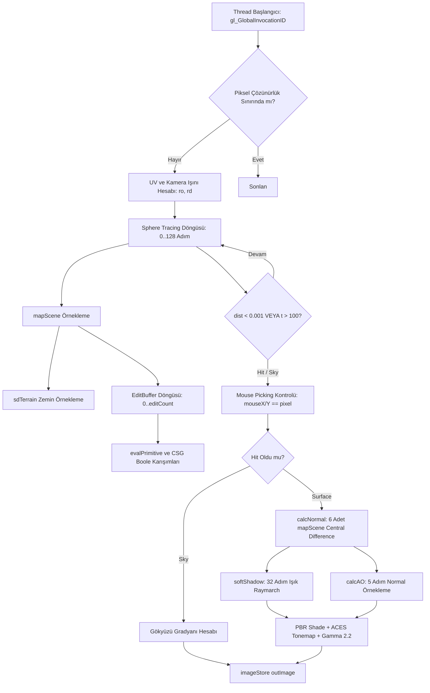
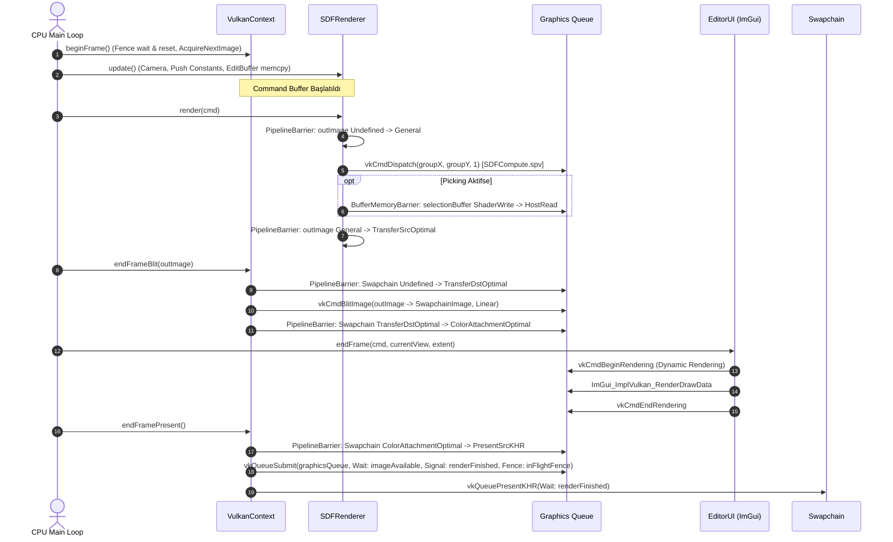

# inkbytefo/SDFRENDEREXAMPLE — Vulkan Compute SDF Renderer Mimarisi ve Teknik Dokümantasyonu

Bu doküman, `inkbytefo/SDFRENDEREXAMPLE` deposunda yer alan modern Vulkan 1.4 ve Compute Shader tabanlı dinamik Signed Distance Field (SDF) renderer motorunun mimari, matematiksel ve donanımsal altyapısını A→Z ortaya koymak, mevcut güçlü/zayıf yönlerini belirlemek ve planlanan optimizasyon döngülerine (PR listesi) zemin hazırlamak amacıyla hazırlanmıştır.

---

## a) Özet (Executive Summary)

Bu sistem, geleneksel poligonel kafes (polygon mesh) render akışı yerine tamamen GPU Compute Shader (`SDFCompute.glsl`) üzerinde koşan küre izleme (sphere tracing / raymarching) tekniğiyle çalışan, gerçek zamanlı, deforme edilebilir ve tahrip edilebilir bir hacimsel geometri motorudur. Sistem; analitik primitiflerin (Küre, Kutu, Torus, Kapsül, Silindir), düzgün Boole CSG (Smooth Union, Subtraction vb.) operasyonlarının ve dinamik bir arazi yükseklik haritasının pürüzsüz biçimde bir araya getirilmesini sağlayarak sonsuz çözünürlüklü ve tahrip edilebilir ortamlar problemini çözer. Mimarinin çekirdeğini; Vulkan 1.4 dinamik render altyapısı (`VulkanContext`), GPU hesaplama hattı (`ComputePipeline`), hacimsel önbellek ve seyrek indeksleme (`BrickAtlas`, `SparseMap`), arazi fırçalama (`Terrain`) ve gerçek zamanlı düzenleme arayüzü (`EditorUI`) oluşturmaktadır.

---

## b) Dosya ve Modül Haritası

```
SDFRENDEREXAMPLE / AstralEngine
├── CMakeLists.txt              # C++20 yapılandırması, FetchContent bağımlılıkları ve glslc derleme adımları
├── shaders/
│   ├── SDFCompute.glsl         # 8x8 workgroup ana raymarching, PBR aydınlatma ve picking compute shader'ı
│   └── TerrainBrush.glsl       # 8x8 workgroup arazi yükseklik ve splatmap fırçalama compute shader'ı
├── src/
│   ├── main.cpp                # Ana uygulama döngüsü, girdi işleme, render/blit koordinasyonu
│   ├── core/
│   │   ├── Window.hpp/.cpp     # GLFW pencere yönetimi, input callback'leri ve Vulkan uzantı sorguları
│   │   ├── InputState.hpp      # Klavye, fare pozisyon/delta ve yakalama bayraklarını tutan veri yapısı
│   │   ├── SDFEdit.hpp         # CPU tarafı SDF primitif ve operasyon veri yapısı (std430 uyumlu)
│   │   ├── VulkanContext.hpp/.cpp # Vulkan 1.4 instance, device, queue, semafor/fence ve swapchain yönetimi
│   │   └── PhysicsSystem.hpp/.cpp # Jolt Physics motoru başlatma, katman filtreleri ve simülasyon adımı
│   ├── renderer/
│   │   ├── Swapchain.hpp/.cpp  # Swapchain yapılandırması, format/present mode seçimi ve image view yönetimi
│   │   ├── ResourceManager.hpp/.cpp # Vulkan Buffer/Image tahsisi ve bellek tipi eşleme yardımcıları
│   │   ├── DescriptorManager.hpp/.cpp # Descriptor set layout, descriptor pool ve set tahsis yöneticisi
│   │   ├── ComputePipeline.hpp/.cpp # SPIR-V shader module, pipeline layout ve compute pipeline sarmalayıcısı
│   │   ├── BrickAtlas.hpp/.cpp # 8x8x8 voksel tuğlalar içeren 3D R16F doku ve CPU tuğla tahsis yöneticisi
│   │   ├── SparseMap.hpp/.cpp  # 128x128x128 3D R32UI seyrek tuğla işaretçi ızgarası
│   │   ├── Terrain.hpp/.cpp    # 1024x1024 R32F heightmap ve RGBA8 splatmap kaynakları ve fırça yürütücüsü
│   │   └── SDFRenderer.hpp/.cpp # Raymarching render koordinatörü, push constants, SSBO transferleri ve picking
│   └── editor/
│       ├── EditorUI.hpp/.cpp   # Dear ImGui ve Vulkan 1.3+ dynamic rendering tabanlı düzenleme paneli
└── docs/                       # Konsept ve tasarım hedeflerini özetleyen ön dokümantasyon dosyaları
```

---

## c) Veri Yapıları ve Bellek Düzenleri

### 1. Brick Atlas & Sparse Map Mimarisi
- **Tuğla (Brick) Boyutu**: $8 \times 8 \times 8$ voksel (`BRICK_SIZE = 8`).
- **Brick Atlas Fiziksel Dokusu (`BrickAtlas`)**:
  - Boyut: $64 \times 64 \times 64$ tuğla $\implies 512 \times 512 \times 512$ voksel.
  - Voksel Formatı: `VK_FORMAT_R16_SFLOAT` (16-bit float işaretli mesafe değeri).
  - VRAM Ayak İzi: $512^3 \times 2 \text{ byte} = 268,435,456 \text{ byte} \approx 256 \text{ MB}$.
  - Descriptor / Binding: Set 0, Binding 0 (`layout(binding = 0, r16f) uniform image3D brickAtlas;`).
  - CPU Tahsis Mekanizması: `std::vector<bool> brickOccupancy` (262,144 bit) ile ilk boş indeksi bulan `allocateBrick()` ve `freeBrick()` lineer tarama algoritması.
- **Seyrek İndeks Haritası (`SparseMap`)**:
  - Izgara Boyutu: $128 \times 128 \times 128$ hücre.
  - Hücre Formatı: `VK_FORMAT_R32_UINT` (Atlas içerisindeki tuğla slot indeksini işaret eder).
  - VRAM Ayak İzi: $128^3 \times 4 \text{ byte} = 8,388,608 \text{ byte} = 8 \text{ MB}$.
  - Descriptor / Binding: Set 0, Binding 1 (`layout(binding = 1, r32ui) uniform uimage3D sparseMap;`).
- *Önemli Mimari Not*: Mevcut shader kodunda tuğla dokusu allocate edilip bind edilmesine rağmen, `SDFCompute.glsl` raymarch aşamasında sahneyi doğrudan `EditBuffer` dizisi üzerinden dinamik olarak hesaplamaktadır. Tuğla tabanlı voxel caching henüz tam devreye alınmamıştır.

### 2. GPU-Side Buffer ve Image Düzenleri (Byte Packing & Alignment)

#### a) `SDFEdit` / `SDFEditGPU` (SSBO Binding 3)
C++ ve GLSL `std430` hizalama kurallarına göre birebir eşleşen 96-byte bellek bloğu:

| Alan (Field) | GLSL Tipi | C++ Tipi | Offset (Byte) | Boyut (Byte) | Açıklama |
| :--- | :--- | :--- | :--- | :--- | :--- |
| `position` | `vec3` | `glm::vec3` | 0 | 12 | Dünya uzayındaki merkez |
| `pad1` | `float` | `float` | 12 | 4 | 16-byte hizalama dolgusu |
| `rotation` | `vec4` | `glm::vec4` | 16 | 16 | Yönelim kuaterniyonu $(x,y,z,w)$ |
| `scale` | `vec3` | `glm::vec3` | 32 | 12 | Boyut çarpanları |
| `primitiveType` | `uint` | `uint32_t` | 44 | 4 | 0=Sphere, 1=Box, 2=Torus, 3=Capsule, 4=Cylinder |
| `operation` | `uint` | `uint32_t` | 48 | 4 | 0=Union, 1=Sub, 2=Intersect, 3=SmoothUnion, 4=SmoothSub |
| `blendFactor` | `float` | `float` | 52 | 4 | Yumuşak Boole yarıçapı $k$ |
| `isDynamic` | `uint` | `uint32_t` | 56 | 4 | Dinamik fizik nesnesi bayrağı |
| `pad2` | `float` | `float` | 60 | 4 | Hizalama dolgusu |
| `albedo` | `vec3` | `glm::vec3` | 64 | 12 | Temel yüzey rengi (RGB) |
| `roughness` | `float` | `float` | 76 | 4 | Yüzey pürüzlülüğü $[0, 1]$ |
| `metallic` | `float` | `float` | 80 | 4 | Metaliklik oranı $[0, 1]$ |
| `matPad1..3` | `float[3]` | `float[3]` | 84 | 12 | 16-byte hizalama tamamlayıcı dolgu |
| **Toplam** | | | | **96 byte** | $256 \times 96 = 24,576 \text{ byte}$ ($24 \text{ KB}$) |

#### b) `SelectionBuffer` (SSBO Binding 4)
- Yapı: `int hitIndex; float hitPosX, hitPosY, hitPosZ;` (16 byte).
- Boyut: 16 byte (`sizeof(SelectionData)`).

#### c) Push Constants (104 Byte)
Tek bir `PushConstants` bloğu `vkCmdPushConstants` üzerinden compute shader'a aktarılır:
```cpp
struct PushConstants {
    float camPosX, camPosY, camPosZ, pad0;      // Offset  0 - 16 byte (vec4)
    float camDirX, camDirY, camDirZ, pad1;      // Offset 16 - 16 byte (vec4)
    float resX, resY, time, editCount;          // Offset 32 - 16 byte (vec4)
    uint32_t renderMode;                        // Offset 48 - 4 byte
    uint32_t showGround;                        // Offset 52 - 4 byte
    float mouseX, mouseY;                       // Offset 56 - 8 byte
    float brushX, brushY, brushZ, brushRadius;  // Offset 64 - 16 byte (vec4)
    uint32_t showGrid;                          // Offset 80 - 4 byte
    float pad2, pad3, pad4;                     // Offset 84 - 12 byte (toplam 96->104 byte push range)
};
```

### 3. Host $\leftrightarrow$ Device Transfer Deseni
- `editBuffer` ve `selectionBuffer`, `VK_MEMORY_PROPERTY_HOST_VISIBLE_BIT | VK_MEMORY_PROPERTY_HOST_COHERENT_BIT` bayraklarıyla doğrudan CPU tarafından erişilebilir VRAM/GTT belleğinde barındırılır.
- **Transfer Yolu**: Her frame CPU tarafında `vkMapMemory` $\rightarrow$ `memcpy` $\rightarrow$ `vkUnmapMemory` çağrısı yapılır. Staging buffer kullanılmamaktadır.
- **Dezavantajı**: Her kare eşleme/ayırma (map/unmap) sürücü çağrısı maliyeti üretir. Belleğin kalıcı olarak eşlenmesi (`persistent mapping`) performans kazancı sağlayacaktır.

---

## d) Compute Shader Akışı (`SDFCompute.glsl`)

### 1. Entry Point & Dispatch Parametreleri
- Shader Bildirimi: `#version 460`, `layout(local_size_x = 8, local_size_y = 8) in;`.
- Dispatch Boyutları:
  $$\text{groupX} = \left\lceil \frac{\text{width}}{8} \right\rceil, \quad \text{groupY} = \left\lceil \frac{\text{height}}{8} \right\rceil, \quad \text{groupZ} = 1$$
  Örnek: $1280 \times 720$ için $160 \times 90 = 14,400$ workgroup ($921,600$ thread).

### 2. Descriptor Set 0 Bağlantı Tablosu

| Binding | Ad | Tip | Format | C++ Kaynağı / Bağlam |
| :--- | :--- | :--- | :--- | :--- |
| 0 | `brickAtlas` | `uniform image3D` | `r16f` | `BrickAtlas::getAtlasView()` |
| 1 | `sparseMap` | `uniform uimage3D` | `r32ui` | `SparseMap::getMapView()` |
| 2 | `outImage` | `uniform image2D` | `rgba8` | `SDFRenderer::outputImage` (TransferSrcOptimal) |
| 3 | `EditBuffer` | `buffer (SSBO)` | `std430` | `SDFRenderer::editBuffer` ($256 \times 96$ B) |
| 4 | `SelectionBuffer` | `buffer (SSBO)` | `std430` | `SDFRenderer::selectionBuffer` (16 B) |
| 5 | `terrainHeight` | `uniform sampler2D` | `r32f` | `Terrain::getHeightmap()` (Linear Clamp) |
| 6 | `terrainSplat` | `uniform sampler2D` | `rgba8` | `Terrain::getSplatmap()` (Linear Clamp) |

### 3. Hesaplama Adımları ve Mantık Akışı



- **SDF Örnekleme (`mapScene`)**: Her ışın adımında zemin SDF'i (`sdTerrain`) hesaplanır; ardından sahnedeki tüm aktif editler (`edits[0..count]`) sırayla gezilerek kümülatif mesafe alanı güncellenir.
- **Normal Hesaplama (`calcNormal`)**: Yüzey tespit edildiğinde $h = 0.001$ mesafesinde 6 yönlü merkezi türev (central difference stencil) alınır:
  $$\vec{n} = \text{normalize}\begin{pmatrix} f(p + h\hat{x}) - f(p - h\hat{x}) \\ f(p + h\hat{y}) - f(p - h\hat{y}) \\ f(p + h\hat{z}) - f(p - h\hat{z}) \end{pmatrix}$$
  Bu işlem yüzey başına tam 6 adet tam sahne (`mapScene`) değerlendirmesi demektir!
- **Yumuşak Gölgeler (`softShadow`)**: Işık yönünde 32 adıma kadar ek bir raymarching yapılarak penumbra açısı $k = 12.0$ ile yumuşak gölge faktörü hesaplanır.
- **Ortam Kapatma (`calcAO`)**: Normal vektörü boyunca 5 artımlı adım atılarak geometrik girintilerdeki ışık kaybı hesaplanır.
- **Picking**: `pixel == ivec2(mouseX, mouseY)` koşulu sağlandığında `hitIndex` ve temas noktası koordinatları doğrudan `SelectionBuffer`'a atomik olmayan tekil yazma ile aktarılır.

---

## e) Render Akışı (Frame-Level)

Bir karede yürütülen tüm CPU ve GPU adımları ile aralarındaki senkronizasyon haritası:



### Senkronizasyon Noktaları ve Eşzamanlılık Analizi:
1. **Fences**: `MAX_FRAMES_IN_FLIGHT = 2` ile CPU-GPU pipelining sağlanır. CPU, önceki döngünün GPU işi bitmeden yeni komut yazmaz (`vkWaitForFences`).
2. **Semaphores**:
   - `imageAvailableSemaphores`: Swapchain'den görüntü alınmadan color attachment yazımına başlanmasını engeller.
   - `renderFinishedSemaphores`: Komut tamponu yürütmesi ve ImGui çizimi tamamlanmadan `vkQueuePresentKHR` çağrılmasını engeller.
3. **Pipeline Barriers**:
   - `outImage`: `Undefined` $\to$ `General` (Compute ShaderWrite) $\to$ `TransferSrcOptimal` (TransferRead).
   - Swapchain: `Undefined` $\to$ `TransferDstOptimal` (BlitDst) $\to$ `ColorAttachmentOptimal` (ImGui Draw) $\to$ `PresentSrcKHR` (Present).
4. **Kritik Senkronizasyon Kusuru (Race Condition)**:
   - `main.cpp` içinde `renderer.getSelection()` fonksiyonu, bir önceki karenin GPU komutlarının tamamlandığından bağımsız olarak `selectionBuffer.memory` üzerinde `mapMemory` çağırmaktadır. GPU henüz ilgili pikseli yazarken CPU okuma yaparsa çakışma oluşabilir. Bu transfer bir staging fence veya transfer tamamlanma sinyali ile korunmalıdır.

---

## f) Performans Karakterizasyonu ve Darboğaz Senaryoları

### 1. Kritik Maliyet Unsurları
1. **Raymarching ALU Yoğunluğu**:
   - Ekran boyutu: $1280 \times 720 = 921,600$ piksel.
   - Maksimum adım: 128. Her adımda 256 editlik döngü.
   - En kötü senaryoda piksel başına $128 \times 256 = 32,768$ analitik primitif testi.
   - Toplam teorik tepe noktası: Frame başına ~30 Milyar primitif değerlendirmesi.
2. **Normal ve Shading Katlayıcı Etkisi**:
   - Normal hesabı için 6 ek `mapScene` çağrısı: $6 \times 256 = 1536$ ekstra primitif testi / isabet eden piksel.
   - Gölge hesabı (32 adım): $32 \times 256 = 8192$ primitif testi.
   - AO hesabı (5 adım): $5 \times 256 = 1280$ primitif testi.
   - Bir yüzeye çarpan her ışın toplamda ~43,000 primitif fonksiyonu çalıştırmaktadır!
3. **Memory Bandwidth & Blit**:
   - `outImage` storage image olarak yazılır ($1280 \times 720 \times 4 \text{ B} = 3.68 \text{ MB}$).
   - Hemen ardından swapchain'e `vkCmdBlitImage` ile kopyalanır ($3.68 \text{ MB}$ okuma $+ 3.68 \text{ MB}$ yazma).
   - Gereksiz yere frame başına ~11 MB fazladan VRAM bant genişliği harcanır.

### 2. Tipik Darboğaz Senaryoları
- **Kamera Geometriye Çok Yaklaştığında (High Divergence & Overdraw)**:
  Kamera bir nesneye çok yaklaştığında veya ray yüzeye sıyırarak geçtiğinde (glancing angle), adım büyüklükleri minimuma iner ($t \mathrel{+}= \text{dist}$, $\text{dist} \to 0$), tüm pikseller 128 adımı tüketir. GPU SIMD birimlerinde thread divergence tavan yapar.
- **Sahne Edit Sayısı Arttığında ($N > 50$)**:
  Sahne karmaşıklığı $O(N)$ şeklinde lineer artmaktadır. Voxel hızlandırma yapısı (Brick Atlas) kullanılmadığı için her primitif tüm ekran için global maliyet yaratır.
- **Sık Edit Güncellemeleri**:
  `editsDirty = true` olduğunda her kare `updateEditBuffer` içinde `vkMapMemory` ve `vkUnmapMemory` çağrılarak CPU-GPU sürücü hattı kilitlenir.

---

## g) Matematiksel Altyapı

### 1. Signed Distance Field (SDF) Tanımı
Bir $\Omega \subset \mathbb{R}^3$ geometrik hacmi için SDF fonksiyonu $f(p): \mathbb{R}^3 \to \mathbb{R}$:
$$f(p) = \begin{cases} -d(p, \partial\Omega) & p \in \Omega \text{ (İç Kısım)} \\ 0 & p \in \partial\Omega \text{ (Yüzey Sınırı)} \\ +d(p, \partial\Omega) & p \notin \Omega \text{ (Dış Kısım)} \end{cases}$$
Burada $d(p, \partial\Omega) = \inf_{y \in \partial\Omega} \|p - y\|$ olup fonksiyon Eikonal Denklemini sağlar: $\|\nabla f(p)\| = 1$.

### 2. Analitik Primitif Formülleri
- **Küre (Sphere)**:
  $$f_{\text{sphere}}(p, r) = \|p\| - r$$
- **Kutu (Box)**:
  $$q = |p| - b \implies f_{\text{box}}(p, b) = \|\max(q, \vec{0})\| + \min(\max(q_x, \max(q_y, q_z)), 0.0)$$
- **Torus**:
  $$q = \left(\sqrt{p_x^2 + p_z^2} - t_x, \; p_y\right) \implies f_{\text{torus}}(p, t) = \|q\| - t_y$$
- **Kapsül (Capsule)**:
  $$p_y' = p_y - \text{clamp}(p_y, 0.0, h) \implies f_{\text{capsule}}(p, h, r) = \|\vec{p}'\| - r$$
- **Silindir (Cylinder)**:
  $$d = \left(\sqrt{p_x^2 + p_z^2}, \; |p_y|\right) - (r, h) \implies f_{\text{cyl}}(p, r, h) = \min(\max(d_x, d_y), 0.0) + \|\max(d, \vec{0})\|$$

### 3. Boole ve Düzgün (Smooth) CSG Operatörleri
- **Standart Birlik (Union)**:
  $$A \cup B = \min(d_1, d_2)$$
- **Standart Fark (Subtraction)**:
  $$A \setminus B = \max(d_1, -d_2)$$
- **Standart Kesişim (Intersection)**:
  $$A \cap B = \max(d_1, d_2)$$
- **Düzgün Birlik (Smooth Union - Polynomial $C^1$)**:
  $$h = \text{clamp}\left(0.5 + 0.5 \frac{d_2 - d_1}{k}, \; 0.0, \; 1.0\right)$$
  $$\text{opSmoothUnion}(d_1, d_2, k) = \text{mix}(d_2, d_1, h) - k \cdot h \cdot (1.0 - h)$$
- **Düzgün Çıkarma (Smooth Subtraction)**:
  $$h = \text{clamp}\left(0.5 - 0.5 \frac{d_1 + d_2}{k}, \; 0.0, \; 1.0\right)$$
  $$\text{opSmoothSub}(d_1, d_2, k) = \text{mix}(d_1, -d_2, h) + k \cdot h \cdot (1.0 - h)$$

### 4. Sphere Tracing / Raymarching Algoritması
Kamera orijini $r_o$ ve birim ışın yönü $r_d$ için ışın parametresi $t$:
$$p(t) = r_o + t \cdot r_d$$
Her $i$. iterasyonda:
$$t_{i+1} = t_i + f(p(t_i))$$
- **Durdurma Koşulları**:
  - İsabet (Hit): $f(p(t_i)) < \epsilon \quad (\epsilon = 10^{-3})$
  - Iska / Kaçış (Miss): $t_i > t_{\max} \quad (t_{\max} = 100.0)$
  - Adım Tükenmesi: $i \ge \text{maxSteps} \quad (\text{maxSteps} = 128)$

### 5. Yüzey Normali Türetimi
- **Central Difference (Merkezi Fark - 6 Örnek)**:
  $$\vec{n} = \text{normalize}\begin{pmatrix} f(p + \epsilon\hat{x}) - f(p - \epsilon\hat{x}) \\ f(p + \epsilon\hat{y}) - f(p - \epsilon\hat{y}) \\ f(p + \epsilon\hat{z}) - f(p - \epsilon\hat{z}) \end{pmatrix}, \quad \epsilon = 10^{-3}$$
- **Tetrahedron Tekniği (4 Örnek - Optimize Alternatif)**:
  $$k_0 = (1, -1, -1), \; k_1 = (-1, -1, 1), \; k_2 = (-1, 1, -1), \; k_3 = (1, 1, 1)$$
  $$\vec{n} = \text{normalize}\left( \sum_{i=0}^3 k_i \cdot f(p + \epsilon k_i) \right)$$

### 6. Brick Coordinate $\leftrightarrow$ World Coordinate Dönüşümleri
Dünya uzayında bir nokta $P_w = (x_w, y_w, z_w)$, ızgara başlangıcı $W_{\min}$, voksel boyutu $s_v$ ve tuğla boyutu $B = 8$:
1. **Dünya $\to$ Sürekli Voksel Koordinatı**:
   $$P_v = \frac{P_w - W_{\min}}{s_v}$$
2. **Voksel $\to$ Seyrek Tuğla Koordinatı ($C_{\text{brick}}$)**:
   $$C_{\text{brick}} = \left\lfloor \frac{P_v}{B} \right\rfloor = \left( \lfloor P_{v,x}/8 \rfloor, \lfloor P_{v,y}/8 \rfloor, \lfloor P_{v,z}/8 \rfloor \right)$$
3. **Tuğla İçi Lokal Voksel Ofseti**:
   $$V_{\text{local}} = P_v - C_{\text{brick}} \times B \quad \in [0, 8)^3$$
4. **Seyrek Haritadan Atlas Koordinatı Bulma**:
   $$\text{AtlasSlotId} = \text{SparseMap}[C_{\text{brick}}]$$
   $$A_z = \lfloor \text{Id} / (S_x S_y) \rfloor, \quad A_y = \lfloor (\text{Id} \bmod (S_x S_y)) / S_x \rfloor, \quad A_x = \text{Id} \bmod S_x$$
5. **Atlas 3D Doku UVW Koordinatı**:
   $$\text{UVW} = \frac{(A_x \cdot 8, A_y \cdot 8, A_z \cdot 8) + V_{\text{local}} + 0.5}{\text{AtlasVoxelSize}}$$

---

## h) Güçlü Yönler (İyi Yapılmış Noktalar)

1. **Modern Vulkan 1.4 & Dynamic Rendering Entegrasyonu**: Klasik Vulkan'ın hantal `VkRenderPass` ve `VkFramebuffer` mimarisi yerine doğrudan `VK_KHR_dynamic_rendering` kullanılarak modern ve temiz bir komut akışı kurulmuş.
2. **FetchContent ile Bağımsız Bağımlılık Yönetimi**: Harici paket yöneticilerine (vcpkg, conan) ihtiyaç duymadan GLFW 3.3.8, GLM 1.0.1, Jolt v5.0.0 ve ImGui v1.91.8 kütüphanelerinin CMake seviyesinde otomatik indirilip derlenmesi sağlanmış.
3. **CMake `glslc` Otomasyonu**: Compute shader'ların CMake derleme sürecine entegre edilerek `.spv` bytecode çıktılarının otomatik üretilmesi ve binary bağımlılığı kurulması sağlanmış.
4. **Sorumlulukların Ayrılması (SoC) ve Modülerlik**: `ComputePipeline`, `ResourceManager`, `DescriptorManager`, `Swapchain` sınıfları Vulkan kaynaklarını temiz RAII (`vk::UniqueHandle`) prensipleriyle yönetmekte.
5. **Seyrek Tuğla (Sparse Brick-Map & Atlas) Mimarisi Hazırlığı**: Voxel tabanlı önbellekleme için $8 \times 8 \times 8$ tuğla boyutlu `BrickAtlas` ve `SparseMap` yapılarının şimdiden yer alması motorun ölçeklenebilirliği için doğru bir temel oluşturmuş.
6. **Jolt Physics Varlığı**: Motor mimarisinde yüksek başarımlı modern bir fizik kütüphanesinin (`PhysicsSystem`) yer alması, hacimsel SDF çarpışma testleri için zemin hazırlamış.

---

## i) İyileştirme Fırsatları ve Riskler (10+ Detaylı Öneri)

1. **Voxel Brick Caching & Incremental Dirty-Brick Updates**:
   - *Sorun*: Şu an shader her piksel için sahnedeki tüm primitifleri raymarching döngüsünde iteratif çözer ($O(N \times \text{steps})$).
   - *Çözüm*: Sadece değişen editlerin sınırlayıcı kutusuna (AABB) denk gelen tuğlaları hesaplayan bir `VoxelizeBricks.glsl` compute pass'i eklenmeli. Raymarcher doğrudan `BrickAtlas` dokusunu donanımsal trilinear filtreleme ile örneklemelidir ($O(\text{steps})$).
2. **Normal Hesaplamasında Tetrahedron Stencil Geçişi**:
   - *Sorun*: `calcNormal` fonksiyonu 6 yönlü merkezi fark kullanır ($6 \times \text{mapScene}$).
   - *Çözüm*: 4 örneklemeli tetrahedron tekniğine geçilmeli; yüzey piksellerindeki ALU yükü anında %33 düşürülecektir.
3. **Kalıcı Bellek Eşleme (Persistent Mapped Memory)**:
   - *Sorun*: Her frame `editBuffer` ve `selectionBuffer` için `vkMapMemory` / `vkUnmapMemory` çağrılmaktadır.
   - *Çözüm*: Buffer oluşturulurken bellek bir kez map edilmeli ve program sonuna kadar açık bir pointer olarak tutulmalıdır.
4. **Workgroup Boyutu ve SIMD Tuning (Specialization Constants)**:
   - *Sorun*: $8 \times 8 = 64$ thread sabit seçilmiştir. NVIDIA'da warp boyutu 32, AMD'de wavefront boyutu 64'tür.
   - *Çözüm*: `local_size_x` ve `local_size_y` specialization constant yapılarak donanıma göre (ör. $16 \times 8$ veya $8 \times 4$) optimize edilmelidir.
5. **Doğrudan Swapchain Çıktısı (Blit Eliminasyonu)**:
   - *Sorun*: `outImage` (R8G8B8A8) oluşturulup swapchain görüntüsüne blit edilmektedir.
   - *Çözüm*: Swapchain formatı `VK_FORMAT_B8G8R8A8_UNORM` destekliyorsa, compute shader doğrudan swapchain görüntüsüne `imageStore` yapabilir; bu sayede fazladan görüntü tahsisi ve blit senkronizasyonu kaldırılır.
6. **Descriptor Bindless / Direct Push Descriptor Mimarisi**:
   - *Sorun*: Her render çağrısında `vkCmdBindDescriptorSets` çağrılmakta ve küçük havuzlu (`maxSets = 10`) bir descriptor pool kullanılmaktadır.
   - *Çözüm*: `VK_KHR_push_descriptor` veya `VK_EXT_descriptor_indexing` ile statik havuz yükü kaldırılmalıdır.
7. **Asenkron Compute Kuyruğu (Async Compute Queue)**:
   - *Sorun*: Compute raymarching ve ImGui rasterizasyonu aynı `graphicsQueue` üzerinde seri çalışır.
   - *Çözüm*: Donanım destekliyorsa özel compute kuyruk ailesi (`computeFamily`) tespit edilerek ağır hesaplamalar grafik kuyruğuyla örtüştürülmelidir.
8. **Vulkan GPU Timestamp Queries ile Hassas Profilleme**:
   - *Sorun*: Şu anda GPU üzerinde compute pass'in ve blit pass'in kaç mikrosaniye sürdüğüne dair donanımsal ölçüm yoktur.
   - *Çözüm*: `vk::QueryPool` (Timestamp) oluşturularak compute başlangıç, bitiş ve raster süreleri ölçülmeli, CSV formatında kaydedilmelidir.
9. **Thread-Safe ve Senkronize Picking**:
   - *Sorun*: `getSelection()` fonksiyonu CPU tarafında GPU fence beklemeden `selectionBuffer`'ı okumaktadır.
   - *Çözüm*: Bir fence veya semafor ile korunan çift tamponlu (double-buffered) staging mimarisine geçilmelidir.
10. **Hiyerarşik Boş Uzay Atlama (Hierarchical Empty Space Skipping / Clipmaps)**:
    - *Sorun*: Boş gökyüzü veya boş hava hacimlerinde ışın gereksiz yere küçük adımlarla yürümektedir.
    - *Çözüm*: `SparseMap` üzerinde DDA (Digital Differential Analyzer) ile boş tuğlalar tek adımda atlanmalıdır.
11. **Gelişmiş Doğrulama ve Hata Yakalama (Vulkan Validation Layer & Debug Messenger)**:
    - *Sorun*: `setupDebugMessenger()` fonksiyonunun içi boş bırakılmıştır.
    - *Çözüm*: `vkCreateDebugUtilsMessengerEXT` tam implemente edilerek tüm VRAM sızıntıları ve senkronizasyon tehlikeleri konsola loglanmalıdır.

---

## j) Geliştirme Planı (Atomic PR / Iteration Yol Haritası)

### PR-0: Yapılandırma, Temiz Derleme ve Dengeleme
- **Amaç**: Kod tabanının Windows (MSVC) ve GCC ortamlarında sıfır hata/uyarı ile derlendiğini ve doğrulama katmanlarının eksiksiz çalıştığını doğrulamak.
- **Değiştirilecek Dosyalar**: `src/core/VulkanContext.cpp` (Debug messenger implementasyonu), `CMakeLists.txt`.
- **Beklenen Test**: Uygulama açılmalı, konsolda Vulkan validation layer aktif mesajı görülmeli ve temiz kapanmalıdır.
- **Risk**: Sistemde Vulkan SDK runtime validation layer'larının eksik olması riski.

### PR-1: Build & Run Baseline + README İyileştirmeleri
- **Amaç**: Geliştirme ortamı kurulum adımlarını, önkoşulları (Vulkan SDK, CMake, C++20 derleyici) standartlaştırmak; derleme scriptlerini eklemek.
- **Değiştirilecek Dosyalar**: `README.md`, `.gitignore`, `CMakePresets.json`.
- **Beklenen Test**: `cmake --preset windows-release` komutu ile projenin sorunsuz derlenip çalıştırılması.
- **Risk**: Düşük.

### PR-2: GPU Timestamp Queries & Baseline Benchmark Çıktısı
- **Amaç**: Alt-milisaniye GPU profilleyici altyapısını kurmak. Compute shader ve render aşamalarının sürelerini doğrudan GPU saat frekansı üzerinden ölçmek.
- **Değiştirilecek Dosyalar**: `src/core/VulkanContext.hpp/.cpp` (Timestamp QueryPool oluşturma), `src/renderer/SDFRenderer.hpp/.cpp` (`vkCmdWriteTimestamp`), `src/main.cpp` (CLI parametreleri: `--bench`, `--bench-frames`, `--bench-out`), `src/core/BenchmarkLogger.hpp` (Yeni CSV/JSON yazıcı).
- **Beklenen Test**: `--bench-out baseline.csv` ile çalıştırıldığında 200 frame çalışıp p50, p95 ve ortalama GPU zamanlarını içeren CSV üretmesi.
- **Beklenen Performans Etkisi**: Ölçüm ek yükü <%0.5.

### PR-3: Otomasyon ve Karşılaştırmalı Bench Runner (`tools/run_bench.py`)
- **Amaç**: Farklı çözünürlük ($720p, 1080p, 1440p$) ve edit sayıları ($5, 20, 100$) altında otomatik performans test matrisi çalıştıran test aracı sunmak.
- **Değiştirilecek Dosyalar**: `tools/run_bench.py`, `tools/plot_benchmarks.py`.
- **Beklenen Test**: Python betiğinin motoru farklı argümanlarla ardışık çalıştırıp `artifacts/bench/` altında konsolide rapor üretmesi.
- **Risk**: Python ortam bağımlılıkları (yalnızca standart kütüphane kullanılmalı).

### PR-4: Workgroup Boyutu ve Normal Hesaplama Optimizasyonu (Tetrahedron Stencil)
- **Amaç**: `SDFCompute.glsl` içindeki 6 örnekli merkezi fark normal hesabını 4 örnekli tetrahedron tekniği ile değiştirmek ve workgroup konfigürasyonlarını test etmek.
- **Değiştirilecek Dosyalar**: `shaders/SDFCompute.glsl`, `src/renderer/ComputePipeline.hpp/.cpp`.
- **Beklenen Test**: Görsel kalitede hiçbir bozulma olmadan yüzey piksellerinde GPU zamanının ölçülmesi.
- **Beklenen Performans Etkisi**: GPU compute süresinde %15–%25 arası doğrudan kazanç.

### PR-5: Persistent Memory Mapping & Blit Optimizasyonu
- **Amaç**: Her kare yapılan `vkMapMemory` / `vkUnmapMemory` çağrılarını ortadan kaldırarak kalıcı eşlenmiş bellek pointer'ı kullanmak; uygun swapchain formatında doğrudan render denemesi.
- **Değiştirilecek Dosyalar**: `src/renderer/ResourceManager.hpp/.cpp`, `src/renderer/SDFRenderer.cpp`.
- **Beklenen Test**: CPU Frame zamanının (`cpuFrameMs`) düşmesi ve mikro-takılmaların (stutter) önlenmesi.
- **Beklenen Performans Etkisi**: CPU döngü süresinde 0.5–1.5 ms düşüş.

### PR-6: Dirty-Brick Voxelization & Incremental Recompute Prototipi
- **Amaç**: `BrickAtlas` ve `SparseMap` yapılarını aktif hale getirerek sahnedeki SDF editlerini tuğlalara vokselize etmek; ışın izleme shader'ını bu atlası örnekleyecek şekilde güncellemek.
- **Değiştirilecek Dosyalar**: `shaders/VoxelizeBricks.glsl` (Yeni), `shaders/SDFCompute.glsl`, `src/renderer/BrickAtlas.cpp`, `src/renderer/SDFRenderer.cpp`.
- **Beklenen Test**: Edit sayısı 50'nin üzerine çıktığında raymarch süresinin sabit kalması ($O(1)$ kompleksite).
- **Beklenen Performans Etkisi**: Çoklu edit senaryolarında 3x–10x arası devasa FPS artışı.

---

## k) Veri Toplama Formatı ve Metrikler

Sistem, `--bench-out <dosya.csv>` parametresiyle çalıştırıldığında her kare için aşağıdaki şemada veri loglayacaktır:

### CSV Formatı Örneği:
```csv
frameIndex,cpuFrameMs,gpuTotalMs,gpuComputeMs,gpuRenderMs,activeBricks,sdfResolution,brickSize,screenW,screenH,driverVersion,gpuName
1,2.15,8.42,7.85,0.57,64,512,8,1280,720,551.86,NVIDIA GeForce RTX 4070
2,1.82,8.39,7.81,0.58,64,512,8,1280,720,551.86,NVIDIA GeForce RTX 4070
3,1.79,8.41,7.83,0.58,64,512,8,1280,720,551.86,NVIDIA GeForce RTX 4070
```

### JSON Formatı Örneği (Özet Metrikler):
```json
{
  "benchmark_metadata": {
    "gpu_name": "NVIDIA GeForce RTX 4070",
    "driver_version": "551.86",
    "vulkan_api_version": "1.4.0",
    "commit_hash": "a1b2c3d",
    "timestamp": "2026-09-02T19:15:00Z"
  },
  "parameters": {
    "screen_width": 1280,
    "screen_height": 720,
    "workgroup_size": [8, 8],
    "edit_count": 3,
    "max_ray_steps": 128
  },
  "metrics": {
    "total_frames": 200,
    "warmup_frames_skipped": 30,
    "gpu_compute_ms": {
      "avg": 7.84,
      "min": 7.62,
      "max": 8.95,
      "p50": 7.82,
      "p90": 8.12,
      "p95": 8.35,
      "stddev": 0.24
    },
    "cpu_frame_ms": {
      "avg": 1.85,
      "p95": 2.10
    }
  }
}
```

---

## l) Kabul Kriterleri (Her PR İçin Zorunlu Koşullar)

Her bir geliştirme dalı (branch) ve PR'ın kabul edilmesi için aşağıdaki kriterlerin eksiksiz sağlanması zorunludur:

1. **Sıfır Derleme Hatası ve Uyarısı**: Kod C++20 standartlarında, MSVC ortamında `/W4`, GCC/Clang ortamında `-Wall -Wextra` bayraklarıyla hatasız ve uyarı vermeden derlenmelidir.
2. **Doğrulama Katmanı Temizliği**: `VK_LAYER_KHRONOS_validation` açıkken hiçbir validation hatası, uyarı veya bellek sızıntısı mesajı tetiklenmemelidir.
3. **Smoke Test Başarısı**: Uygulama başlatılmalı, sahnedeki nesneler (Küre, Kutu, Torus) doğru renk ve aydınlatma ile ekranda görünmeli, kamera hareketi ve ImGui panelleri akıcı çalışmalıdır.
4. **Ölçüm & Raporlama Zorunluluğu**: Her performans odaklı PR için test matrisi en az 200 kare çalıştırılmalı (ilk 30 kare ısınma olarak atılmalı), `artifacts/bench/` altına benchmark CSV dosyası eklenmeli ve PR özetinde önceki durum ile yeni durumun karşılaştırmalı tablosu (Öncesi/Sonrası ms, % değişim) sunulmalıdır.
5. **Geri Alınabilirlik (Reversibility)**: Kritik algoritma değişiklikleri (ör. tetrahedron stencili veya voxel sampling) runtime veya derleme zamanı flag'leri ile eski haline döndürülebilir olmalıdır.
