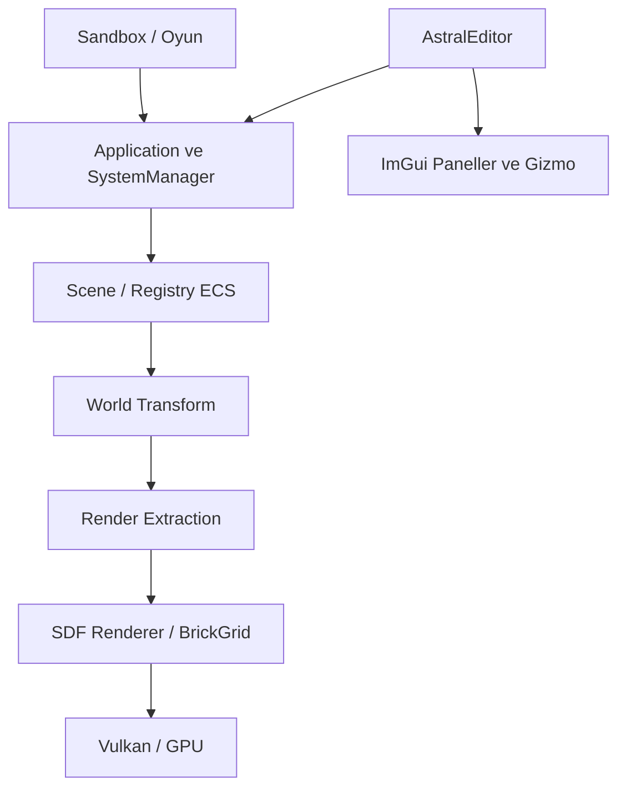

# Astral Engine — Teknik Değerlendirme ve Geliştirme Yol Haritası

**Başlangıç tarihi:** 5 Eylül 2026  
**Durum:** Planlandı; aşağıdaki geliştirme işleri henüz tamamlanmış sayılmıyor.  
**Amaç:** Astral Engine'i güvenilir, ölçülebilir, bağımsız oyun geliştirmeye uygun ve seçilmiş kullanım alanlarında AAA düzeyinde kaliteyi hedefleyen bir SDF motoruna dönüştürmek.  
**Teknoloji:** C++20, CMake, Vulkan compute, GLFW, GLM, VMA; ayrı editör hedefinde Dear ImGui ve ImGuizmo.  
**Dayanak:** Bu dokümandaki 5 Eylül 2026 kaynak kodu incelemesi ve yerel doğrulamalar. Commit edilmemiş çalışma ağacı değişiklikleri de incelenmiştir.

> Bu dosya ana rapor ve aşamalı ürün/mühendislik yol haritasıdır. Yakın işler somut düzeltme kartlarına ayrılmıştır. İleri aşamalardaki API ve algoritma kararları, ilgili aşama başlarken ölçümlerle hazırlanacak küçük uygulama planlarında kesinleştirilir. Bir kutu yalnızca kabul kriteri sağlandığında kapatılır; özelliğin sınıfının veya dosyasının bulunması tamamlanma kanıtı değildir.

## 1. Yönetici değerlendirmesi

Astral Engine çalışan, belirgin bir teknik kimliği olan erken aşama bir motordur. SDF render altyapısı, oyun geliştirme altyapısından daha ileridedir. Mevcut olgunluk tanımı: **SDF odaklı motor prototipi ve gelişmekte olan sahne editörü**.

Doğru temeller kurulmuştur: motor/editör/oyun hedefleri ayrılmış, sparse-set ECS uygulanmış, generation içeren nesne kimlikleri eklenmiş, sahne verisinden GPU verisine dönüşüm katmanı oluşturulmuştur. Sahne kopyalama, komut yığını, olay sistemi ve input mapping motorun gelişimini destekler.

Temel sorun, bu altyapıların henüz bağımsız bir oyunun uçtan uca yaşam döngüsünde yeterince sınanmamış olmasıdır. Demo sahnesi, sabit kamera ve simülasyon politikası motorun `Application` sınıfındadır. Render özelliklerinin bir bölümü ilk uygulama seviyesindedir; veri kalıcılığı ve test güvenilirliğinde kapatılması gereken açıklıklar vardır.

**Stratejik yön:** Önce güvenilir bir çekirdek ve küçük bir oynanabilir referans oyun; ardından kanıtlanmış darboğazlara yönelik kalite ve ölçek geliştirmeleri.

## 2. AAA hedefinin kapsamı

AAA kalitesi tek bir shader, özellik listesi veya sürüm numarasıyla kazanılmaz. Bu yol haritasında hedef aşağıdaki boyutlarda değerlendirilir:

| Boyut | Beklenen kanıt |
|---|---|
| Görsel kalite | Hareketli kamera ve nesnelerde kararlı görüntü, tutarlı materyal/ışık, kontrollü aliasing ve gölgeler |
| Performans | Tanımlı donanım, çözünürlük ve sahnelerde frame-time dağılımları; bellek ve yükleme bütçeleri |
| Güvenilirlik | Veri kayıpsız kayıt, doğru hata raporu, uzun süreli çalışma ve kurtarma senaryoları |
| Üretim araçları | Sahne oluşturma, düzenleme, Play/Stop, undo/redo, içerik yönetimi ve paketleme |
| Ölçek | Gerçek içerik üzerinden nesne, SDF işlem, hiyerarşi ve bellek ölçekleme ölçümleri |
| Geliştirici deneyimi | Çekirdeği değiştirmeden yeni oyun ekleme; belgelenmiş API ve tekrarlanabilir build |

İlk doğrulama platformu mevcut Windows/Vulkan geliştirme ortamıdır. Diğer masaüstü platformları ayrı doğrulama kapılarıdır. Konsol desteği, ağ tabanlı açık dünya, araç soft-body fiziği ve tam içerik üretim ekosistemi mevcut kapsamın doğal olarak tamamlanmış parçaları sayılmaz.

İlk aday performans hedefi, tanımlanacak referans oyun için **RTX 3060 üzerinde 1080p, p95 toplam frame süresi ≤16,67 ms** olarak alınır. Bu bir hedef bütçedir; mevcut motorun ulaştığı sonuç değildir. İşlemci, sürücü, sahne, ışık sayısı ve kalite ayarları benchmark profiline yazılmadan hedef doğrulanmış sayılmaz. 4K/60, 120 FPS veya daha büyük dünya hedefleri ayrıca bütçelendirilir.

## 3. İnceleme ve doğrulama raporu

### 3.1 Doğrudan gözlenen sonuçlar

| Kontrol | Sonuç ve sınır |
|---|---|
| Release derlemesi | `cmake --build build-release -j 4` başarılı; Ninja `no work to do` bildirdi. Temiz derleme yapılmadı. |
| CPU regresyonları | TaskGraph hariç 12 grup, toplam 229 assertion geçti. |
| TaskGraph | Ayrı çalıştırmalarda 4 ve 10 saniye zaman aşımı. Tüm test koşusu da tamamlanmadı. Kök neden kesinleştirilmedi. |
| G-buffer GPU çalışması | `Sandbox --frames 5 --gbuffer`, RTX 3060 üzerinde tamamlandı; picking isabeti kaydedildi, stderr boştu. |
| GPU test kapsamı | Bu kısa koşu görüntü kalitesi, uzun süreli kararlılık veya Present/resize yolunun tamamına kanıt değildir. Sınırlı frame koşusu normal etkileşimli sunum yolunu kullanmıyor. |
| Editör | Kod üzerinden incelendi; tüm etkileşimler elle çalıştırılmadı. |
| ImageEditor | Kaynak ve mimari incelendi; Astral'a bağlı bir uygulama olmadığı doğrulandı. |

Yerel kayıtlar: `artifacts/review-20260905/cpu-12.out.log`, `cpu-12.err.log`, `gpu.out.log`, `gpu.err.log`, `taskgraph-recheck.out.log`, `taskgraph-recheck.err.log`.

Testler ayrı bir çalışma dizininde çalıştırıldı; serializer testlerinin depo içindeki sahne dosyalarını değiştirmesi önlendi. Bu kayıtlar yerel inceleme çıktılarıdır; gelecekte sürüm/commit bilgisiyle CI artifact olarak saklanmalıdır.

### 3.2 Mimari

**Güçlü taraflar:**

- `AstralEngine/CMakeLists.txt`: motor statik kütüphanesi ImGui/ImGuizmo'ya bağlanmıyor.
- `include/Astral/Core/Registry.hpp`: ardışık bileşen depolama, sparse lookup, swap-and-pop ve generation kimlikleri.
- `src/Core/RenderExtractionSystem.cpp`: sahne bileşenlerinden GPU veri yapısına açık dönüşüm.
- Sahne deep-copy, CommandStack, EventBus ve ActionMap altyapıları mevcut.
- Bağımsız CPU test koşucusu, GPU testini ayırmaya uygun bir başlangıç sunuyor.

**Mimari borç:**

- `src/Core/Application.cpp` demo sahnesi, animasyon, sabit kamera, fizik etkinliği, seçim, render ve benchmark sorumluluklarını bir arada tutuyor.
- Sistem sırası `Input → Physics → Transform → RenderExtraction → kullanıcı sistemleri`. Kullanıcı sistemi transform değiştirirse o karede çıkarılmış render verisi eski kalabilir.
- Aktif sahne erişimi ve ana döngüde tutulan sahne referansları için tek bir yaşam döngüsü sözleşmesi gerekli.
- World transform hesabı her nesne için ataları yeniden dolaşıyor; derin hiyerarşilerde tekrar hesaplama maliyeti doğabilir. Ölçümden sonra topolojik güncelleme/dirty tracking değerlendirilmelidir.
- Başlık ve bağlantı düzeyinde Vulkan/GLFW bağımlılıkları public arayüze yayılıyor. GPU'suz çalışma ve harici oyun entegrasyonu için sınırlar netleştirilmeli.

### 3.3 Render değerlendirmesi

Mevcut yetenekler: compute SDF raymarching, CSG primitifleri, BrickGrid boş alan atlama, VMA, persistent mapping, GPU timestamp, picking, G-buffer/motion vector üretimi, deferred lighting, HDR/tonemapping ve IBL altyapısı.

Sınırlar:

- `shaders/TAAResolve.glsl` geçmişi aynı pikselden okuyor; motion-vector reprojection ve disocclusion rejection henüz tamamlanmış değil.
- `src/Renderer/IBLManager.cpp` prefilter mip'lerini keskin gökyüzü ile diffuse yaklaşımı arasında karıştırıyor. Bu sadeleştirilmiş yöntemin gerçek çevre haritası filtrelemesiyle kalite farkı ölçülmeli.
- `SDFRenderer::UpdateEdits` en fazla 256 edit yüklüyor; fazlası sessizce kesiliyor.
- Tek frame fence ve beklemeler CPU–GPU örtüşmesini sınırlıyor. Çoklu frame kaynakları eklenmeden senkronizasyon sözleşmesi doğrulanmalı.
- Eski ve yeni render yolları için aynı özellik bayrağının aynı görsel davranışı verdiği varsayılmamalı; gölge, TAA ve debug modlarının kapsama matrisi gerekli.

### 3.4 Fizik ve threading değerlendirmesi

`PhysicsSubsystem` mevcut haliyle hız entegrasyonu yapıyor. Çarpışma, temas çözümü ve constraint solver incelediğimiz uygulamada yok. `SoftBodyComponent` bir veri tanımıdır; çalışır soft-body simülasyonu kanıtı değildir.

Her render güncellemesinde sabit `0.016` ile entegrasyon yapılması gerçek fixed-step döngüsü oluşturmuyor. Geçen zamanın biriktirilmesi, gerekli fizik adımlarının çalıştırılması ve aşırı gecikmenin sınırlandırılması gerekiyor. Etkileşimli çalışmada fiziğin demo/test bayraklarına bağlı olması da oyun yaşam döngüsüne taşınmalıdır.

JobSystem worker'ları oluşturuluyor; `SystemManager::UpdateAll` ise sıralı. Ana iş yükünün paralelleştiği söylenemez. TaskGraph zaman aşımı ayrıca araştırılmalıdır. Eksik bağımlılık adları ve döngüler için graph validation bulunmaması bağımsız bir hata riskidir; gözlenen timeout'un kesin nedeni olarak kabul edilmemelidir.

### 3.5 Veri ve hata yönetimi

| Kimlik | Bulgu | Kanıt / ilgili alan |
|---|---|---|
| F01 | Nesne adları kayıt sırasında korunmuyor; string içeren Tag atlanıyor. | `src/Scene/SceneSerializer.cpp`, `TagComponent` |
| F02 | Visibility yazılabiliyor ama deserializer kaydı yok. | `GetDeserializerRegistry()` |
| F03 | `Registry::Clear()` generation tablosunu sıfırlıyor; yeni nesne eski handle ile eşleşebilir. | `include/Astral/Core/Registry.hpp` |
| F04 | `Application::Run()` exception'ı loglayıp başarı benzeri dönüş yapıyor. | `src/Core/Application.cpp` |
| F05 | GPU smoke testi `Run()` dönüşünü başarı kabul ediyor. | `Tests/EngineTests/src/GpuSmokeTest.cpp` |
| F06 | TaskGraph test koşusu tamamlanmıyor. | Yerel test kayıtları |
| F07 | Fixed-step entegrasyon render sıklığına bağlı. | `PhysicsSubsystem.cpp`, `Application.cpp` |
| F08 | Oyun sistemleri render extraction'dan sonra çalışıyor. | `Application.cpp`, `SystemManager.hpp` |
| F09 | 256 üzeri SDF edit sessizce kesiliyor. | `SDFRenderer::UpdateEdits` |
| F10 | TAA motion vector'ü geçmiş örneklemede kullanmıyor. | `shaders/TAAResolve.glsl` |

Serializer'ın bozuk dosyada geçici sahne kullanması iyi bir tasarımdır. Ham C++ bellek dökümü ise padding, ABI ve bileşen değişikliklerine duyarlıdır. Alan bazlı dosya şeması, boyut sınırları, sürüm dönüşümü ve atomik kayıt gereklidir. Yeni oyun bileşenlerinin kayıt/okuma genişletilebilirliği ayrıca sınanmalıdır.

### 3.6 Örnek uygulamalar

| Uygulama | Değerlendirme |
|---|---|
| Sandbox | Render ve benchmark için faydalı; sahne çekirdekte kurulduğundan bağımsız oyun geliştirme sözleşmesini henüz yeterince sınamıyor. |
| EmptyGameTemplate | Giriş sözleşmesi sade; temel Application demo ürettiği için gerçekten boş değil. |
| AstralEditor | Hierarchy, Inspector, Content Browser, gizmo ve sahne/proje işlemleri mevcut. Tam authoring/Play/Stop/kurtarma akışı tamamlanmalı. |
| Graphite Studio / ImageEditor | Ayrı OpenGL uygulaması; Astral'a bağlanmıyor. Document/Compositor/BrushEngine ayrımı editör tasarımı için faydalı. Tam katman snapshot geçmişi büyük belgelerde bellek maliyeti yaratabilir. |

### 3.7 Performans arşivi

RTX 3060 için depoda bulunan eski sonuçlar:

| Senaryo | Ortalama GPU süresi |
|---|---:|
| 720p standart, grid + TAA | 1,75 ms |
| 1080p standart, grid + TAA | 3,36 ms |
| 720p stress, grid açık | 18,21 ms |
| 720p stress, grid kapalı | 32,32 ms |

Kaynaklar: `artifacts/bench/matrix_summary.csv`, `bench_stress_grid.json`, `bench_stress_nogrid.json`.

Bunlar güncel deferred/IBL yolunun yeni ölçümü değildir. Grid'in yararını ve karmaşıklık maliyetini gösterir. CPU frame metriği beklemeleri de içerdiğinden saf CPU işi sayılmaz; GPU süresinin tersi doğrudan oyun FPS'i değildir. Sonraki ölçümlerde commit, donanım, sürücü, kalite ayarları ve sahne kimliği zorunlu olmalıdır.

## 4. Çalışma kuralları ve tamamlanma tanımı

- Her iş tek bir gözlenebilir davranış veya bağımsız değerlendirilebilir teslimat üretir.
- Düzeltmelerde önce hatayı gösteren regresyon kurulur; ardından en dar çözüm ve ilgili kontroller çalıştırılır.
- Mevcut çalışma ağacı değişiklikleri korunur. Bu doküman otomatik commit, push veya tüm özellikleri tek seferde uygulama talimatı değildir.
- Her tamamlanan iş için tarih, değişiklik/PR kimliği, test komutu, sonuç ve kalan sınır kayıt edilir.
- Performans değişikliği aynı sahne ve ayarlarda önce/sonra ölçülür; görsel doğruluk kontrolü olmadan hız kazanımı kabul edilmez.
- Rastgele timeout artırmak veya başarısız testi devre dışı bırakmak düzeltme sayılmaz.
- Her aşama sonunda motor derlenebilir ve referans uygulama çalışır durumda kalır.
- Bir alt sistemin ayrıntılı uygulama planı aşama başında hazırlanır; doğrulanmamış ileri API tasarımları peşinen kilitlenmez.

## 5. Aşamalar ve bağımlılıklar

| Aşama | Amaç | Bağımlılık | Çıkış kapısı |
|---|---|---|---|
| A0 | Güvenilir ölçüm ve test tabanı | Yok | Temiz build, gerçek hata çıkışları, tamamlanan testler |
| A1 | Veri ve nesne yaşam döngüsü | A0 | Veri kayıpsız round-trip ve eski referans güvenliği |
| A2 | Motor/demo ayrımı ve oyun döngüsü | A1 | Çekirdek değişmeden gerçek boş oyun oluşturma |
| A3 | Editörden oynanabilir referans oyun | A2 | Düzenle → oyna → kaydet → yeniden aç → paketle |
| A4 | Görsel kalite | A3 | Hareketli sahnelerde doğrulanmış temporal/ışık kalitesi |
| A5 | Performans ve ölçek | A3; A4 kalite profili | Referans içerikte frame/bellek bütçeleri |
| A6 | Üretim araçları ve içerik | A3 | Günlük üretimde güvenli ve tekrarlanabilir içerik akışı |
| A7 | Sürüm adayı ve platform doğrulaması | A4–A6 | Uzun koşu, paket ve hedef cihaz kalite kapıları |

Takvim tahmini ekip kapasitesi ve A0/A3 ölçümleri sonrasında yapılır. A4–A6 gerektiğinde ayrı iş akışları olarak ilerleyebilir; temel veri ve yaşam döngüsü düzeltmeleri atlanmaz.

## 6. A0 — Test ve teşhis tabanı

### A0.1 Hata sözleşmesini düzelt — F04, F05

**Dosyalar:** `src/Core/Application.cpp`, `include/Astral/Core/Application.hpp`, `include/Astral/EntryPoint.hpp`, `Tests/EngineTests/src/GpuSmokeTest.cpp`.

- [x] Bulunmayan shader yolu ile kontrollü başlatma hatasını tekrar üret.
- [x] `Run()` başarısızlığının exception veya açık sonuç üzerinden çağırana ulaşacağı tek sözleşmeyi seç ve uygula.
- [x] Kısmi başlatmada sistem/GPU kaynaklarının doğru sırayla temizlendiğini doğrula.
- [x] Giriş noktasının hata halinde sıfırdan farklı çıkış vermesini sağla.
- [x] Smoke testinde tamamlanan frame sayısını da doğrula.

**Kabul:** Geçersiz shader ile uygulama/test başarısız; geçerli shader ile istenen frame sayısı tamamlanır. Log metni başarı ölçütü değildir.

### A0.2 TaskGraph zaman aşımını çöz — F06

**Dosyalar:** `src/Core/Threading/TaskGraph.cpp`, `src/Core/Threading/JobSystem.cpp`, ilgili başlıklar, `Tests/EngineTests/src/TaskGraphTests.cpp` ve `JobSystemTests.cpp`.

- [x] Mevcut sıra/elmas/çoklu-frame testlerinde hangi adımın tamamlanmadığını flush edilen teşhis çıktısıyla belirle.
- [x] Worker sayısı 1 ve 4 için tekrar üret; sayaç, bağımlılık ve yaşam süresi akışını kaydet.
- [x] Kanıtlanan kök nedeni gider; onun için sınırlı süreli regresyon ekle.
- [x] Eksik bağımlılık, yinelenen isim, kendine bağımlılık ve döngüyü çalıştırmadan önce reddet.
- [x] İşin exception üretmesi halinde bekleyenin sonsuza kadar kalmayacağı sözleşmeyi uygula.

**Kabul:** Geçerli grafik testleri 100 ardışık çalıştırmada takılmaz; geçersiz grafikler açıklayıcı hata verir. Her koşu için dış timeout vardır.

### A0.3 Tekrarlanabilir doğrulama

**Dosyalar:** kök `CMakeLists.txt`, `AstralEngine/CMakeLists.txt`, `Tests/EngineTests/CMakeLists.txt`, `README.md`; yeni CI yapılandırması.

- [ ] Ayrı dizinde temiz Release ve Debug derlemesi çalıştır.
- [ ] CPU testlerini CTest'e kaydet, timeout ve GPU etiketlerini tanımla.
- [ ] Test fixture'larını izole çalışma dizinlerine taşı.
- [ ] ImGuizmo gibi hareketli branch bağımlılıklarını doğrulanmış commit'e sabitle.
- [ ] Editör/test hedeflerini seçeneklerle ayır; CPU testlerinin çalışmak için GPU gerektirmediğini ve build bağımlılıklarını açıkça belgele.
- [ ] CI'da CPU testleri ve derleme kayıtlarını sakla; GPU kontrollerini uygun cihaz koşucusuna ayır.

**Kabul:** Temiz checkout üzerinde belgelenmiş komutlarla build/test tamamlanır; herhangi bir başarısızlık CI'ı kırmızı yapar.

## 7. A1 — Veri bütünlüğü ve kimlik güvenliği

### A1.1 Kayıt/yükleme kayıplarını kapat — F01, F02

**Dosyalar:** `src/Scene/SceneSerializer.cpp`, `include/Astral/Scene/SceneSerializer.hpp`, `include/Astral/Core/Components.hpp`, `Tests/EngineTests/src/SerializationTests.cpp`.

- [x] Türkçe/Unicode ad, gizli ebeveyn, gizli çocuk ve boş düğüm içeren round-trip testi ekle.
- [x] Tag için uzunluk sınırlı string serileştirme ve Visibility için okuyucu ekle.
- [x] Sahne adı ve bileşensiz nesnelerin korunmasını açık sözleşmeye bağla ve test et.
- [x] Geçersiz uzunluk, bozuk chunk ve aşırı allocation girişimlerini dosya boyutu/bütçe ile sınırla.
- [x] Yeni oyun bileşeninin motor `.cpp` dosyasını değiştirmeden kaydedilip okunabildiğini test et.

**Kabul:** Desteklenen authoring verisi kayıt öncesi/sonrası eşdeğerdir; başarısız yükleme mevcut sahneyi değiştirmez.

### A1.2 Eski handle ve sahne ömrü — F03

**Dosyalar:** `Registry.hpp`, `EntityHandle.hpp`, `Entity.hpp`, `Scene.hpp`, `Scene.cpp`, `IdentityTests.cpp`, `SceneTests.cpp`.

- [ ] Nesne oluştur → handle tut → Clear → yeniden oluştur senaryosunda eski handle'ın geçersiz kaldığını test et.
- [ ] Sahne değiştirme/yükleme sonrası seçim ve komut referanslarının davranışını test et.
- [ ] Clear sırasında kimlik tekrarını engelleyen generation/epoch yaklaşımını uygula.
- [ ] Public mutasyon API'sinin Release derlemesinde de geçersiz handle'ı reddetmesini sağla.
- [ ] Sahne yok edilirken ham sahne referanslarının yaşam süresi sözleşmesini netleştir.

**Kabul:** Eski referans yeni nesneyi değiştiremez; seçim ve undo geçmişi sahne geçişinde güvenle sıfırlanır veya yeniden eşlenir.

### A1.3 Dosya formatını ürünleştir

- [ ] Ham struct dump yerine açık boyutlu alanlar ve belirlenmiş byte order için format tasarla.
- [ ] Mevcut v2 fixture'larından yeni formata dönüşüm testi ekle; destek dışı sürümü açıkça reddet.
- [ ] Geçici dosyaya yazıp başarılı tamamlanmadan asıl dosyayı değiştirmeyen kayıt uygula.
- [ ] Bilinmeyen chunk, kesik veri ve başarısız yazma testlerini tamamla.

**Kabul:** Başarısız kayıt son sağlam dosyayı korur; desteklenen eski sahneler veri kaybetmeden yüklenir.

## 8. A2 — Bağımsız oyun mimarisi

### A2.1 Demo ve kamera sorumluluklarını ayır

**Dosyalar:** `Application.cpp/.hpp`, `Projects/Sandbox/src/main.cpp`, `Projects/EmptyGameTemplate/src/main.cpp`, `Components.hpp`, `RenderExtractionSystem.cpp`.

- [ ] Demo sahnesi ve animasyonlarını Sandbox'a taşı.
- [ ] İstemcinin başlangıç sahnesini ve sistemlerini sağlayacağı yaşam döngüsü hook'unu tanımla.
- [ ] Kamera bileşeni ve aktif kamera seçimini ekle; sabit kamera değerlerini çekirdekten çıkar.
- [ ] Boş şablonun gerçekten boş sahneyle açılmasını doğrula.

**Kabul:** Yeni istemci çekirdek dosyalarına dokunmadan farklı sahne/kamera oluşturur; Sandbox görsel regresyonu korunur.

### A2.2 Güncelleme aşamaları ve fixed step — F07, F08

**Dosyalar:** `SystemManager.hpp`, `ISubsystem.hpp`, `Application.cpp`, `PhysicsSubsystem.cpp`, yeni uygulama-döngüsü testleri.

- [ ] Input, gameplay, fixed simulation, transform ve extraction sıralamasını açıklaştır.
- [ ] Gerçek delta biriktirme, sabit adım, maksimum catch-up ve duraklatma davranışı ekle.
- [ ] Render interpolation için önceki/güncel simülasyon durumunun sözleşmesini belirle.
- [ ] 30/60/144 render FPS girdileriyle eşit simülasyon süresinde eşdeğer sonuç test et.
- [ ] Oyun tarafından değiştirilen transform'un aynı kare extraction sonucuna yansımasını doğrula.

**Kabul:** Simülasyon hızı render FPS'inden bağımsızdır; duraklatmada ilerlemez; gecikme sonrası sınırsız adım döngüsü oluşmaz.

### A2.3 Servis sınırları

- [ ] Seçim ve authoring oturumunu editör sorumluluğuna taşı; runtime picking sonucunu genel API olarak koru.
- [ ] Sahne değişimini tek noktadan yönet; ana döngünün eski sahneyi güncellemeye devam etmesini engelle.
- [ ] Public API'deki Vulkan bağımlılığını ihtiyaç duyulan render arayüzleriyle sınırla.
- [ ] GPU'suz simülasyon çalışma seçeneği için pencere/render başlatmayı ayrıştır.

**Kabul:** CPU simülasyonu pencere açmadan çalışır; sahne değişimi tüm sistemlerde aynı sahneye yansır.

## 9. A3 — Oynanabilir referans ve editör döngüsü

Referans ürün: küçük bir SDF bulmaca sahnesi. Oyuncu hareket eder, bir CSG işlemiyle dünyayı değiştirir, hedefe ulaşır ve ilerlemeyi kaydeder. Amaç motorun tüm temel yollarını gerçek kullanımda sınamaktır.

- [ ] Editörde authoring sahnesi → Play için kopya → Stop ile orijinale dönüş akışı ekle.
- [ ] Oyuncu hareketi, kamera ve input odağı ekle; UI kullanırken oyun input'u sızmasın.
- [ ] Minimum çarpışma/karakter hareketi ihtiyacını belirle; fizik kütüphanesi entegrasyonu ile özel SDF sorgularını ölçülü karşılaştır.
- [ ] SDF yüzey değiştiğinde çarpışmanın görselle uyumunu doğrula.
- [ ] Bir kesme/birleştirme etkileşimi, kazanma koşulu ve tekrar başlatma ekle.
- [ ] Nesne ekleme/silme/yeniden adlandırma/görünürlük/hiyerarşi işlemlerini undo/redo kapsamına al.
- [ ] Kaydet → kapat → yeniden aç testinde dünya durumunu koru.
- [ ] Editörsüz oyun paketini farklı çalışma dizininden aç.

**Kabul:** Tek kişi editörde sahne hazırlayıp bağımsız oyunu oynayabilir; Play, authoring verisini bozmaz; kayıt yeniden yüklenir; motor çekirdeğinde oyuna özel kod bulunmaz.

## 10. A4 — Görsel kalite

- [ ] **Temporal doğruluk (F10):** Motion vector reprojection, depth tabanlı disocclusion, kamera kesiminde history reset, hareketli nesne önceki transform'u ve history clamping uygula.
- [ ] **Aydınlatma:** Deferred ve diğer yol için özellik matrisi çıkar; yönlü/noktasal ışık ve gölge davranışlarını açıklaştır.
- [ ] **IBL:** Sabit HDR test ortamında BRDF LUT ve roughness filtrelemesini referans görüntüyle karşılaştır; gerçek environment import/prefilter akışını tamamla.
- [ ] **SDF doğruluğu:** Non-uniform scale, smooth CSG ve sınır durumlarını test et; grid açık/kapalı görüntülerinin kabul toleransı içinde eşleşmesini sağla.
- [ ] **Renk hattı:** Linear HDR, exposure, tonemapping ve sRGB dönüşümünün yalnızca doğru aşamada uygulandığını doğrula.
- [ ] **Regresyon sahneleri:** Kamera pan, ince geometri, parlak metal, hızlı nesne, disocclusion ve yeniden boyutlandırma kayıtları oluştur.

**Kabul:** Belirlenmiş görüntü karşılaştırma toleransları ve hareketli video incelemesi geçer. Görsel kaliteyi düşürerek alınan performans sonucu ayrıca etiketlenir.

## 11. A5 — Performans ve ölçekleme

- [ ] **Ölçüm tabanı:** 4/32/128/256 edit, statik/dinamik, sığ/derin hiyerarşi, grid açık/kapalı ve 720p/1080p profilleri üret.
- [ ] **Kapasite (F09):** Önce limit aşımına açık hata/uyarı ekle; 257 edit testinde sessiz kaybı engelle. Sonra ölçüme göre dinamik kapasite veya sahne bölme tasarla.
- [ ] **CPU ölçümü:** Simülasyon, transform, extraction, grid ve GPU bekleme sürelerini ayır; p50/p95/p99 raporla.
- [ ] **GPU ölçümü:** Geometry, lighting, temporal resolve ve sunum maliyetlerini ayrı timestamp aralıklarında raporla.
- [ ] **Paralellik:** Yalnızca ölçülen bağımsız işleri JobSystem'e taşı; ECS okuma/yazma sahipliğini ve ana thread zorunluluklarını tanımla.
- [ ] **Çoklu frame:** Frame başına command/descriptor/upload/history kaynakları tasarla; resize ve picking gecikmesini test ederek CPU–GPU örtüşmesi ekle.
- [ ] **Hiyerarşi/grid:** Dirty tracking ve yeniden hesaplama maliyetini profille; tekrarlı ancestor hesabını ve gereksiz allocation'ları azalt.
- [ ] **Büyük içerik:** Referans oyunun ihtiyacına göre spatial partition, LOD ve streaming prototipi hazırla; yalnızca faydası ölçülen yaklaşımı kalıcılaştır.

**Kabul:** Tanımlı referans donanım/sahnede 1080p hedef bütçesi sağlanır veya darboğaz açık ölçümle belgelenir. CPU/GPU bellek tepe değerleri ve uzun koşuda büyüme grafikleri kayıtlıdır. Hedef karşılanmazsa kapsam/kalite kararı açıkça alınır.

## 12. A6 — Üretim araçları ve içerik

- [ ] Asset kimlikleri, taşınabilir proje-relative yollar ve bağımlılık kayıtları oluştur.
- [ ] Kaynak içerik ile çalışma zamanı verisini ayıran import/cook hattı kur; ilk kapsamı referans oyunun kullandığı türlerle sınırla.
- [ ] Prefab/yeniden kullanılabilir sahne parçası ihtiyacını referans içerik üzerinden uygula.
- [ ] Autosave, crash recovery ve kaydedilmemiş değişiklik göstergesini ekle.
- [ ] Proje açma/kapama ve birden fazla sahne arasında editör durumunu izole et.
- [ ] Runtime paketinde shader/asset çözümlemesini build makinesinin mutlak yolundan bağımsızlaştır.
- [ ] Hata mesajlarını kullanıcı eylemiyle ilişkilendir; profiler ve tanılama görünümünü ekle.
- [ ] Ses, animasyon ve gameplay genişletme ihtiyaçlarını referans oyuna göre ayrı alt planlara dönüştür.

**Kabul:** İçerik başka klasöre taşındığında proje ve paket çalışır; kurtarma son sağlam çalışmayı geri getirir; günlük editör işlemleri uçtan uca test edilir.

## 13. A7 — Sürüm adayı kalite kapısı

- [ ] Hedef GPU/sürücü matrisi üzerinde açılış, sunum, minimize/restore, resize ve kapanış testlerini çalıştır.
- [ ] Referans oyunda en az 2 saat soak testi; çökme, doğrulama hatası ve sürekli bellek büyümesi olmadan tamamla.
- [ ] En az 100 sahne aç/kapat ve Play/Stop döngüsünü otomatik doğrula.
- [ ] Bozuk proje, eksik asset, yazma hatası ve desteklenmeyen donanım için anlaşılır hata davranışını doğrula.
- [ ] Temiz makine/çalışma dizininde paket testi yap; geliştirme SDK'sı gereksinimlerini runtime bağımlılıklarından ayır.
- [ ] Bağımlılık lisansları, üçüncü taraf bildirimleri, sürüm notları ve bilinen sınırları paketle.
- [ ] Performans ve görsel regresyon eşiklerini sürüm kapısına bağla.

**Kabul:** Seçilen platform ve referans içerik için tüm kapılar geçer. Bu sonuç kapsamı belli bir kalite iddiasıdır; otomatik olarak tüm oyun türleri veya platformlar için AAA yeterliliği ifade etmez.

## 14. İlk uygulanacak iş sırası

1. A0.1 — Hata dönüşü ve GPU smoke testinin yanlış başarı ihtimali.
2. A0.2 — TaskGraph zaman aşımının teşhisi ve düzeltmesi.
3. A0.3 — Temiz build, CTest ve izole test çalıştırma.
4. A1.1 — Tag/Visibility ve sahne round-trip doğruluğu.
5. A1.2 — Clear/sahne geçişinde eski handle güvenliği.
6. A1.3 — Güvenli kayıt ve format evrimi.
7. A2.1 — Demo sahnesi ve kamera ayrımı.
8. A2.2 — Fixed-step ve sistem aşamaları.
9. A2.3 — Sahne/servis yaşam döngüsü.
10. A3 — Uçtan uca oynanabilir SDF referans oyunu.

## 15. İlerleme kaydı

| Tarih | İş | Durum | Kanıt | Kalan sınır |
|---|---|---|---|---|
| 2026-09-05 | İlk teknik inceleme | Tamamlandı | 12 CPU grubu / 229 assertion; 5 kare G-buffer koşusu | TaskGraph timeout; temiz build ve tam UI doğrulaması yapılmadı |
| 2026-09-05 | Ana roadmap | Hazır | Bu doküman | Geliştirme kutuları açık |
| 2026-09-05 | A0.1 — Hata sözleşmesi ve GPU smoke testi (F04, F05) | Tamamlandı | `EngineTests --gpu` 3 assertion (happy + fault); `Sandbox --shader invalid.spv` exit 1; `Sandbox --frames 5` exit 0; 12 CPU grubu / 229 assertion korundu | A0.2 TaskGraph timeout incelemesi sırada |
| 2026-09-05 | A0.2 — TaskGraph zaman aşımı ve JobSystem yaşam döngüsü (F06) | Tamamlandı | JobSystem lost-wakeup giderildi; TaskGraph Kahn DAG doğrulama, istisna iptali/yayılımı ve zaman aşımı koruması eklendi; 100 ardışık stres testi sıfır takılma ile geçti; 13 test grubu / 249 assertion | A0.3 Tekrarlanabilir doğrulama ve CTest entegrasyonu sırada |
| 2026-09-05 | A1.1 — Kayıt/yükleme kayıplarını kapat (F01, F02) | Tamamlandı | TagComponent UTF-8/Unicode desteği ve Visibility okuyucu eklendi; SceneMetadata ve EntityTable chunk'ları ile sahne adı ve boş düğümler korundu; dosya boyutu ve payload güvenlik bütçeleri uygulandı; motor dışı custom bileşen kaydı doğrulandı; 98 assertion / 13 test grubu / 285 assertion | A1.2 Eski handle ve sahne ömrü (F03) sırada |

Yeni tamamlanan işler bu tabloya eklenir. Rapordaki başlangıç bulguları tarihsel kayıt olarak korunur; çözülme durumu iş kartına ve ilerleme kaydına yazılır.
