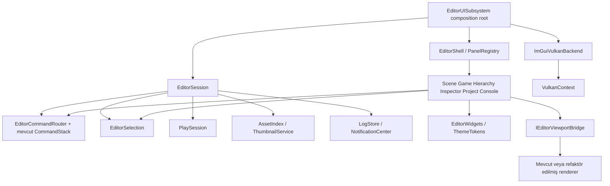

# AstralEditor — Prowl referanslı mimari ve görsel tasarım

Tarih: 2026-09-11. Durum: uygulanmak üzere hazırlanmış tasarım; bu oturumda yalnız doküman üretildi.

Kaynak araştırması: [PROWL_EDITOR_RESEARCH.md](PROWL_EDITOR_RESEARCH.md). Görev rehberi: [EDITOR_REFACTOR_IMPLEMENTATION_PLAN.md](EDITOR_REFACTOR_IMPLEMENTATION_PLAN.md). Renderer entegrasyon kaynağı: [RENDER_REFACTOR_IMPLEMENTATION_PLAN.md](RENDER_REFACTOR_IMPLEMENTATION_PLAN.md).

## 1. Hedef ve kapsam

Hedef, kullanıcının Prowl ekran görüntüsündeki büyük viewport, sağ hierarchy/inspector, alt project/console, kompakt toolbar ve tutarlı property alanlarını Astral'a çok yakın bir görsel düzenle taşımaktır. Mevcut motor C++20/Vulkan/ImGui kalır. UI görünümü, etkileşimleri ve bakım sınırları birlikte yeniden tasarlanır.

Teslim kapsamı: editor shell, docking/layout persistence, tema/font/ikon sistemi, ortak widgets, command/shortcut routing, selection, Inspector transaction, hierarchy, project/thumbnail, console/status/toast, Scene/Game view, play/pause/step, preferences ve test altyapısı.

Mesh/skinned mesh renderer, animation, C# scripting/hot reload, prefab sistemi, model import pipeline, terrain ve yeni fizik component'leri bu editör refaktörünün uygulanmış özelliği sayılmaz. Bunların Prowl görünümünde olması Astral'da hazır oldukları anlamına gelmez. Unsupported tipler dürüst bir açıklama/ikon ile sunulur; görünür ama çalışmayan sahte buton üretilmez.

Görsel yakınlık hedefi panel düzeni ve kontrol dilidir; Prowl markası ve YouTube sahnesindeki dış asset'ler kopyalanmaz. Doğrudan alınacak açık kaynak kodu/ikon/font için kaynak ve lisans kaydı tutulur.

## 2. Tasarım seçenekleri ve karar

| Seçenek | Kazanç | Maliyet | Karar |
|---|---|---|---|
| Mevcut ImGui üzerine tasarım sistemi + modüler editor services | Mevcut Vulkan/ImGuizmo/test yatırımını korur; hızlı doğrulanır | Özel widget ve layout disiplini gerekir | Seçilen yaklaşım |
| Prowl Paper/Origami arayüzünü port et | Kaynağa daha yakın UI altyapısı | C#/.NET ve rendering entegrasyonu, geniş yeniden yazım | Bu çalışma için gereksiz |
| Qt/web tabanlı yeni shell | Farklı widget ekosistemi | Input, viewport, paketleme ve yaşam döngüsü yeniden entegrasyonu | Görsel hedef için zorunlu değil |

SRP: Panel çizim, session oturum, command mutation, backend GPU UI kaynakları, asset index disk modelini yönetir. DRY: Ortak buton/property/search/layout token'ları tek kaynaktan kullanılır. DIP: Panel geniş Application/SDFRenderer erişimi yerine ihtiyacı olan dar servisi alır. YAGNI: Genel plugin sistemi veya ikinci event bus kurulmaz.

## 3. Görsel tasarım sözleşmesi

### 3.1 Varsayılan yerleşim

Oranlar Prowl kaynaklarındaki varsayılan layout'a dayanır; piksel ölçüleri aşağıda Astral için öneridir.

```text
┌ Menüler ─────────────── [Play Pause Step] ─── FPS · Proje · Ayarlar ┐
├────────────────────────────────────────────────┬──────────────────┤
│ Scene | Game                                   │ Hierarchy        │
│                                                │ Search           │
│ Büyük sahne alanı       sağ üst orientation     │ Entity list      │
│ Sol tool rail                                  ├──────────────────┤
│                                                │ Inspector        │
├───────────────────────────────┬────────────────┤ Object header    │
│ Project                       │ Console        │ Transform        │
│ Tree | Breadcrumb + Grid      │ Filters + Rows │ SDF / Components │
└───────────────────────────────┴────────────────┴──────────────────┘
  Status: son log · hata sayısı · scene · bellek · backend
```

- Ana içerik: sol %80, sağ %20.
- Sol içerik: viewport %70 yükseklik, alt dock %30.
- Alt dock: Project %65 genişlik, Console %35.
- Sağ: Hierarchy %30 yükseklik, Inspector %70.
- 1920×1080 referans; 1366×768 dar ekran alternatifi. Başlık/taskbar alanları karşılaştırma ROI'sine katılmaz.
- Inspector minimum 280 logical px, Project 280, Console 240, viewport 480×280 hedef minimumu. Sığmıyorsa alt paneller sekmeli hale gelir; Inspector kontrolleri üst üste geçebilir. Negatif/1px genişlikte sahte alan oluşturulmaz.
- Kayıtlı kullanıcı layout'u varsa varsayılan oranlar her açılışta zorlanmaz. Reset Layout açık komuttur.
- Panel başlığı çeviriden bağımsız kimlik taşır: `Scene###astral.scene`, `Hierarchy###astral.hierarchy` gibi. Türkçe dilde başlık değişse de layout kaybolmaz.

### 3.2 Renk ve ölçü token'ları

Bunlar Prowl kaynağından birebir çıkarılmış değerler değil, ekran referansına yakın Astral başlangıç önerileridir. Uygulama sırasında screenshot review ile tek token dosyasında ayarlanır.

| Semantic token | Öneri | Kullanım |
|---|---|---|
| Canvas | #141A1E | Dış zemin |
| Panel | #20292B | Panel içi |
| Raised | #2D373C | Tab/toolbar/header |
| Input | #0D141F | Property/search alanı |
| Border | #46535E | İnce ayırıcı |
| Text | #E9F0F4 | Ana metin |
| Muted | #A3B0BA | İkincil metin |
| Accent | #B7EAF7 | Focus/seçim vurgu |
| Selection | #D7F5FC | Aktif hierarchy satırı; koyu foreground |
| Success / Warning / Error | #76D3A5 / #F2C76A / #F07C85 | Durum, yalnız renge dayanmayan ikonla |

| Ölçü | Logical px @100% |
|---|---|
| Menü/transport satırı | 32 |
| Tab yüksekliği | 24 |
| Row / input yüksekliği | 24 / 22 |
| Status bar | 22 |
| Spacing ölçeği | 2, 4, 6, 8, 12, 16 |
| Splitter | 4 |
| Input radius / panel radius | 3 / 4 |
| İnce çerçeve | 1 |
| UI metni | 14; başlık 14 semibold; log 12–13 mono |
| İkon | 14–16; hit target en az 24×24 |

Yazı ailesi: lisansı paketlenmiş Geist veya aynı ölçü rolünde doğrulanmış font; log/numerik kolon için JetBrains Mono seçilebilir. Unicode Türkçe glyph set'i test edilir. Windows sistem fontuna bağlı fallback dağıtımın tek stratejisi olmaz. Renkler ve ölçüler panel içinde hard-code edilmez.

DPI: logical ölçü × platform content scale × kullanıcı ölçeği. Font atlası ve style aynı katsayıdan üretilir; her kare `ScaleAllSizes` çağrısıyla birikimli büyüme yapılmaz. 100%, 150%, 200% test edilir. Aktif focus ring okunur; selection üstünde açık metin kullanılmaz.

### 3.3 Etkileşim dili

- IconButton: tooltip, disabled reason, aktif/toggle hali, klavye focus aynı helper'dan.
- Inspector: label/control kolonları, X/Y/Z ayrımı, sürükleme + Ctrl giriş + reset; multi-selection mixed değer için `—` gösterimi. İlgili olmayan eksen değerleri korunur.
- Component header: açık/kapalı, enable checkbox, reset/remove context menu. Bileşen kaldırma undo'lanır.
- Hierarchy: seçim tüm satırda; expand oku seçimden ayrı hit alanı; arama ancestor yolunu korur; rename Enter commit/Escape cancel.
- Project: breadcrumb, back/forward, tree/grid, thumbnail size; asset type ikonları tutarlı.
- Console: severity ikon/sayaç, collapse, arama, copy, seçili mesaj detayları. Log text format string olarak yorumlanmaz.
- Toast: layout kaydedildi gibi kısa onay; hata detayını Console'a bağlar. Aynı başarı bildirimi her kare tekrarlanmaz.
- Motion: focus/hover 80–120 ms önerisi, reduced-motion seçeneğinde kapalı. Arka plan animasyonu varsayılan kapalı; viewport dikkati korunur.

## 4. Hedef modüller ve sahiplik



| Modül | Sahip olduğu | Sahip olmadığı |
|---|---|---|
| EditorUISubsystem | Başlatma/durdurma ve runtime event adaptörleri | Widget iç ayrıntıları |
| EditorSession | Proje/authoring scene referansı, selection, command services | ImGui context/GPU device |
| ImGuiVulkanBackend | ImGui context, backend init/shutdown, UI descriptors | Scene mutation, panel state |
| EditorShell | Menü/transport/status ve açık panel örnekleri | Asset tarama, undo algoritması |
| PanelRegistry | Sabit ID → panel factory; instance yaşamı | Global static state |
| LayoutStore | Versiyonlu kullanıcı layout'u ve panel UI state | Runtime play snapshot |
| EditorCommandRouter | Command metadata, canExecute, dispatch | GPU kaynakları |
| ShortcutRouter | Context önceliği ve key binding | Ayrı komut davranışı |
| EditTransaction | Before/preview/after, cancel/commit | Yeni undo stack |
| PropertyRegistry | Component/property schema ve typed callbacks | Runtime RTTI taramasıyla plugin keşfi |
| EditorSelection | Scene-safe entity veya asset selection | Sahne sahipliği |
| PlaySession | Edit/Playing/Paused state, authoring/runtime geçişi | View çizimi |
| AssetIndex | UUID/path/type/revision snapshot | Panel piksel düzeni |
| ThumbnailService | Job queue, generation cache, GPU lease | Scene authoring state |
| LogStore | Bounded kayıt ve ingest queue | Panel filtre state'i |
| ViewportBridge | View request/result, texture lease, pick token adaptörü | Toolbar çizimi |

Ömür: VulkanContext > ImGuiVulkanBackend/renderer kaynakları; EditorSession > panellerin servis referansları; panel kapanışı tüm abonelikleri kaldırır. Thread worker'ları yalnız kopyalanabilir sonuç üretir; UI/ECS/ImGui/GPU nesnesini worker'da değiştirmez.

## 5. Hedef dosya haritası

Yeni editör dosyalarında public header kökü `tools/AstralEditor/include/Astral/Editor`, implementation kökü `tools/AstralEditor/src` olur. Aşağıdaki her `.hpp` için aynı alt dizinde `.cpp` karşılığı yalnız implementation gerektiren sınıfta açılır.

| Yol | Rol |
|---|---|
| `Backend/ImGuiVulkanBackend.hpp` | Mevcut EditorUI backend kodunun sahibi |
| `Core/EditorSession.hpp` | Açık oturum state'i |
| `Core/EditorCommandRouter.hpp`, `Core/ShortcutRouter.hpp` | Tek eylem yolu |
| `Core/EditTransaction.hpp`, `Core/EditorSelection.hpp` | Düzenleme ve seçimin kimlikli state'i |
| `Core/PlaySession.hpp` | Runtime clone/restore/pause/step |
| `Shell/EditorShell.hpp`, `Shell/PanelRegistry.hpp`, `Shell/LayoutStore.hpp` | Pencere düzeni ve panel örnekleri |
| `UI/ThemeTokens.hpp`, `UI/EditorWidgets.hpp`, `UI/EditorIcons.hpp` | Tek tasarım sistemi |
| `Inspector/PropertyRegistry.hpp`, `Inspector/PropertyDrawers.hpp` | Typed inspector |
| `Assets/AssetIndex.hpp`, `Assets/ThumbnailService.hpp` | Çizim dışı asset işi |
| `Diagnostics/LogStore.hpp`, `Diagnostics/NotificationCenter.hpp` | Console/status veri kaynağı |
| `Viewport/IEditorViewportBridge.hpp`, `Viewport/EditorViewportBridge.hpp` | Renderer uyum katmanı |
| `Viewport/EditorCameraController.hpp` | Authoring kamera kontrolü |
| `Panels/GameViewPanel.hpp`, `Panels/ConsolePanel.hpp`, `Panels/PreferencesPanel.hpp` | Eksik bağımsız paneller |

Mevcut `Panels/ViewportPanel` Scene view rolüne daralır; `SceneHierarchy`, `Inspector`, `ContentBrowser` dosyaları yerinde refaktör edilir. `SelectionContext`, `TransformGizmo`, `GizmoState`, `CommandStack` değerli mevcut davranışı taşır; adaptörle geçirilir, aynı işi yapan ikinci sistem kalıcı bırakılmaz.

## 6. Temel sözleşmeler

### 6.1 Kimlik ve command

`EditorEntityKey = { sceneInstance, entity UUID }`. Raw `Entity*`, component pointer veya sıra index'i undo/history/layout'a yazılmaz. Entity çözümleme her Execute/Undo anında doğrulanır. Asset selection UUID taşır; entity ve asset seçimleri aynı anda Inspector'a belirsiz hedef vermez.

Command ID örnekleri: `scene.save`, `edit.undo`, `edit.redo`, `entity.delete`, `entity.duplicate`, `play.start`, `play.pause`, `play.stop`, `play.step`, `layout.reset`, `view.frameSelection`. Menü/toolbar/shortcut aynı ID'yi dispatch eder. `CanExecute` hem UI disabled görünümünde hem gerçek execute anında kontrol edilir.

Transaction: Begin ile before alınır; Preview yalnız geçici değeri uygular; Commit değişiklik varsa tek ICommand üretir; Cancel before'u geri yükler. Component/entity kaybolduysa çözümleme başarısız olur ve diagnostic verilir; dangling pointer kullanılmaz. Multi-edit tek composite command'dir.

### 6.2 Input önceliği

1. Modal/dialog.
2. Aktif text edit / property drag.
3. Aktif gizmo drag.
4. Focus'lu Scene kamera veya Game input.
5. Focus'lu panel kısayolları.
6. Global command.

Bir fiziksel key event aynı karede iki kez çalışmaz. Text girerken Delete entity silmez; Ctrl+Z text edit önceliğini korur. Game input yalnız Game içerik rect'i focus'lu ve capture koşulu sağlanmışsa runtime'a gider. Gizmo veya toolbar tıklaması picking'e geçmez.

### 6.3 Viewport / renderer kontratı

Scene view editor kamerası, Game view active runtime kamerası kullanır. Editor kamera sahne entity'sine yazılmaz. View kimliği sabittir; kamera veya view değişiminde yanlış temporal history kullanılmaz.

Bridge dönüşü: imageView/sampler/extent yanında `viewId`, `generation`, `frameSerial`, `completion` veya release protokolü taşır. Panel raw GPU handle'ın ömrünü varsaymaz. ImGui texture kayıtları generation ile cache'lenir; GPU tüketimi bitmeden serbest bırakılmaz.

Render planındaki G05/G14/G15/G16 ile bağ: RAII targets, slot kaynakları, tamamlanan picking, güvenli resize. Render refaktörü uygulanmamışsa bridge eski senkron API'yi adapte eder. İki view için aynı singleton history'yi arka arkaya kullanmak kabul edilmez; başlangıçta aynı dock grubunda tek aktif view çizilir, geçişte history reset yapılır. Eşzamanlı Scene/Game açmak istenirse ayrı view-scoped history ve target sahipliği zorunlu ek görevdir.

Grid/orientation gizmo/selection outline editor overlay'dir. Game çıktısına karışmaz. Orientation widget ilk aşamada ImGui çizimi olabilir; dünya grid'i için kamera doğru projection ve depth davranışı gerekir. Sabit ekran çizgileri dünya grid'i diye sunulmaz.

### 6.4 Asset ve thumbnail

Mevcut AssetManager .meta/UUID kaynağıdır. Yeni AssetIndex bunun editor read model'i; ikinci UUID sistemi değildir. Rescan/change-event, revision üretir; UI immutable snapshot okur. Draw içinde directory_iterator, disk decode veya sorting yoktur.

Thumbnail key: asset UUID + source revision + preview config revision + thumbnail size. Cache bounded LRU; görünür öğe önceliği. Scene/project kapanışı job generation'ını geçersiz kılar. CPU decode worker'da; GPU upload ve descriptor lifecycle render thread kurallarına uyar. İlk kapsam mevcut desteklenen resim/env/scene tipleri ve ikon fallback'leri; mesh desteği olmayan motora mesh thumbnail renderer eklenmez.

### 6.5 Layout, settings ve play

Proje başına kullanıcı state'i: `.astral/editor/layout.ini` ve `state.json` önerisi; repo ignore kuralı ayrıca gözden geçirilir. `state.json` şema sürümü, stable panel ID, panel filtreleri ve editor camera içerir. Settings global kullanıcı tercihleriyle proje layout'unu ayırır. Yarım yazım temp+replace ile önlenir; bozuk layout fallback yapar ve Console'a anlaşılır uyarı yazar.

PlaySession mevcut clone/restore davranışını korur. Play/Pause/Stop/Step command'ları tek state machine'den geçer. Step yalnız Paused'da tam bir belirlenmiş simulation adımıdır; repaint veya UI frame'i step sayılmaz. Authoring undo ve layout runtime clone ile kirlenmez. İlk geçişte mevcut history temizleme politikası korunur; authoring history korunacak değişiklik ayrı test/commit ile yapılır.

## 7. Performans ve görsel kabul

- UI çizimi içinde filesystem taraması, shader compile, font atlas rebuild veya synchronous thumbnail readback bulunmaz.
- Büyük listelerde görünür satır/item çizimi; filtre/sort yalnız source revision veya query değişince yeniden hesaplanır.
- Ölçüm hedefi: warm cache'te 10.000 hierarchy kaydı + 10.000 asset metadata + 5.000 console girdisinde editor UI CPU p95 ≤4 ms referans donanımda. Bu hedef henüz ölçülmemiştir; test koşulları raporlanır.
- Thumbnail GPU bütçesi görünür renderer'ı aç bırakmaz; frame başı en fazla 1 iş başlangıç üst sınırı, ayrıca süre/queue limiti. Pahalı işi frame'e sıkıştırmak yerine asenkron completion gerekir.
- 1920×1080 ve 1366×768; %100/%150/%200 DPI: yazılar kesilmiyor, hiçbir kontrol çakışmıyor, Inspector dar yerleşimde kullanılabilir.
- Sabit fixture UI screenshot'ında panel oranları toleransı ±2 yüzde puanı; 1 logical px çerçeveler tutarlı. Bu tolerans yeni öneridir.
- Prowl ekranındaki farklı 3D sahne nedeniyle tam resim SSIM skoru ana kabul değildir. Chrome/paneller ayrı ROI, typography ve alignment review; Astral scene renderer için kendi sabit baseline'ı kullanılır.
- Empty, loading, missing asset, error, disabled ve mixed-value durumları tasarım sisteminin parçasıdır.

## 8. Bilinçli sınırlar ve kabul kapıları

Kapı A: Session/command/backend ayrımı ve mevcut test eşdeğerliği.
Kapı B: Prowl yerleşimi, tema ve ana panel etkileşimleri; screenshot kanıtı.
Kapı C: Asset/console cache ve view lifecycle; CPU/GPU doğruluk.
Kapı D: Uçtan uca authoring akışı, DPI ve performans raporu; doküman güncelliği.

Hiçbir kapı yalnız dosya sayısı veya sınıf isimleriyle geçilmez. Mevcut kullanıcı değişiklikleri korunur; uygulayıcı belgeyi izlerken render planındaki diğer ajanın dosyalarını aynı anda değiştirmez. Detaylı görev ve devir metni uygulama rehberindedir.
