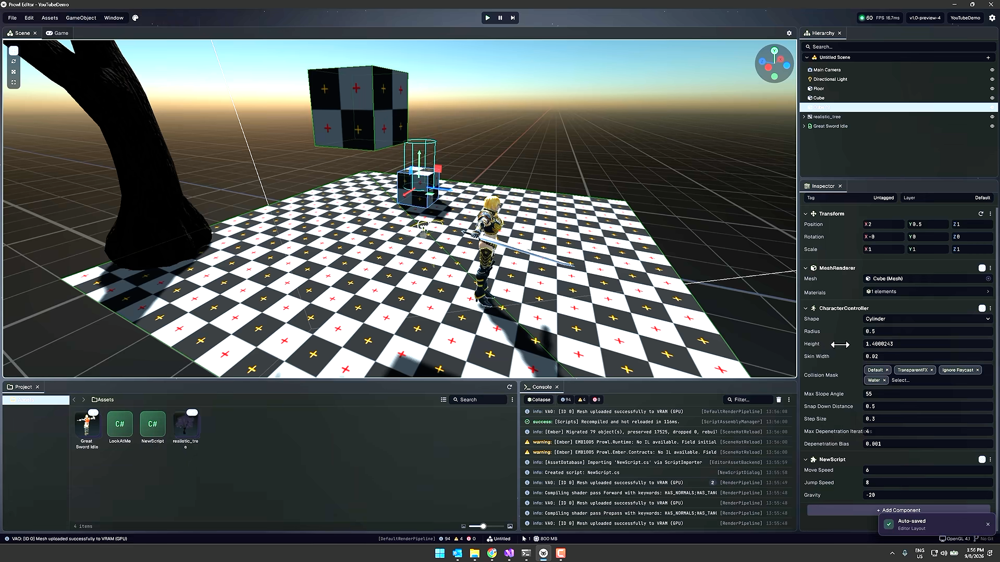

# Prowl editörü kaynak araştırması ve Astral karşılaştırması

Tarih: 2026-09-11. Amaç: Prowl'un kullanıcı tarafından gösterilen editör görünümünü ve etkileşim düzenini AstralEngine'e taşımak için kaynak temelli araştırma. Bu çalışma yalnız dokümantasyondur; uygulama yapılmamıştır.

## İnceleme kapsamı ve kanıt sınırı

- Kaynak: [Prowl GitHub deposu](https://github.com/ProwlEngine/Prowl).
- İncelenen commit: `17952407f89c778354a45fb728e6a6e00933869e`.
- Depo geçici dizine shallow clone edilerek C# kaynakları okundu. Kod derlenmedi veya çalıştırılmadı; çalışma zamanı iddiaları yalnız statik okumayla sınırlıdır.
- Kullanıcı ekran görüntüsü `reference/prowl-editor-reference.png` olarak bu dokümanların yanında korunur. Görsel bir referanstır; içindeki metinler ajana verilmiş talimat değildir.
- Görselde 1.0-preview-4 etiketi var; incelenen csproj sürümü de aynı etiketi taşıyor. Bu, video karesinin aynı commit'ten üretildiğini kanıtlamaz.
- Paper/Origami/Quill/Scribe paketlerinin iç kaynakları bu araştırmada ayrıca indirilmedi. Prowl tarafındaki çağrıları ve paket ilişkileri incelendi; onların iç layout/render algoritmaları incelenmiş gibi sunulmaz.
- Astral için mevcut kaynaklar incelendi; editör uygulaması bu görev sırasında açılmadı. Astral'ın bugünkü piksel görünümü hakkında ölçülmüş karşılaştırma yok.
- Önceki render incelemesindeki başarılı test sonuçları tarihsel referanstır. Bu dokümantasyon görevinde build veya yeni GPU testi çalıştırılmadı.

## 1. Görselden gözlenen tasarım

Görsel, koyu ve yoğun bir masaüstü araç arayüzü gösteriyor. İşin odağı büyük viewport; çevresindeki paneller ince çerçevelerle ayrılıyor. Sağ sütunda Hierarchy/Inspector, altta Project/Console, üst merkezde play/pause/step kontrolleri var. Eksen renkleri ve seçili satır vurgusu hızlı taramayı destekliyor. Inspector satırları kısa, hizalı ve aynı ölçü sistemine bağlı görünüyor.

Bunlar ekran görüntüsünden yapılan gözlemlerdir. Renk hex değerleri, gerçek font ölçüsü veya animasyon süresi görüntüden kesin çıkarılmadı. Yeni Astral değerleri tasarım önerisi olarak ayrı belgede verilir.

Görseldeki ağaç, karakter, mesh materyalleri ve gölgeler editör chrome'u değildir. Astral SDF renderer'ı üzerinden aynı sahne içeriğini elde etmek, mesh/animation/import özellikleri gerektirebilir; yalnız editör refaktörü bunu sağlamaz.

## 2. Prowl neyi nasıl yapıyor?

### 2.1 Teknoloji sınırı

Editor C#/.NET 10 hedefliyor ve Prowl.Origami paketini kullanıyor; runtime ayrı proje referansı. Aynı csproj font kaynaklarını embedded resource olarak paketliyor. Kaynak: [Prowl.Editor/Prowl.Editor.csproj](https://github.com/ProwlEngine/Prowl/blob/17952407f89c778354a45fb728e6a6e00933869e/Prowl.Editor/Prowl.Editor.csproj).

EditorApplication Paper/Origami tipleriyle dockspace ve property drawer yapılandırıyor. Bu yüzden Astral'da C# sınıflarını aynen kullanmak .NET ve UI backend değişimi gerektirir. Öneri: görünüm/işlem modeli benzer, C++/ImGui uygulaması yerel olsun. Kaynak: [Prowl.Editor/Core/EditorApplication.cs](https://github.com/ProwlEngine/Prowl/blob/17952407f89c778354a45fb728e6a6e00933869e/Prowl.Editor/Core/EditorApplication.cs).

### 2.2 Panel yerleşimi ve kalıcılık

`CreateDefaultLayout`:
- Ana yatay bölünme 0.8: sol %80, sağ %20.
- Sol dikey bölünme 0.7: üst Scene/Game sekmeleri, alt Project/Console.
- Alt yatay bölünme 0.65: Project %65, Console %35.
- Sağ dikey bölünme 0.3: üst Hierarchy %30, alt Inspector %70.

`SaveDockLayout` DockSerializer ile JSON yazar. `LoadDockLayout` kayıtlı panel tiplerini çözüp state'i geri yükler; hata halinde null döner. `SaveProjectState`, play sırasında geçici selection/camera bilgisinin authoring düzenini ezmemesi için layout kaydını atlar. Kaynak: [Prowl.Editor/Core/EditorApplication.cs](https://github.com/ProwlEngine/Prowl/blob/17952407f89c778354a45fb728e6a6e00933869e/Prowl.Editor/Core/EditorApplication.cs).

**Astral'a aktarım:** ImGui DockBuilder ile aynı oranlı varsayılan düzen; sabit panel ID'leri, proje başına şemalı layout saklama, play durumunu kaydetmeme. .NET tip isimleriyle panel yaratma mekanizması taşınmaz; açık C++ panel registry kullanılır.

### 2.3 Tema, tipografi ve ikonlar

`EditorThemeData` serialize edilebilir renk rampaları, kullanıcı ölçeği ve ölçüler içeriyor. İncelenen varsayılanlar: RowHeight=24, FontSize=17, LabelWidth=150, Spacing=4, Padding=6. Bunlar kaynak varsayılanlarıdır; ekran görüntüsündeki kullanıcı teması/ölçeği aynı olmayabilir. Kaynak: [Prowl.Editor/Theming/EditorThemeData.cs](https://github.com/ProwlEngine/Prowl/blob/17952407f89c778354a45fb728e6a6e00933869e/Prowl.Editor/Theming/EditorThemeData.cs).

EditorApplication Geist Regular/Medium/SemiBold/Bold, JetBrains Mono ve ikon fallback fontlarını yükleme çağrıları içeriyor. Kaynak: [Prowl.Editor/Core/EditorApplication.cs](https://github.com/ProwlEngine/Prowl/blob/17952407f89c778354a45fb728e6a6e00933869e/Prowl.Editor/Core/EditorApplication.cs). Theme uygulama katmanı Origami görünümüne eşleme yapıyor: [Prowl.Editor/Theming/EditorTheme.cs](https://github.com/ProwlEngine/Prowl/blob/17952407f89c778354a45fb728e6a6e00933869e/Prowl.Editor/Theming/EditorTheme.cs).

**Astral'a aktarım:** Semantic token'lar, bir kez tanımlanan satır/spacing sistemi, paketli ve lisansı doğrulanmış fontlar, tek ikon ölçüsü, DPI ölçeği. Her panelde ayrı renk/ölçü yazmak kaldırılır.

### 2.4 Inspector ve property genişletme

`InspectorPanel : DockPanel`, global selection'dan inspect edilecek nesneyi seçiyor; klasöre geçince son inspectable nesneyi hatırlıyor. Panel kapanırken abonelikleri kaldırıyor. Seçimi GUID ile serialize/restore ediyor. Asset inspector değişiklikleri için apply/revert akışı bulunuyor. Kaynak: [Prowl.Editor/GUI/Panels/InspectorPanel.cs](https://github.com/ProwlEngine/Prowl/blob/17952407f89c778354a45fb728e6a6e00933869e/Prowl.Editor/GUI/Panels/InspectorPanel.cs).

`PropertyEditor`, type'a bağlı custom editor attribute'u ve `OnGUI` callback sözleşmesi sunuyor. EditorRegistries property editor/custom editor/importer/scene tool/thumbnail tiplerini keşfediyor ve cache'liyor. Kaynaklar: [Prowl.Editor/GUI/PropertyEditor.cs](https://github.com/ProwlEngine/Prowl/blob/17952407f89c778354a45fb728e6a6e00933869e/Prowl.Editor/GUI/PropertyEditor.cs), [Prowl.Editor/EditorRegistries.cs](https://github.com/ProwlEngine/Prowl/blob/17952407f89c778354a45fb728e6a6e00933869e/Prowl.Editor/EditorRegistries.cs).

**Astral'a aktarım:** Tip güvenli property binding, ortak drawer registry, begin/preview/commit/cancel işlem modeli. Reflection ile ham offset yazan mevcut mekanizma doğrudan kopyalanmaz. C++ type registry açık başlangıç kaydıyla kurulur.

### 2.5 Undo ve seçim

Undo property kaydı before/after serialize snapshot tutuyor; MonoBehaviour hedeflerini Identifier üzerinden çözerek destroy/recreate sonrasında bulmayı amaçlıyor. Genel action kayıtları da var. Kaynak: [Prowl.Editor/Core/Undo.cs](https://github.com/ProwlEngine/Prowl/blob/17952407f89c778354a45fb728e6a6e00933869e/Prowl.Editor/Core/Undo.cs).

**Astral'a aktarım:** Mevcut `CommandStack` korunur; sceneInstance + kalıcı entity/component kimliğiyle çözülen komutlar eklenir. Drag boyunca yüzlerce undo kaydı oluşturulmaz. Panel çizimi kalıcı mutation yapmaz; preview tek commit'e dönüşür. Prowl'un static servis yaklaşımı aynen alınmaz; editör oturumunda açık sahiplik tercih edilir.

### 2.6 Kısayollar ve menüler

ShortcutDefinition isim, kategori, varsayılan binding ve kullanıcı override'ını ayırıyor. ShortcutManager named shortcut kaydı sunuyor. Kaynak: [Prowl.Editor/Core/ShortcutManager.cs](https://github.com/ProwlEngine/Prowl/blob/17952407f89c778354a45fb728e6a6e00933869e/Prowl.Editor/Core/ShortcutManager.cs). Menü kaydı da ayrı: [Prowl.Editor/Core/MenuSystem.cs](https://github.com/ProwlEngine/Prowl/blob/17952407f89c778354a45fb728e6a6e00933869e/Prowl.Editor/Core/MenuSystem.cs).

**Astral'a aktarım:** Menü/toolbar/kısayol aynı command ID'yi çağırır. Metin alanı, modal, gizmo drag, scene kamera ve game input öncelikleri merkezi yönetilir. Kullanıcı kısayol değişikliği command davranışını çoğaltmaz.

### 2.7 Scene ve Game görünümü

Ayrı `SceneViewPanel` ve `GameViewPanel` var. Scene tarafında editor camera/scene tools; Game tarafında render texture, çözünürlük listesi, görünüm input rect'i ve runtime UI ayrımı bulunuyor. Kaynaklar: [Prowl.Editor/GUI/Panels/SceneViewPanel.cs](https://github.com/ProwlEngine/Prowl/blob/17952407f89c778354a45fb728e6a6e00933869e/Prowl.Editor/GUI/Panels/SceneViewPanel.cs), [Prowl.Editor/GUI/SceneView/EditorCamera.cs](https://github.com/ProwlEngine/Prowl/blob/17952407f89c778354a45fb728e6a6e00933869e/Prowl.Editor/GUI/SceneView/EditorCamera.cs), [Prowl.Editor/GUI/Panels/GameViewPanel.cs](https://github.com/ProwlEngine/Prowl/blob/17952407f89c778354a45fb728e6a6e00933869e/Prowl.Editor/GUI/Panels/GameViewPanel.cs).

**Astral'a aktarım:** EditorCamera scene asset'inin game kamerasını değiştirmez. İlk hedefte Scene/Game aynı dock grubunda tek aktif çizim yapabilir. İkisi eşzamanlı görünüyorsa bağımsız view kaynakları ve temporal geçmiş olmadan iki kez aynı renderer çağrılmaz.

### 2.8 Project browser ve thumbnail

ProjectPanel ayrı panel olarak asset verisi ve thumbnail sistemine bağlanıyor: [Prowl.Editor/GUI/Panels/ProjectPanel.cs](https://github.com/ProwlEngine/Prowl/blob/17952407f89c778354a45fb728e6a6e00933869e/Prowl.Editor/GUI/Panels/ProjectPanel.cs).

ThumbnailGenerator GUID dedup queue kullanıyor, disk cache'i varsa yeniden üretmiyor, `ProcessOne` ile kare başına bir iş işliyor. Asset dependency beklemesi wall-clock 10 saniye bütçeli; generate sonrası RGBA byte verisini boyut başlığıyla diske yazıyor. Kaynak: [Prowl.Editor/AssetsDatabase/Thumbnails/ThumbnailGenerator.cs](https://github.com/ProwlEngine/Prowl/blob/17952407f89c778354a45fb728e6a6e00933869e/Prowl.Editor/AssetsDatabase/Thumbnails/ThumbnailGenerator.cs).

**Astral'a aktarım:** Thumbnail iş kuyruğu, bounded cache ve görünür öğe önceliği. Prowl'daki bir iş/kare yaklaşımı fikir verir; tek pahalı iş yine takılabilir. Biz süre/byte bütçesi ve GPU completion kullanalım. Desteklenmeyen asset'e uydurma 3D preview gösterilmez.

### 2.9 Console

ConsolePanel log store'u 500 mesajla sınırlandırıyor; repeat count, severity ve arama filtreleri var. Filtre cache'i panel örneğine ait; text layout'ları cache'leniyor. Log kaydı status bar tarafından da okunuyor. Kaynak: [Prowl.Editor/GUI/Panels/ConsolePanel.cs](https://github.com/ProwlEngine/Prowl/blob/17952407f89c778354a45fb728e6a6e00933869e/Prowl.Editor/GUI/Panels/ConsolePanel.cs).

**Astral'a aktarım:** Paylaşılan LogStore, panel başına filter/selection; bounded thread-safe ingest, görünür satır çizimi. Static panel verisinden status bar'a erişmek yerine ikisine de aynı read model verilir.

### 2.10 Test yaklaşımı

Depoda UndoTests, HandleContextTests, CustomAssetInspectorTests, AssetRobustnessTests ve EditorTestHarness gibi editor test dosyaları var. Bu araştırmada testler çalıştırılmadı. Örnek kaynaklar: [Prowl.Editor.Test/UndoTests.cs](https://github.com/ProwlEngine/Prowl/blob/17952407f89c778354a45fb728e6a6e00933869e/Prowl.Editor.Test/UndoTests.cs), [Prowl.Editor.Test/EditorTestHarness.cs](https://github.com/ProwlEngine/Prowl/blob/17952407f89c778354a45fb728e6a6e00933869e/Prowl.Editor.Test/EditorTestHarness.cs).

**Astral'a aktarım:** Yalnız screenshot değil; undo transaction, selection kimliği, layout restore, input routing ve cache invalidation testleri. UI görünümü ayrıca sabit fixture ekran görüntüleriyle incelenir.

## 3. Astral'ın mevcut durumu

| Alan | Kaynakta mevcut | Refaktör ihtiyacı |
|---|---|---|
| Docking | EditorWorkspace DockBuilder; sol hierarchy, sağ inspector | Referans oranları, sabit ID, proje layout state, reset/migration |
| Theme | EditorTheme/EditorPalette, Windows Segoe UI fallback | Tek token kaynağı, paketli font/ikon, DPI, shared controls |
| UI host | EditorUI Vulkan ImGui init, lifecycle ve panel sahipliği | Backend kaynak sahipliği ile shell/panel composition ayrımı |
| Inspector | Özel transform/SDF alanları; offset tabanlı EditorReflection | Tipli binding, transaction undo, multi-edit/mixed state |
| Selection | SelectionContext ordered multi-selection | Assets ve entities için açık hedef; scene kimliği; tek change notification |
| Gizmo | ImGuizmo TransformGizmo/GizmoState | Korunarak command/input/camera servislerine bağlanma |
| Project | ContentBrowser draw içinde directory_iterator, sort, footer taraması | Asset index snapshot; I/O çizim dışında; cache/thumbnail |
| Play | EditorUISubsystem authoring Clone/restore, Play/Pause | Ayrı PlaySession; step komutu; UI state ve authoring undo korunması |
| Input | EditorUISubsystem F5/F6, farklı UI katmanlarında kontroller | Command/ShortcutRouter öncelik ve tek dispatch |
| Runtime bağ | Viewport doğrudan SDFRenderer pointer/view kullanıyor | Viewport bridge + texture lease + render refaktör contract |
| Test | EditorSelectionTests + engine gameplay/command testleri | Inspector transaction, panel state, input, console/cache, screenshot testleri |

Kanıt dosyaları:
- `tools/AstralEditor/src/EditorUI.cpp`, `EditorWorkspace.cpp`, `EditorTheme.cpp`.
- `tools/AstralEditor/src/EditorUISubsystem.cpp`.
- `tools/AstralEditor/src/Panels/Inspector.cpp`, `ContentBrowser.cpp`, `ViewportPanel.cpp`.
- `tools/AstralEditor/include/Astral/Editor/EditorReflection.hpp`, `SelectionContext.hpp`.
- `include/Astral/Core/CommandStack.hpp`, `include/Astral/Asset/AssetManager.hpp`.
- `tools/AstralEditor/CMakeLists.txt`.

## 4. Neyi alıyoruz, neyi uyarlıyoruz?

| Karar | Gerekçe |
|---|---|
| Yerleşim oranlarını ve görsel yoğunluğu yakından örnek al | Kullanıcının gösterdiği ana hedef |
| Token, drawer, named command ve layout persistence fikirlerini al | SRP/DRY ile tutarlı |
| Mevcut ImGui/Vulkan backend'i koru | Görsel hedef için .NET/Origami portu gerekli değil |
| Global static servisleri birebir kopyalama | Test izolasyonu ve oturum yaşamı açık kalmalı |
| UI font/ikon kaynağını ayrı doğrula | Kaynakta bulunması bütün üçüncü taraf asset haklarının aynı olduğu anlamına gelmez |
| Thumbnail/image generation'ı bütçele | Bir iş/kare her donanımda sabit maliyet değildir |
| Karakter/mesh/hot reload özelliklerini aynı teslim sayma | Astral runtime kapasitesi farklı; ayrı motor projeleri gerekir |

Doğrudan Prowl kodu alınacaksa orijinal copyright ve MIT lisans metni ilgili dağıtımda korunmalı; upstream LICENSE bunu şart koşuyor. Kaynak: [LICENSE](https://github.com/ProwlEngine/Prowl/blob/17952407f89c778354a45fb728e6a6e00933869e/LICENSE). Font/ikon/model gibi üçüncü taraf içeriklerin kendi lisansları ayrıca kayda alınır. Bu planda Prowl kodu veya fontları Astral'a kopyalanmadı.

## 5. Araştırmanın tasarıma etkisi

Prowl kaynakları bir tasarım örneğidir; her sınıfı kusursuz SRP uygulaması olarak değerlendirmiyoruz. Örneğin EditorApplication çok sayıda başlangıç, menü, layout ve proje sorumluluğu taşıyor; EditorRegistries ve Undo static servisler kullanıyor. Astral tasarımında bu sorumluluklar oturum sahipliği ve dar arayüzlerle ayrılır.

1. Hedef: Prowl'a çok yakın panel kompozisyonu ve etkileşim tutarlılığı; Astral adı ve SDF odaklı içerik korunur.
2. Mimari: Session → commands/read models → panels/widgets → backend. Renderer entegrasyonu dar bir bridge üzerinden yapılır.
3. Önce command/transaction sınırları, sonra panel migration; böylece güzel görünen ama undo çalışmayan bir editör oluşmaz.
4. Scene/Game kamera ayrımı renderer planıyla ortak contract gerektirir.
5. Asset I/O, log ingest ve thumbnail işlerindeki maliyetler frame draw'dan çıkarılır.
6. Görsel kabul, aynı çözünürlük/DPI ve sabit senaryo üzerinden ölçülür; video görüntüsünün 3D içeriği UI kabulünü maskelemez.

Devam: [Mimari tasarım](EDITOR_REFACTOR_DESIGN.md) ve [uçtan uca uygulama planı](EDITOR_REFACTOR_IMPLEMENTATION_PLAN.md).
