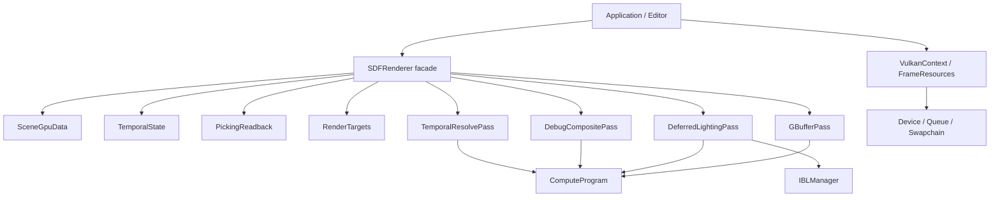

# AstralEngine Render Refaktörü — Uçtan Uca Uygulama Planı

> **Uygulayıcı AI ajanına:** Bu belge görev görev yürütülmek üzere hazırlanmıştır. Ortamında varsa `superpowers:executing-plans` becerisini kullan. Başka ajanlar görevlendirilecekse `superpowers:subagent-driven-development` uygulanabilir; eşzamanlı çalışma sınırları Bölüm 12'de tanımlıdır. İşaretlenmemiş kutular yapılacak işi gösterir, tamamlandığı anlamına gelmez.

**Amaç:** AstralEngine'in mevcut Vulkan deferred SDF renderer'ını görsel davranışı koruyarak SRP, DRY ve açık kaynak sahipliği esaslarıyla yeniden yapılandırmak; ölçülebilir CPU/GPU maliyetlerini azaltmak.

**Mimari:** İnce bir `SDFRenderer` dış cephesi; ayrı GPU kaynak sahipleri, sahne hazırlama, temporal durum, picking ve dört render aşaması kullanır. Sabit aşama sırası korunur. Önce davranış koruyan ayrıştırma, ardından ayrı değişiklikler halinde davranış düzeltmeleri ve performans optimizasyonları yapılır.

**Teknoloji:** C++20, Vulkan-Hpp, Vulkan, VMA, GLM, GLFW, GLSL compute shader'ları, CMake/Ninja, mevcut özel test çatısı. Editör ImGui/ImGuizmo kullanır; motor çekirdeği bunlara bağımlı yapılmaz.

**Tasarım kaynağı:** [RENDER_REFACTOR_DESIGN.md](RENDER_REFACTOR_DESIGN.md).

**Durum:** 2026-09-11 tarihinde yalnız inceleme ve planlama yapıldı. Bu belge hazırlanırken refaktör uygulanmadı. Aşağıdaki yeni dosya ve API adları hedef tasarımdır; mevcutmuş gibi kullanılmamalıdır.

## 1. Uygulama kuralları ve kapsam

1. İlk iş güncel `AGENTS.md`, bu belge, tasarım belgesi ve gerçek kaynak kodunu oku. Tarihî raporların kaynakla çeliştiği yerde kaynak ve çalıştırılmış test sonuçlarını esas al.
2. Çalışma ağacındaki kullanıcı değişikliklerini koru. İnceleme başlangıcında `WORK_PLAN.md` değiştirilmiş, `FINDINGS_VERIFICATION_REPORT.md` izlenmeyen dosyaydı. Bunları kendi değişikliğin sayma.
3. Kullanıcı bu oturumda yalnız dokümantasyon istedi. Bu belgeyi hazırlayan ajan uygulamaya başlamaz. Uygulayıcı ajan, kendisine verilen uygulama talebiyle çalışır.
4. Her görev bir bağımsız incelenebilir değişiklik üretir. Görev alt adımlarını sırayla yap; gereken test geçmeden bağımlı göreve geçme.
5. Bir sınıfı birkaç `.cpp` dosyasına bölmek tek başına mimari refaktör sayılmaz. Her modülün sorumluluğu, sahipliği ve bağımlılığı gerçekten ayrılmalıdır.
6. Global renderer servisleri, bütün iç durumu taşıyan ortak context, geniş `friend` erişimi, şablon metaprogramlama çatısı ve gereksiz sanal arayüzler ekleme.
7. Vulkan sürüm gereksinimini veya üçüncü taraf bağımlılık sürümlerini bu iş kapsamında yükseltme. C++20 ve mevcut derleme düzenini koru.
8. Yeni graphics backend, DLSS/FSR entegrasyonu, yeni GI algoritması, bindless rendering ve genel dinamik render graph bu planın kapsamında değildir. `IUpscaler` varlığı bu özelliklerin çalıştığı anlamına gelmez.
9. SDF/CSG değerlendirmesi, materyal paketleme, ışık modeli ve tonemap matematiğini mimari taşıma sırasında değiştirme.
10. Doğruluk sorunu bulunursa önce yeniden üreten test ekle; düzeltmeyi refaktörden ayrı değişiklik olarak kaydet. Sadece eski davranış diye bilinen hatayı kalıcılaştırma.
11. Test toleranslarını sonucu geçirmek amacıyla genişletme. Başlangıç görüntülerini güncelleyip regresyonu gizleme.
12. Ölçüm olmadan performans kazancı yüzdesi veya FPS artışı yazma. Modülerlik kazanımı ile hızlanmayı ayrı raporla.
13. Görevler için yalnız ilgili dosyaları stage et. Commit yapılacaksa önerilen sınırlar görev sonlarıdır; push/merge/deploy bu planın parçası değildir.

## 2. Başlangıç mimarisinin haritası

### 2.1 Gerçek kare akışı

```text
Application::Run
  ├─ gameplay / fixed simulation / transform
  ├─ RenderExtractionSubsystem → SDFSceneSnapshot + entity sırası
  ├─ ExtractActiveCamera + Halton jitter
  ├─ SDFRenderer::SetCamera
  ├─ SDFRenderer::UpdateEdits
  │    ├─ primitive SSBO
  │    ├─ önceki world transform SSBO
  │    └─ BrickGrid::Build
  ├─ VulkanContext::BeginFrameCommand
  ├─ SDFRenderer::Render
  │    ├─ kamera yoksa siyah çıktı
  │    ├─ GBuffer compute
  │    ├─ DeferredLighting veya DebugComposite compute
  │    └─ TAAResolve + tonemap + history ilerletme
  ├─ editör çizimi veya swapchain blit
  ├─ VulkanContext submit / present / fence bekleme
  └─ picking sonucunu entity sırasıyla eşleştirme
```

### 2.2 Kaynak rehberi

| Dosya / sembol | Neden okunmalı? |
|---|---|
| `include/Astral/Renderer/SDFRenderer.hpp` | Dış API ve bugün iç içe geçmiş tüm sahiplikler |
| `src/Renderer/SDFRenderer.cpp` | Görüntüler, pipeline/descriptor kurulumu, upload, pass kaydı, resize ve temporal politika |
| `include/Astral/Renderer/ComputePipeline.hpp` | GPU veri sözleşmeleri ve mevcut pipeline sınıfı aynı yerde |
| `src/Renderer/VulkanContext.cpp` | Submit/present, fence, timestamp, immediate komut ve device yaşamı |
| `include/Astral/Renderer/VulkanContext.hpp` | Tek komut tamponu/fence/query sahipliği; `VmaImage` yalnız ham handle sarmalayıcısı |
| `src/Renderer/Buffer.cpp` | Map, kopyalama, VMA/fallback ve bellek görünürlüğü |
| `src/Renderer/BrickGrid.cpp` | Mevcut incremental cell güncellemesi ve grid upload |
| `include/Astral/Renderer/SDFTemporalHistory.hpp` | Mevcut CPU temporal güven modeli; yeni durum makinesiyle karıştırma |
| `src/Geometry/SDFSceneSnapshot.cpp`, `src/Geometry/SDFChangeSet.cpp` | Kimlik, revision ve değişim bölgeleri |
| `src/Core/Application.cpp` | Upload/submit sırası, seçim çözümlemesi, renderer çağıran ana tüketici |
| `src/Core/Systems/RenderExtractionSubsystem.cpp` | Snapshot ve entity sırasının üretimi |
| `tools/AstralEditor/src/Panels/ViewportPanel.cpp` | Çıktı view kaydı, resize, seçim isteği; kaynak değiştirilirken güncellenmeli |
| `Tests/EngineTests/src/VisualQualityGpuTests.cpp` | Çıktı readback ve görsel kalite referansı |
| `Tests/EngineTests/src/CameraGpuTests.cpp` | Kamera geçişi ve görüntü kıyaslaması |
| `Tests/EngineTests/src/SDFContractGpuTests.cpp` | Picking ve depth readback doğruluğu |
| `AstralEngine/CMakeLists.txt`, `Tests/EngineTests/CMakeLists.txt` | Kaynak ve test kayıtları; yeni `.cpp` otomatik eklenmez |

### 2.3 Doğrulanmış durum ve henüz doğrulanmamış iddialar

- 2026-09-11: Release derlemesi başarılı; 23/23 CTest kaydı geçti (20 CPU/editor, 3 GPU).
- Ayrı `EngineTests.exe --contract`: 2 suite, 43 assertion başarılı; RTX 3060, validation layer etkin.
- Bu sonuçlar yalnız o andaki kaynak durumunu kapsar. Uygulayıcı başlangıçta yeniden çalıştırır.
- GPU performans karşılaştırması yapılmadı. CPU/GPU örtüşmesi ve upload maliyetleri koddan saptanan optimizasyon adaylarıdır.
- `SDFRenderer.cpp` yaklaşık 1.750 satır, `Render` yaklaşık 430 satır. Satır sayısı hedef değil; sorumluluk ayrımı hedeftir.
- Görüntü geçişlerinde gereksiz veya şüpheli stage/access zincirleri var. Özellikle çıktı `general → transfer-src → general` zinciri ve son geçişteki `TransferWrite` kaynağı senkronizasyon incelemesine alınmalıdır; doğrulanmadan tüm bariyerler silinmemelidir.

## 3. Hedef mimari ve bağımlılık yönleri



### 3.1 Hedef dosya düzeni

Tüm yeni sınıflar `Astral` namespace altında; GPU testleri mevcut `Astral::Test` düzeninde tutulur.

| Yeni dosyalar | Sorumluluk |
|---|---|
| `include/Astral/Renderer/ShaderInterop.hpp` | Mevcut GPU struct tanımları ve ABI doğrulamaları |
| `include/Astral/Renderer/RenderFrameSettings.hpp` | Kare başına çözülmüş girdiler |
| `include/Astral/Renderer/ComputeProgram.hpp`, `src/Renderer/ComputeProgram.cpp` | Ortak shader/pipeline oluşturma |
| `include/Astral/Renderer/RenderTargets.hpp`, `src/Renderer/RenderTargets.cpp` | Taşınabilir RAII görüntü ve hedef paketleri |
| `include/Astral/Renderer/SceneGpuData.hpp`, `src/Renderer/SceneGpuData.cpp` | Sahne tamponları ve yeniden kullanılan CPU çalışma alanı |
| `include/Astral/Renderer/TemporalState.hpp`, `src/Renderer/TemporalState.cpp` | Kare hazırlama/commit/iptal, history index ve reset |
| `include/Astral/Renderer/PickingReadback.hpp`, `src/Renderer/PickingReadback.cpp` | Tamamlanan kareye ait seçim sonucu |
| `include/Astral/Renderer/ImageTransitions.hpp`, `src/Renderer/ImageTransitions.cpp` | Açık kaynak erişimleri arasındaki image bariyerleri |
| `include/Astral/Renderer/Passes/GBufferPass.hpp`, `src/Renderer/Passes/GBufferPass.cpp` | Geometri compute |
| `include/Astral/Renderer/Passes/DeferredLightingPass.hpp`, `src/Renderer/Passes/DeferredLightingPass.cpp` | PBR/IBL compute |
| `include/Astral/Renderer/Passes/DebugCompositePass.hpp`, `src/Renderer/Passes/DebugCompositePass.cpp` | Debug composite |
| `include/Astral/Renderer/Passes/TemporalResolvePass.hpp`, `src/Renderer/Passes/TemporalResolvePass.cpp` | TAA ve mevcut tonemap |
| `include/Astral/Renderer/FrameResources.hpp`, `src/Renderer/FrameResources.cpp` | Frame slot, completion ve slot kaynak ömrü |
| `Tests/EngineTests/src/RendererArchitectureTests.cpp` | CPU durum/ayar/sözleşme regresyonları |
| `Tests/EngineTests/src/RendererLifecycleGpuTests.cpp` | Resize, kaynak yaşamı ve kare tamamlama GPU testleri |
| `Tests/EngineTests/src/RendererBenchmark.cpp` | Kontrollü sahnelerde renderer ölçümü |

`SDFRenderer.hpp/.cpp` yerinde kalır; tüketicilere uyum katmanıdır. `Buffer`, `BrickGrid`, `IBLManager`, `VulkanContext`, `Swapchain` yeniden oluşturulmaz; gerekli dar değişiklikler kendi görevlerinde yapılır. Üç farklı render context sınıfı oluşturarak aynı veriyi kopyalama: mevcut `RenderContext` editör çizimine aittir ve bu rolünü korur.

### 3.2 Sahiplik kuralları

- Device ve allocator, bunları kullanan tüm nesnelerden uzun yaşar.
- `RenderTargets` görüntü/view sahibidir. Pass'ler yalnız handle görünümü alır.
- Her pass kendi `ComputeProgram`, descriptor pool ve descriptor set'lerinin sahibidir. Pool kapasitesi binding tablosu ve set sayısından hesaplanır.
- `SceneGpuData` primitive, previous-transform, camera UBO, light ve grid GPU verisinin sahibidir. CPU `SDFSceneSnapshot` üretmek veya kamera geçmişi politikasını hesaplamak onun görevi değildir; kamera byte verisini TemporalState/facade girdisinden alır.
- `TemporalState` GPU handle içermez. `SDFTemporalHistory` güven değerlendirmesi korunur; onun matematiği ikinci kez yazılmaz.
- `PickingReadback` kamera veya sahne taramaz; isteğin kare/scene kimliği ile sonucu taşır. Entity eşleme Application katmanındadır.
- `FrameResources` cihaz kare slotlarını yönetir; renderer kaynak sahipliği device sınıfına taşınmaz. Renderer, tamamlanan slot kimliği üzerinden kendi tamponlarını yeniden kullanır.
- Destructor GPU çalışması devam ederken kaynak yok etmez. Normal karede gizli `waitIdle` olmaz; kapanış ve yeniden kurulum beklemeleri açık üst katman politikasına aittir.

### 3.3 Planın temel API sözleşmeleri

Aşağıdaki tanımlar hedef dış sözleşmelerdir; içerideki yardımcı isimler serbesttir. İmzaları değiştirmek gerekirse bu belge ve tüm tüketici görevleri aynı değişiklikte güncellenir.

```cpp
// RenderFrameSettings.hpp
struct RenderFrameSettings {
    std::optional<RenderCamera> camera;
    glm::vec2 jitter{0.0f};
    QualitySettings quality{};
    uint64_t frameId = 0;
    uint32_t width = 0, height = 0;
    uint32_t normalMode = 0;
    int debugMode = 0;
    int selectedHitIndex = -1;
    bool useGrid = true;
    bool optimizedShadows = true;
    bool taaEnabled = true;
    float exposure = 1.0f;
};

// FrameResources.hpp
struct FrameToken {
    uint64_t serial = 0; // 0 geçersiz; slot geri kullanıldığında değişir
    uint32_t slot = 0;
};

// RenderTargets.hpp
struct ImageViewRef {
    vk::Image image{};
    vk::ImageView view{};
    vk::Format format = vk::Format::eUndefined;
    vk::Extent2D extent{};
};
struct GBufferViews {
    ImageViewRef albedo, normal, material, depth, motion;
};

// SceneGpuData.hpp
struct SceneBufferViews {
    vk::DescriptorBufferInfo primitives, previousTransforms, lights, grid;
    uint32_t primitiveCount = 0;
    glm::vec4 gridParams{0.0f};
};

// TemporalState.hpp
enum class TemporalResetReason {
    Explicit, Resize, SceneChanged, CameraCut, MissingCamera,
    TaaChanged, DebugChanged, EnvironmentChanged, SubmissionFailed
};
struct TemporalPlan {
    uint32_t readIndex = 0, writeIndex = 1;
    bool useHistory = false;
};
// TemporalState public methods:
// TemporalPlan Prepare(const RenderFrameSettings& frame);
// void CommitSubmitted();
// void AbortPrepared() noexcept;
// void Reset(TemporalResetReason reason) noexcept;
```

`FrameToken` history ping-pong index değildir. `frameId`, sunulmuş frame serial, swapchain image index ve slot index birbirinin yerine kullanılmaz. Kalite yapılandırmasının legacy öncelikleri G03'te, yeni API'nin tek kaynak politikası G12'de uygulanır.

## 4. Değişmeden korunacak GPU sözleşmeleri

### 4.1 Hedef görüntüler

| Kaynak | Gerçek format | Ana kullanım |
|---|---|---|
| Albedo | `R8G8B8A8_UNORM` | GBuffer yaz → lighting/debug/resolve oku |
| Normal | `R16G16B16A16_SFLOAT` | Normal ve önceki beklenen ray derinliği |
| Material | `R32G32B32A32_UINT` | Roughness/metallic bitleri, hitIndex, surfaceId |
| Depth | `R32_SFLOAT` | Ray mesafesi, resolve/readback |
| Motion | `R16G16_SFLOAT` | UV hareketi, resolve/readback |
| Raw HDR | `R16G16B16A16_SFLOAT` | Lighting/debug yaz → resolve oku |
| History color × 2 | `R16G16B16A16_SFLOAT` | Önceki color oku / yeni color yaz |
| History extra × 2 | `R32G32B32A32_UINT` | Surface/lighting/normal geçmişi |
| Final output | `R8G8B8A8_UNORM` | Resolve yaz → ImGui sample veya transfer |

Material formatı için eski header yorumundaki RGBA8 bilgisine güvenme. `CreateImages` ve shader gerçek tanımları `RGBA32UI` kullanıyor. İlk ayrıştırmada usage bayraklarını mevcut fonksiyondan aynen taşı; yeni readback ihtiyacı için transfer bayrağı gerekiyorsa açıkça ekle ve test et.

### 4.2 Binding tablosu

| Pass | Binding → kaynak |
|---|---|
| GBuffer | 0 albedo; 1 normal; 2 material; 3 depth; 4 motion; 5 primitive SSBO; 6 grid SSBO; 7 selection SSBO; 8 camera UBO; 9 previous transform SSBO |
| DeferredLighting | 0 albedo; 1 normal; 2 material; 3 depth; 4 raw HDR; 5 irradiance sampler; 6 prefiltered sampler; 7 BRDF sampler; 8 light SSBO; 9 primitive SSBO; 10 grid SSBO |
| DebugComposite | 0 albedo; 1 normal; 2 material; 3 depth; 4 motion; 5 raw HDR; tüm binding'ler storage image |
| TAAResolve | 0 raw HDR; 1 sampled history color; 2 output; 3 next history color; 4 motion; 5 depth; 6 normal; 7 material; 8 albedo; 9 history extra; 10 next history extra |

Binding tablosunu G09'da ilgili `Create*Pipeline`, `Update*DescriptorSets` ve shader üçlüsünden yeniden doğrula ve pass header'ında sabitle. Debug modları shader'da 1–8 aralığını içeriyor; bazı yorumlar ve QualitySettings açıklamaları farklı anlamlar taşıyor. Özellikle debug confidence/rejection görünümlerini gerçek TAA kararlarının readback'i sanma: shader içinde hareket/derinlikten türetilen gösterimler var. Ayrıştırmada bunları koru; daha doğru debug telemetrisi ayrı davranış geliştirmesidir.

- `SDFPushConstants`: 128 byte.
- `DeferredLightingPushConstants`: 128 byte.
- `TAAPushConstants`: 96 byte.
- `DebugCompositePushConstants`: 16 byte.
- `CameraUBOData`: 160 byte.
- `SelectionDataGPU`: 32 byte.
- `LightGPU`: 48 byte; `LightBufferHeader`: 16 byte.
- Compute local size mevcut shader'larda 8×8×1; dispatch `(width + 7) / 8`, `(height + 7) / 8` olabilir. Boyutlar doğrulanmadan taşma riski olan aritmetik kullanma.
- TAA kapalı olsa bile tonemap gerekir. Debug modunda mevcut `blendAlpha = -1` bypass davranışı korunur.
- Jitter pixel cinsindedir; GBuffer ve lighting aynı jitter'ı kullanır. Motion UV cinsindedir.

## 5. Görev sırası ve kontrol kapıları

```text
G00 → G01 → G02 → G03 → G04 → G05 → G06 → G07 → G08
    → G09 → G10 → G11 → [KAPI A: modüler davranış eşdeğerliği]
    → G12 → G13 → G14 → G15 → G16 → G17
    → [KAPI B: güvenli asenkron kare ve ölçüm] → G18
```

Öncelik: doğruluk → gerçek modül sınırları → ölçülebilir optimizasyon. G12 sonrasındaki davranış değişikliklerini G02–G11 taşıma commit'lerine karıştırma. GPU testleri koşturulamıyorsa CPU işleri yapılabilir; GPU kapıları tamamlandı sayılmaz.

## 6. Görevler: başlangıç ve sözleşmeler

### G00 — Çalışma durumunu ve referansları dondur

**Ne / neden:** Başlangıçta var olan hatayı yeni değişikliğe mal etmemek ve kullanıcı işini korumak.

**Dosyalar:** Oku: Bölüm 2 kaynakları, `CMakePresets.json`, `Tests/EngineTests/src/main.cpp`. Oluştur: `docs/render-refactor/BASELINE.md`. Kanıt çıktıları: `artifacts/render-refactor/baseline/`.

**Bağımlılık:** Yok. **Çıktı:** Git kimliği, çalışma ağacı durumu, build/test logları, sabit test koşulları.

- [x] `git status --short` ve `git rev-parse HEAD` sonucunu kaydet; kullanıcı değişiklikleri listesini rapora koy.
- [x] Aşağıdaki komutları proje kökünde çalıştır; her komutun exit code'unu ayrı kaydet.

```powershell
cmake --build --preset mingw-release -j 4
ctest --preset test-release --output-on-failure
./build-release/EngineTests.exe --contract
```

- [x] GPU adı, driver, Vulkan sürümü, validation durumu, çözünürlük ve kalite ayarlarını kaydet.
- [x] Görsel test çıktılarının güncel build içindeki gerçek yerini CTest kaydından bul; başlangıç kopyasını ayrı artifact dizinine al. Aynı yola yeni sonucu yazıp referansı ezme.
- [x] Build başarısızsa mevcut toolchain ve önbellekteki bağımlılık yollarını doğrula. İnternet erişimi yok diye sürüm değiştirip yeni toolchain ekleme.

> [!NOTE]
> **G00 Tamamlandı (2026-09-11):** Başlangıç durumu, git commit `3adfa0b6f32df6712f7236c257a56334a8ca1385`, 23/23 CTest (%100 geçiş), 43/43 sözleşme assertion'ı ve görsel referans çıktıları [BASELINE.md](render-refactor/BASELINE.md) ve [EXECUTION_LOG.md](render-refactor/EXECUTION_LOG.md) belgelerinde donduruldu ve kaydedildi.

**Doğrulama:** Eski test sayısı ile güncel test sayısını karşılaştır; yeni kaynak durumu farklıysa yeni referansı açıklayarak kaydet. **Tamamlanma:** Her testin komutu ve sonucu var, kullanıcı değişikliği kaybolmamış. **Commit sınırı:** Yalnız baseline raporu; artifact'ları depo politikasına göre sakla.

### G01 — Refaktör güvenlik testlerini gerçek GPU davranışıyla güçlendir

**Ne / neden:** Mevcut testlerin kapsamadığı lifecycle geçişlerinde sessiz bozulmayı yakalamak.

**Dosyalar:** Oluştur: `Tests/EngineTests/src/RendererLifecycleGpuTests.cpp`, `Tests/EngineTests/src/RendererArchitectureTests.cpp`. Değiştir: `Tests/EngineTests/CMakeLists.txt`, `Tests/EngineTests/src/main.cpp`.

**Bağımlılık:** G00. **Arayüz:** Mevcut `SDFRenderer` API'si ve mevcut readback yardımcı örnekleri; henüz yeni mimari sınıfı gerektirmez.

- [x] CPU dosyası için `Astral::Test::RunRendererArchitectureTests()` suite girişini kaydet. `--renderer` CLI filtresi ekle; bilinmeyen flag'ın yanlışlıkla bütün testleri çalıştırmadığını doğrula.
- [x] Lifecycle GPU dosyasını ayrı `RendererLifecycleGpuTests` executable olarak kaydet; `EngineTests.GPU.RendererLifecycle` CTest adı, `GPU` etiketi ve 180 saniye timeout kullan.
- [x] Şu dizileri public API üzerinden çalıştır: 64×64 → 127×65 → 64×64 resize; kamera var → yok → var; TAA açık → kapalı → açık; shaded → her debug modu → shaded; sahne A → boş → B; seçim hit → consume → yeniden consume.
- [x] Kamerasız çıktının tüm piksellerinde RGB=0 ve A=255 olduğunu doğrula; test adı `MissingCameraProducesOpaqueBlack` olsun.
- [x] Önceki karede farklı renkte görüntü üretip reset sonrasında bu rengin taşınmadığını doğrula. Sadece history flag'ını kontrol etmek yeterli değil.
- [x] Boyut değişikliğinden sonra sağ/alt kenar readback'i kontrol et; 8'in katı olmayan dispatch boyutunu kapsa.
- [x] Testleri mevcut kodla çalıştır. Yeni saptanan kusuru BASELINE'a ekle; test kaldırma. Davranış düzeltmesini ayrı commit yap ve nedenini yaz.

> [!NOTE]
> **G01 Tamamlandı (2026-09-11):** `RendererArchitectureTests.cpp` (CPU, 42 assertion) ve `RendererLifecycleGpuTests.cpp` (GPU, 30 assertion) oluşturuldu. Main test çalıştırıcısına `--renderer` eklendi ve bilinmeyen bayrak reddi doğrulandı. CTest'te 25/25 test (%100 geçiş) sağlandı. İcra detayları [EXECUTION_LOG.md](render-refactor/EXECUTION_LOG.md) dökümanına işlendi.

**Doğrulama:** `ctest --test-dir build-release -R RendererLifecycle --output-on-failure`; ardından `./build-release/EngineTests.exe --renderer`. **Tamamlanma:** Geçiş testleri gerçek output/readback inceliyor; CPU testleri Vulkan cihazı gerektirmiyor.

```cpp
// Mevcut assertion biçimi; pixel readback fixture'ı GPU test dosyasında kurulacak.
TEST_CHECK("RendererLifecycle", "SelectionConsumedOnce",
           !renderer.ConsumeSelectionResult().hasHit);
```

**Doğrulama:** `ctest --test-dir build-release -R RendererLifecycle --output-on-failure`; ardından `./build-release/EngineTests.exe --renderer`. **Tamamlanma:** Geçiş testleri gerçek output/readback inceliyor; CPU testleri Vulkan cihazı gerektirmiyor.

### G02 — ShaderInterop ABI'sini ayır

**Ne / neden:** Pipeline oluşturma kodunu GPU veri yerleşiminden ayırmak; header bağımlılığını azaltmak.

**Dosyalar:** Oluştur: `include/Astral/Renderer/ShaderInterop.hpp`. Değiştir: `ComputePipeline.hpp`, GPU struct tüketen renderer/test kaynakları, `RendererArchitectureTests.cpp`.

**Bağımlılık:** G01. **Girdi/çıktı:** Mevcut struct adları, namespace, alan sırası ve boyutu aynen korunur. `ComputePipeline.hpp`, geçişte `ShaderInterop.hpp` include ederek eski tüketicileri derlenebilir tutar.

- [x] Bölüm 4.2'deki sekiz struct'ı yeni header'a taşı; farklı isimlerle kopyalarını bırakma.
- [x] `sizeof`, `alignof`, `offsetof` kontrolü ekle; GLM packing makrolarını değiştirme.
- [x] Renderer, IBL, test ve shader veri tüketicilerini doğrudan yeni header'a geçir.
- [x] Shader değiştirmeden build ve contract testlerini çalıştır.

> [!NOTE]
> **G02 Tamamlandı (2026-09-11):** `ShaderInterop.hpp` oluşturuldu ve sekiz GPU veri yapısı taşındı. Derleme anı `static_assert` ve çalışma anı mimari testleri (toplam 70 assertion) ile ABI birebir doğrulandı. CTest (25/25 test) ve sözleşme testleri sıfır hata ile geçti. İcra detayları [EXECUTION_LOG.md](render-refactor/EXECUTION_LOG.md) dökümanına işlendi.

```cpp
static_assert(sizeof(SDFPushConstants) == 128);
static_assert(offsetof(SDFPushConstants, cameraUp) == 112);
static_assert(sizeof(CameraUBOData) == 160);
static_assert(offsetof(CameraUBOData, prevCameraPosition) == 128);
static_assert(offsetof(CameraUBOData, jitter) == 144);
static_assert(offsetof(SelectionDataGPU, hitPoint) == 16);
```

**Tamamlanma:** Tek struct tanımı, aynı ABI, contract testi geçiyor. **Commit:** `refactor(renderer): isolate shader data contracts`.

### G03 — Kare girdilerini isimlendir, legacy öncelikleri kayıt altına al

**Ne / neden:** Uzun boolean parametre zincirini açık bir veri nesnesine çevirmek; kalite yorumlamayı test edilebilir yapmak.

**Dosyalar:** Oluştur: `RenderFrameSettings.hpp`. Değiştir: `SDFRenderer.hpp/.cpp`, `RendererArchitectureTests.cpp`.

**Bağımlılık:** G02. **Arayüz:** Bölüm 3.3'teki `RenderFrameSettings`; yeni overload `void Render(vk::CommandBuffer, const RenderFrameSettings&)`. Mevcut overload bu girdiyi oluşturur ve delegasyon yapar.

- [x] Mevcut `time`, `width`, `height` parametrelerinin kullanılmadığını belgeleyip legacy overload'da koru; yeni çağrı gerçek target boyutunu doğrulasın.
- [x] İlk taşıma sırasında `Render` içindeki kalite fallback'ini aynen koru; beklenmedik görüntü değişikliğini G12'ye karıştırma.
- [x] Exposure, debugMode ve enableTAA için hangi setter/parametrenin baskın olduğunu test vakalarıyla kaydet.
- [x] Jitter, selectedHitIndex ve normalMode değerlerini yeni girdiden aynı push constant alanlarına geçir.
- [x] Aynı sahneyi legacy ve yeni overload ile çizip output eşdeğerliğini kontrol et.

> [!NOTE]
> **G03 Tamamlandı (2026-09-11):** `RenderFrameSettings.hpp` oluşturuldu, `SDFRenderer::Render(cmd, settings)` açık arayüzü eklendi ve legacy `Render(...)` bu overload'a delege edildi. Durum ve fallback öncelikleri CPU mimari testleriyle (89 assertion) ve legacy/yeni piksel karşılaştırması GPU eşdeğerlik testiyle (`memcmp` ile 0 diff) doğrulandı. CTest (25/25 test) %100 başarıyla geçti. İcra detayları [EXECUTION_LOG.md](render-refactor/EXECUTION_LOG.md) kütüğüne işlendi.

```cpp
RenderFrameSettings frame;
frame.width = static_cast<uint32_t>(renderer.GetWidth());
frame.height = static_cast<uint32_t>(renderer.GetHeight());
frame.camera = camera;
frame.taaEnabled = false;
frame.jitter = glm::vec2(0.0f);
renderer.Render(commandBuffer, frame);
```

**Tamamlanma:** Eski çağrılar derleniyor; yeni overload aynı sonucu veriyor. **Commit:** `refactor(renderer): introduce explicit frame settings`.

## 7. Görevler: sahiplik ve render aşamaları

### G04 — ComputeProgram ve shader yüklemeyi merkezileştir

**Ne / neden:** Dört pass'in shader module/layout/pipeline kurulum tekrarını kaldırmak.

**Dosyalar:** Oluştur: `ComputeProgram.hpp/.cpp`. Değiştir: `SDFRenderer.cpp`, `AstralEngine/CMakeLists.txt`, `RendererArchitectureTests.cpp`.

**Bağımlılık:** G02. **Arayüz:**

```cpp
struct ComputeProgramDesc {
    std::filesystem::path shaderPath;
    std::vector<vk::DescriptorSetLayoutBinding> bindings;
    uint32_t pushConstantBytes = 0;
};
// ComputeProgram(vk::Device device, const ComputeProgramDesc& desc);
// vk::Pipeline GetPipeline() const noexcept;
// vk::PipelineLayout GetLayout() const noexcept;
// vk::DescriptorSetLayout GetSetLayout() const noexcept;
// std::vector<uint32_t> ReadSpirv(const std::filesystem::path& path);
```

- [ ] CPU shader yükleyici testlerini yaz: bulunamayan dosya, boş dosya, 4 byte katı olmayan dosya, eksik SPIR-V header, geçerli magic ve payload okuma.
- [ ] SPIR-V'yi `vector<uint32_t>` olarak oku; boyut/read başarı kontrollerini yap. Magic kontrolünü tam shader doğrulaması diye sunma; geçersiz program ayrıca pipeline creation'da hata verebilir.
- [ ] Eski shader arama sırasını ortak yardımcıya taşı: verilen açık yol; legacy ana yolun parent'ı; mevcut fallback'ler. CWD değişince sessizce başka shader seçilmesini raporla.
- [ ] Program sahibi sırasıyla descriptor layout, pipeline layout ve pipeline oluşturur. Kısmi constructor hatasında Unique handle'lar temizlenir.
- [ ] Dört oluşturucu aynı yardımcıyı kullanır; descriptor kaynak yazımı pass sorumluluğunda kalır.

**Test:** CPU yükleyici vakaları ve GPU smoke. **Tamamlanma:** Dört kopya pipeline kurulum kodu yok; shader hatası yol bilgisiyle dışarı çıkıyor. Mevcut `ComputePipeline` başka yerde kullanılıyorsa silme; tüketici taraması G18'de.

### G05 — RenderTargets ve RAII görüntü sahipliğini çıkar

**Ne / neden:** Resize ve constructor hatalarında kaynakları tutarlı yönetmek; görüntü/view çiftlerinin dağılmasını önlemek.

**Dosyalar:** Oluştur: `RenderTargets.hpp/.cpp`. Değiştir: `SDFRenderer.hpp/.cpp`, `AstralEngine/CMakeLists.txt`, lifecycle GPU testleri.

**Bağımlılık:** G04. **Arayüz:** `ImageViewRef`, `GBufferViews`; `RenderTargets(VulkanContext&, uint32_t width, uint32_t height)`, `GBufferViews GetGBuffer() const`, `ImageViewRef GetOutput() const`, `ImageViewRef GetRawColor() const`, `ImageViewRef GetHistoryColor(uint32_t) const`, `ImageViewRef GetHistoryExtra(uint32_t) const`.

- [ ] İçte `OwnedImage` RAII sahibi yaz. VMA allocator, image/allocation ve view tek nesnede olsun; copy yasak, move sonrası kaynak nesne boş, destructor önce view sonra `vmaDestroyImage` çağırsın.
- [ ] Mevcut `VmaImage::reset()` bellek serbest bırakmadığı için onu gerçek RAII destructor yerine kullanma.
- [ ] Bölüm 4.1 formatlarını ve mevcut usage/clear işlemlerini taşı. On bir görüntünün creation/initialization adımlarını tek paket altında topla.
- [ ] `Resize` için önce aday `RenderTargets` oluştur. Aday başarısızsa eski boyut ve kaynaklar geçerli kalsın. İlk aşamada mevcut güvenli device-idle beklemesini koru.
- [ ] Descriptor yeniden bağlama ve editör view tüketimi güncellendikten sonra eski paketi yok et. Frame-slot sürümüne G15'te geçilecek.
- [ ] Eski getter'lar yeni sahibin view'larını döndürsün; API kaldırma.

**Test:** 127×65 resize/readback, art arda 50 resize, sıfır boyutun eski hedefi koruması; hata enjeksiyonunda N'inci görüntü oluşturma başarısızlığından sonra VMA allocation sayısının eski değere dönmesi. **Tamamlanma:** `SDFRenderer` içinde manuel on bir image cleanup zinciri yok.

### G06 — SceneGpuData ile sahne aktarımını ayır

**Ne / neden:** Primitive/transform/light/grid aktarımını pass orchestration'dan ayırmak.

**Dosyalar:** Oluştur: `SceneGpuData.hpp/.cpp`. Değiştir: `SDFRenderer.hpp/.cpp`, `AstralEngine/CMakeLists.txt`, CPU ve GPU contract testleri.

**Bağımlılık:** G05. **Arayüz:** `void Upload(std::span<const SDFPrimitiveRecord>, const SDFChangeSet&, bool legacyMap)`, `SceneBufferViews GetViews() const`, `void SetLights(std::span<const LightGPU>)`, `void UploadCamera(const CameraUBOData&)`, `vk::DescriptorBufferInfo GetCameraDescriptor() const`. Legacy getter'ların ihtiyaç duyduğu Buffer/BrickGrid erişimleri uyum katmanında korunur.

- [ ] `CreateEditBuffer`, `CreateLightBuffer`, `UpdateLights` ve span `UpdateEdits` tampon işlerini yeni sahibine taşı.
- [ ] `CreateCameraUBO` kaynak sahipliğini de buraya taşı; kamera matrislerini hesaplayan politika bu sınıfa taşınmaz. G07'de hazırlanan `CameraUBOData`, `UploadCamera` ile yazılır.
- [ ] Legacy edit → record dönüşümünü facade sınırında tut. `MAX_SDF_EDITS` clamp davranışını koru.
- [ ] İlk adımda mevcut upload algoritmasını aynen taşı; dirty-range optimizasyonunu G13'te yap.
- [ ] Önceki dönüşümler için surfaceId anahtarını koru; kimliği olmayan test kayıtlarındaki index fallback'ini açıkça isimlendir.
- [ ] Empty/non-empty sahne geçişleri ve grid update davranışını her overload için aynı işleme yönlendir.
- [ ] IBL görüntü üretimini bu sınıfa taşıma; yalnız ışık SSBO burada olsun.

**Test:** 0/1/kapasite sınırı kayıt; hareket eden primitive; silinen ve yeniden eklenen kimlik; legacy map ve persistent map GPU eşdeğerliği. **Tamamlanma:** Facade buffer kopyalama ve grid build ayrıntılarını bilmiyor.

### G07 — TemporalState durum makinesini ayır

**Ne / neden:** Render edilmiş geçmiş ile hazırlanmış ama gönderilmemiş kareyi ayırmak; reset kurallarını tek yerde tutmak.

**Dosyalar:** Oluştur: `TemporalState.hpp/.cpp`. Değiştir: `SDFRenderer.hpp/.cpp`, `RendererArchitectureTests.cpp`, build listesi.

**Bağımlılık:** G03, G06. **Arayüz:** Bölüm 3.3 `Prepare`, `CommitSubmitted`, `AbortPrepared`, `Reset`.

- [ ] CPU testleriyle ilk kare/history kapalı, başarılı commit/history açık, abort/index değişmiyor, reset/history kapalı durumlarını tanımla.
- [ ] Frame kamera/sahne/jitter verisini aday ve committed durum olarak ayır. Transform geçmişinin aday commit gereksinimini SceneGpuData'da da açık bırak; G11'de aynı completion akışına bağlanır.
- [ ] İkinci `Prepare` ilk aday tüketilmeden çağrılırsa `std::logic_error` üret. Aday yokken commit de hata olsun; sessizce index döndürme.
- [ ] Resize, scene switch, missing camera, debug/TAA değişimini aynı reset API'sinden geçir.
- [ ] `SDFTemporalHistory` confidence hesabını koru; sahipliği TemporalState altında veya ona dar delegasyonla tek yerde tut.
- [ ] İlk entegrasyonda mevcut akışın commit noktasını testlerle kaydet; gerçek submit callback'ine taşıma G11'in açık davranış düzeltmesidir.

```cpp
TemporalState state;
RenderFrameSettings frame;
frame.camera = RenderCamera{};
const auto first = state.Prepare(frame);
TEST_CHECK("TemporalState", "FirstFrameRejectsHistory", !first.useHistory);
state.AbortPrepared();
const auto retried = state.Prepare(frame);
TEST_CHECK("TemporalState", "AbortKeepsWriteIndex",
           retried.writeIndex == first.writeIndex);
state.CommitSubmitted();
const auto next = state.Prepare(frame);
TEST_CHECK("TemporalState", "CommitAdvancesHistory",
           next.readIndex == first.writeIndex);
state.AbortPrepared();
```

**Tamamlanma:** History index/validity tek sahibin kontrolünde; reset sebebi testte görülebiliyor.

### G08 — PickingReadback'i istek/sonuç yaşam döngüsüne ayır

**Ne / neden:** GPU'nun henüz yazmadığı veya başka sahneye ait seçimi okumamak.

**Dosyalar:** Oluştur: `PickingReadback.hpp/.cpp`. Değiştir: `SDFRenderer.hpp/.cpp`, `Application.cpp`, CPU/GPU testleri.

**Bağımlılık:** G06, G07. **Arayüz:** `PickRequest { uint64_t requestId, sceneInstance; int x, y; }`; `CompletedPick { uint64_t requestId, sceneInstance, frameSerial; SelectionDataGPU data; }`. `std::optional<CompletedPick> ConsumeCompleted()` tek tüketimli olur.

- [ ] İstek, kaydedilmiş GPU işi, tamamlanan sonuç ve tüketilmiş durumlarını ayır.
- [ ] İlk sürüm mevcut senkron submit yoluyla completion alır; G15'te slot bazlı olur.
- [ ] Yalnız completed slot için host read yap. Shader-write → host-read bariyeri ile fence beklemesinin farklı gereksinimler olduğunu koru.
- [ ] Her seçim isteğine monoton requestId ata; aynı request sonucu iki kez yayınlanmasın.
- [ ] Kamera yoksa veya piksel hedef dışında ise sonuç `hasHit=false`; eski hit kalmasın.
- [ ] Application request'in ait olduğu entity sırasını ve sceneInstance değerini tutar. Şu anki snapshot sırasıyla gecikmiş hitIndex çözümleme.

**Test:** İlk consume hit, ikinci consume boş; scene switch sonrası eski sonuç yok sayılır; aynı slot tekrar kullanıldığında eski serial sonuç döndüremez. **Tamamlanma:** Public legacy selection API uyum sağlar, yeni completed sonuçta kare kimliği var.

### G09 — Pass'leri ayrı sahipliklerle çıkar

**Ne / neden:** Her render aşamasını kendi shader/binding/dispatch sorumluluğunda değiştirebilmek.

**Dosyalar:** Bölüm 3.1'deki dört pass `.hpp/.cpp`; `SDFRenderer.hpp/.cpp`; motor CMake; GPU testleri.

**Bağımlılık:** G04–G08. **Arayüz:** Kaynak referansları aşağıdaki pass girdilerinde toplanır; hiçbir girdi bütün renderer referansı içermez. Tanımlar ilgili pass header'ında bulunur; ortak `ImageViewRef`, `GBufferViews`, `SceneBufferViews` Bölüm 3.3'ten gelir.

```cpp
struct GBufferInputs {
    GBufferViews targets;
    SceneBufferViews scene;
    vk::DescriptorBufferInfo camera, selection;
};
struct LightingInputs {
    GBufferViews gbuffer;
    ImageViewRef output;
    SceneBufferViews scene;
    vk::DescriptorImageInfo irradiance, prefiltered, brdf;
    uint32_t prefilteredMipLevels = 0;
};
struct DebugInputs {
    GBufferViews gbuffer;
    ImageViewRef output;
};
struct ResolveInputs {
    GBufferViews gbuffer;
    ImageViewRef rawColor, output;
    std::array<ImageViewRef, 2> historyColor, historyExtra;
    vk::Sampler historySampler{};
};
// GBufferPass:
// void BindResources(const GBufferInputs&);
// void Record(vk::CommandBuffer, const RenderFrameSettings&);
// DeferredLightingPass:
// void BindResources(const LightingInputs&);
// void Record(vk::CommandBuffer, const RenderFrameSettings&);
// DebugCompositePass:
// void BindResources(const DebugInputs&);
// void Record(vk::CommandBuffer, const RenderFrameSettings&);
// TemporalResolvePass:
// void BindResources(const ResolveInputs&);
// void Record(vk::CommandBuffer, const RenderFrameSettings&,
//             const TemporalPlan&, const SDFChangeSet&);
```

G09 tek slotta bu imzaları kullanır. G14'te `BindResources` ve `Record` metotlarına `uint32_t slot` eklenir; program ortak, descriptor set'leri slot başına olur. History'nin iki yönü her slot için önceden bağlanır. Immutable pipeline nesnelerini slot başına çoğaltma.

| Pass | Record girdileri | Descriptor güncelleme zamanı |
|---|---|---|
| GBufferPass | `GBufferViews`, `SceneBufferViews`, camera UBO descriptor, selection descriptor | Kurulum, hedef/slot değişimi |
| DeferredLightingPass | `GBufferViews`, raw HDR, `SceneBufferViews`, IBL sampler/view'ları | Kurulum, resize, environment değişimi |
| DebugCompositePass | `GBufferViews`, raw HDR | Kurulum, resize |
| TemporalResolvePass | GBuffer, raw HDR, output, iki history color/extra, `TemporalPlan`, `SDFChangeSet` | Kurulum, resize; iki history yönü önceden hazırlanır |

- [ ] Önce GBufferPass'i çıkar; GPU smoke ve contract çalıştır, değişikliği ayrı commit yap.
- [ ] DeferredLightingPass'i çıkar; PBR/IBL görsel kalite testi çalıştır, ayrı commit yap.
- [ ] DebugCompositePass'i çıkar; gerçek binding tablosunu shader ile eşleştir, bütün modları doğrula, ayrı commit yap.
- [ ] TemporalResolvePass'i çıkar; TAA açık/kapalı ve debug bypass testlerini çalıştır, ayrı commit yap.
- [ ] `Record` yalnız command kaydeder; queue submit, device wait, dosya okuma ve pipeline oluşturma yapmaz.
- [ ] Descriptor yazımı `Record` sırasında her kare yapılmaz; slot/target generation değişiminde güncellenir. Descriptor-info geçici pointer'ları `updateDescriptorSets` çağrısına kadar yaşar.
- [ ] Shader include dosyası değiştiğinde SPIR-V yeniden üretilsin. Yeni include bağımlılıklarını `AstralEngine/CMakeLists.txt` custom command `DEPENDS` listesine ekle; eski SPIR-V ile geçen testi kaynak doğrulaması sayma.
- [ ] Her pass'in binding count/type/stage listesi tek kaynaktan layout ve pool boyutlarını üretir.

```cpp
// Her pass'in Record gövdesindeki ortak yürütme sırası:
cmd.bindPipeline(vk::PipelineBindPoint::eCompute, program.GetPipeline());
cmd.bindDescriptorSets(vk::PipelineBindPoint::eCompute,
                      program.GetLayout(), 0, descriptorSet, {});
cmd.pushConstants(program.GetLayout(), vk::ShaderStageFlagBits::eCompute,
                  0, sizeof(pushConstants), &pushConstants);
cmd.dispatch((frame.width + 7u) / 8u, (frame.height + 7u) / 8u, 1);
```

Bu örnek gövde örüntüsüdür; `program`, `descriptorSet` ve `pushConstants` her pass'in kendi program/set/veri tipidir. **Tamamlanma:** Facade'da shader binding numaraları ve push constant inşası bulunmaz.

### G10 — Kaynak geçişlerini açıkça modelle

**Ne / neden:** Yanlış image layout ve eksik RAW/WAR/WAW bağımlılıklarını merkezi ve incelenebilir hale getirmek.

**Dosyalar:** Oluştur: `ImageTransitions.hpp/.cpp`. Değiştir: facade, pass kayıt sınırları, `VulkanContext.cpp` blit, GPU test readback yardımcıları.

**Bağımlılık:** G09. **Arayüz:** `enum class ImageUse { ComputeRead, ComputeWrite, FragmentRead, TransferRead, TransferWrite };` ve `void TransitionImage(vk::CommandBuffer, vk::Image, ImageUse before, ImageUse after, vk::ImageSubresourceRange)`. İlk kullanım için ayrı initialize yolu kullanılır.

- [ ] Aşağıdaki erişim tablosunu stage/access/layout dönüşümüne çevir. Mevcut Vulkan bariyer API'si yeterlidir; sırf modern görünmesi için synchronization2 zorunlu kılma.
- [ ] Bir kaynak birden fazla tüketiciye gidiyorsa son kullanımını gerçekten takip et; yalnız enum son değerini yanlış güncelleyen cache yazma.
- [ ] Eski output `general → transfer-src → general` zincirini tüketiciye göre sadeleştir. ImGui için compute-write → fragment-read; blit/readback için compute-write → transfer-read bağımlılığı kur.
- [ ] `oldLayout=Undefined` yalnız içeriği atılacak kaynakta kullanılır; önceki GPU kullanımının tamamlanma bağımlılığını ortadan kaldırmaz.
- [ ] GPU testleri output'u transfer-src'e geçiriyorsa döndükleri layout'u renderer'a bildirir veya beklenen layout'a geri getirir.
- [ ] Mevcut şüpheli bariyer düzeltmelerini ayrı commit'te yap; validation mesajı/yeniden üretim kanıtını kaydet.

| Üreten → tüketen | Gereken erişim |
|---|---|
| GBuffer → lighting/debug/resolve | compute shader write → compute shader read |
| Lighting/debug → resolve | compute shader write → compute shader read |
| History önceki yazma → sonraki okuma | compute shader write → compute shader read |
| History önceki okuma → yeni yazma | compute shader read → compute shader write |
| Output → ImGui | compute shader write → fragment shader read |
| Output → blit/readback | compute shader write → transfer read |
| Picking → CPU | compute shader write → host read + submission completion |

**Test:** Validation açık lifecycle + kamera + quality + contract; ayrıca sync validation destekleniyorsa etkinleştir ve yapılandırmasını raporla. **Tamamlanma:** Her geçişin kaynak/tüketici açıklaması var; blanket `AllCommands` ile hatalar örtülmüyor.

### G11 — Facade'ı sadeleştir ve submit/commit sözleşmesini bağla

**Ne / neden:** Render command kaydı başarısız veya gönderilmemişken geçmiş ilerlememeli.

**Dosyalar:** `SDFRenderer.hpp/.cpp`, `VulkanContext.hpp/.cpp`, `Application.cpp`, tüm doğrudan renderer GPU test çağrıları.

**Bağımlılık:** G10. **Arayüz:** Facade'a `void CommitSubmittedFrame()` ve `void AbortPreparedFrame() noexcept` ekle. Başarılı queue submit'ten sonra commit; kaydedilip submit edilmeyen karede abort. Sonraki aşamada completion picking için ayrıca FrameToken taşır.

- [ ] Bütün `Render` çağrılarını `rg` ile bul; test fixture'larını da yeni commit sözleşmesine geçir.
- [ ] Vulkan submit sonucunu kontrol et; başarısız submit için commit çağırma. Present out-of-date, başarılı submit'i geri almaz.
- [ ] Temporal history, önceki kamera ve previous-transform adaylarını aynı submit sonucuna bağla.
- [ ] Frame kaydı istisna verirse adayları iptal et. Device lost olduğunda döngüyü sonlandır; aynı fence üzerinde sonsuz bekleme yapma.
- [ ] Facade akışı yalnız prepare → GBuffer → lighting/debug → resolve → output hazırlığı olsun. Kamera yoksa clear ve reset yolu açık kalsın.
- [ ] Constructor/destructor kaynak sırası ve getter delegasyonlarını temizle; boşalmış alanları kaldır.

```text
prepare CPU adayları
record komutlar
submit başarılı mı?
  evet → CommitSubmittedFrame; GPU sonucunu completion'da oku
  hayır / kayıt iptal → AbortPreparedFrame; history ilerletme
```

**Test:** Submit edilmeden iptal edilen kare previous transform ve ping-pong index'i değiştirmez; başarılı submit, present yeniden kurulumuna rağmen yalnız bir kez commit edilir. **KAPI A:** Tam Release build, CPU, GPU ve contract geçmeden G12'ye geçme.

## 8. Görevler: tutarlı politika ve ölçülebilir performans

### G12 — Tek kalite politikası ve API geçişi

**Ne / neden:** Setter/parametre/debug/quality çakışmalarını deterministik hale getirmek.

**Dosyalar:** `RenderFrameSettings.hpp`, `SDFRenderer.hpp/.cpp`, `Application.cpp`, `QualitySettings.hpp`, quality CPU/GPU testleri.

**Bağımlılık:** KAPI A. **Politika:** Yeni API'de `RenderFrameSettings` nihai etkin ayardır; pass'ler tekrar fallback yapmaz. `quality` sayısal parametreleri taşır, `taaEnabled`, `debugMode`, `exposure` ve `optimizedShadows` açık alanları kullanılır. `quality.enableShadows` ile `optimizedShadows` ayrı anlamını korur; AO aç/kapatın shader'a etkisini ayrıca doğrula.

- [ ] `ResolveFrameSettings` adlı tek helper'ı facade sınırında tanımla; varsayılan kalite ile açık override'ı `std::optional<QualitySettings>` üzerinden ayır. `shadowMaxSteps > 0` gibi sentinel kullanma.
- [ ] Mevcut legacy overload eski öncelikleri koruyan adaptör olur; Application yeni overload'a geçer. Eski `SetQualitySettings` yeni input varsayılanını sağlar.
- [ ] Etkisiz kalite alanlarını alan → tüketen shader parametresi tablosuna yaz. Özellikle rayHitEpsilon, enableAO, grid ayarları için gerçek tüketimi doğrula; çalışmayan ayarı çalışıyormuş gibi belgelememe.
- [ ] Kullanılmayan ayarları etkinleştirmek görsel davranış değişikliği olduğundan ayrı test/commit yap. Shader push budget'ını aşacak yeni alanı sessizce ekleme.
- [ ] NaN/sonsuz exposure ve geçersiz boyutta mevcut güvenli davranışı test et; yeni API pozitif hedef boyutu ve sonlu sayısal değer gereksinimini belgeleyerek doğrulasın.

**Test:** Açık override > default; TAA kapalı tonemap çalışıyor; geometry ve lighting jitter aynı; debug enum anlamları shader ile tutarlı. **Tamamlanma:** Aktif yeni akışta pass içinde kalite fallback'i yok.

### G13 — Sahne upload ve CPU çalışma alanını optimize et

**Ne / neden:** Kare başı geçici tahsis, gereksiz tam upload ve matris tersleme maliyetini azaltmak.

**Dosyalar:** `SceneGpuData.hpp/.cpp`, `BrickGrid.hpp/.cpp`, `Buffer.hpp/.cpp`, architecture/contract testleri.

**Bağımlılık:** G12. **Sözleşme:** GPU'daki slot verisi CPU'nun o slot için bildiği sürümle eşleşmelidir. Global scene revision tek başına çoklu slot doğruluğu sağlamaz.

- [ ] Records, previous matrices ve upload byte çalışma tamponlarını üye olarak tut; kapasiteyi yeniden kullan. Warmup sonrası sabit kapasiteli sahnede bu tamponlar yeniden allocate etmesin.
- [ ] Record alanlarını anlamlı eşitlikle karşılaştır; padding içeren struct'a kör `memcmp` yapma. Stabil surfaceId ve değişen transform/material bilgisini kullan.
- [ ] Değişmeyen primitive byte aralıklarını yeniden yükleme. Önceki dönüşümün bir sonraki kareye ilerlemesi primitive verisi değişmese de gerekli olabilir.
- [ ] A konumu → B konumu → B sabit senaryosunda previous matrices sırasıyla A → A → B olmalı. Bu testi optimizasyondan önce yaz.
- [ ] Silinen surfaceId girdilerini temizle; sonsuza büyüyen geçmiş map bırakma. Yeni kimlik ilk karede kendi transformunu previous olarak alır.
- [ ] BrickGrid incremental hesaplama algoritmasını koru. İlk kazanç geçici upload byte vektörünü kaldırmak olsun; dirty-cell upload yalnız ölçüm gösteriyorsa bitişik aralıklara birleştirilir.
- [ ] Grid bounds değişimi/global change/sıralama değişimi için tam upload fallback bırak.
- [ ] Buffer offset/size doğrulamasını taşma güvenli yaz: `offset > capacity || size > capacity - offset`. Sıfır byte kopyayı no-op yap.
- [ ] VMA host-visible allocation için flush; readback için invalidate gereksinimini gerçek memory flags ile doğrula. Host coherent olmayan bellek desteklenmiyorsa oluşturma anında açık hata ver; sessiz veri kaybı bırakma.

```text
Upload kararının referans algoritması:
  slot içeriği hiç kurulmadıysa → tam upload
  kayıt adedi/sırası değiştiyse → gerekli kaymış aralığı veya tam veriyi yükle
  yalnız belli kayıtlar değiştiyse → bitişik değişen aralıkları yükle
  previous-transform adayını her frame semantiğine göre ayrıca değerlendir
  başarılı submit sonrası CPU committed geçmişini ilerlet
```

**Test:** Static → moving → static, sil/ekle, reorder, 0 kayıt, legacy map eşdeğerliği, Buffer sınırları. **Tamamlanma:** Upload byte sayısı ölçülebiliyor ve statik sahnede azalıyor; görüntü/selection değişmiyor.

### G14 — Kare slotlarını kur, önce senkron davranışı koru

**Ne / neden:** Beklemeyi kaldırmadan önce bütün değişebilir kaynakların tekrar kullanımını güvenceye almak.

**Dosyalar:** `FrameResources.hpp/.cpp`, `VulkanContext.hpp/.cpp`, `Application.cpp`, `SceneGpuData`, picking, pass descriptor'ları.

**Bağımlılık:** G13. **Arayüz:** `FrameToken BeginFrame()`, `vk::CommandBuffer GetCommandBuffer(FrameToken)`, `void WaitForFrame(FrameToken)`, `bool IsFrameComplete(FrameToken) const`. İlk implementation bir slot çalıştırır; iki slot G15'te etkinleşir.

- [ ] Her slot command pool/buffer, fence ve timestamp query aralığına sahip olsun. Slot reuse'dan önce fence tamamlanmış olmalı.
- [ ] Application'da slot edinimini mapped buffer yazımlarından önceye taşı. Eski `UpdateEdits → BeginFrameCommand` sırası çoklu slot için korunamaz.
- [ ] Primitive, previous transform, camera UBO, light, grid ve selection tamponlarını slot başına ayır; her pass descriptor set'i doğru slotun tamponlarını işaret etsin.
- [ ] CPU extraction snapshot tek olabilir; GPU tamponu sürüm takibi slot başına tutulur.
- [ ] G06 `Upload`, `GetViews`, `UploadCamera` ve `GetCameraDescriptor` API'lerine slot kimliği ekle; `SetLights` CPU ışık verisini değiştirir, güvenli slot edinilince GPU'ya aktarılır. Legacy mutable `GetLights()` kullanımı kaldıysa dirty takibini atlayamayacak karşılaştırmalı geçiş adaptörüyle destekle veya tüketicilerini açık setter'a geçir.
- [ ] İlk aşamada submit sonunda beklemeye devam et; yeni sahiplik aynı sonuçla çalışsın.
- [ ] Fence'i başarılı iş gönderimine hazırlanan son noktada resetle. Acquire out-of-date nedeniyle iş gönderilmezse unsignaled fence üzerinde bir sonraki kareyi kilitleme.

**Test:** 100 slot reuse; stale serial reddi; başarısız acquire/iptal sonrası sonraki kare devam ediyor; kaynak sayısı sabit. **Tamamlanma:** Slot olmayan mutable upload buffer kalmamış; senkron testler geçiyor.

### G15 — İki kare slotunu güvenle etkinleştir

**Ne / neden:** CPU hazırlığının GPU işini gereksiz yere beklemesini azaltmak.

**Dosyalar:** `FrameResources`, `VulkanContext`, `RenderTargets`, pass descriptor'ları, `SDFRenderer`, `Application`, `ViewportPanel.cpp`, lifecycle GPU testleri.

**Bağımlılık:** G14. **Karar:** İlk sürüm iki slot ve tek graphics queue. GBuffer, HDR, final output slot başına; temporal history color/extra tek ortak iki görüntülü zincir olarak kalır. GPU temporal bağımlılığı nedeniyle karelerin bu bölümü sıralıdır; amaç CPU/GPU örtüşmesidir.

- [ ] İki slot için ayrı GBuffer/HDR/output paketleri üret. History'yi `RenderTargets` içinde ortak alt paket yap; slot başına kopyalayıp yanlış önceki kareyi okutma.
- [ ] Ortak history için frame N write → frame N+1 read ve frame N read → frame N+1/2 overwrite bağımlılıklarını tek queue üzerinde açık bariyerlerle kur. Queue submit sırasını tek başına bellek görünürlüğü sayma.
- [ ] Normal submit sonundaki CPU fence beklemesini kaldır. BeginFrame yalnız tekrar kullanılacak slotu beklesin.
- [ ] Query sonuçlarını completed slot'tan gecikmeli oku; normal karede `eWait` kullanıp beklemeyi başka yere taşıma.
- [ ] Picking completion polling yap; tamamlanmış slot sonuçlarını tüket. Seçimi o frame'in entity tablosuyla çöz ve güncel sceneInstance eşleşmiyorsa düşür.
- [ ] ImGui her slot output view'u için uygun texture descriptor kullanır. Slot dolaşımı yüzünden her kare descriptor silip oluşturma.
- [ ] Render-finished semaphore sahipliğini swapchain image başına koru. Submit fence'in tamamlanması present queue'nun semaphore tüketimini tek başına garanti etmez.
- [ ] `ExecuteImmediate`, capture ve benchmark sonu readback gibi senkron tüketiciler için açık `WaitForFrame`/drain kullan. Normal render loop'a gizli wait ekleme.
- [ ] Kapanışta son iki slotun ölçüm/readback sonuçlarını drain et; son karelerin kaybolmasını önle.

**Test:** En az 300 kare, iki slot, hareketli sahne, TAA açık; picking sırasında sahne değişimi; kamera yok/var; sync validation; bir slot ve iki slot aynı sabit kare dizisi görüntü kıyası. **Tamamlanma:** Normal frame submit dönüşünde zorunlu CPU beklemesi yok; bellek, descriptor ve history yarışları test edilmiş.

### G16 — Resize, environment ve editör kaynak geçişini tamamla

**Ne / neden:** Çoklu karede kaynak yenilemenin eski GPU/ImGui kullanımıyla çakışmasını önlemek.

**Dosyalar:** `RenderTargets`, `SDFRenderer`, `IBLManager`, `VulkanContext`, `ViewportPanel.cpp`, lifecycle GPU testleri.

**Bağımlılık:** G15. **Politika:** Resize/environment seyrek işlemlerdir; ilk güvenli sürümde ilgili işleri drain ederek yeniden kur. Asenkron retirement sistemi ölçüm olmadan eklenmez.

- [ ] Viewport resize talebini UI çizimi içinden doğrudan çalışan kaynak yıkımına dönüştürme; frame başlangıcında uygulanacak boyut isteğine dönüştür.
- [ ] Zero/minimized boyutta yeniden kaynak oluşturma; render/sunum atlanır, eski geçerli paket güvenle tutulur.
- [ ] Drain → aday hedef paketi kur → tüm slot descriptor'larını güncelle → editör texture kayıtlarını yenile → eski paketi bırak sırasını uygula.
- [ ] Environment import/filter başarılı olmadan mevcut IBL'i değiştirme; başarılı değişimde tüm lighting descriptor'larını ve temporal reset'i birlikte güncelle.
- [ ] Resize/reset sonrasındaki ilk history sıfırlama ve format doğru clear işlemlerini koru.
- [ ] Kullanıcı viewport seçimini resize öncesi yaptıysa koordinatların hangi extent'e ait olduğunu kaydet; uyumsuz eski isteği iptal et.

**Test:** 100 değişken resize, minimize/restore, environment yükleme başarısızlığı, resize sırasında picking, VMA canlı allocation sayısı. **Tamamlanma:** Eski image view hiçbir in-flight komutta veya ImGui descriptor'da yok edilmeden önce tüketimi bitmiş.

### G17 — Ölçüm altyapısı ve karşılaştırmalı performans raporu

**Ne / neden:** Modüler mimarinin gerçek hız/maliyet etkisini değerlendirmek.

**Dosyalar:** `RendererBenchmark.cpp`, test CMake, `BenchmarkLogger.hpp/.cpp`, `FrameResources`, `docs/render-refactor/PERFORMANCE.md`.

**Bağımlılık:** G16. **Arayüz:** Yeni benchmark executable CLI: `--scene static|moving|dense`, `--frames 360`, `--warmup 60`, `--width 1280`, `--height 720`, `--out <csv>`, `--frame-slots 1|2`. Bu bayraklar mevcut Sandbox bayrakları değildir; bu görevde eklenecek sözleşmedir.

- [ ] Fixture'lar aynı kamera, seed ve frame-index hareketi kullanır. Static: sabit kayıtlar; moving: aynı sahnede belirlenmiş hareket; dense: kapasite içinde çok kayıt. Gerçek kayıt sayısını CSV metadata'sına koy.
- [ ] CPU extraction/upload/record/wait sürelerini ayrı ölç. GPU pass timestamp'lerini completed slot'tan al; GPU süresini CPU submit duvar süresi sanma.
- [ ] Upload byte, slot wait süresi ve VMA kullanılan byte bilgilerini ölçümlere ekle.
- [ ] Başlangıç ve yeni sürümü aynı fixture ile ölç. Yeni benchmark eski checkout'a derlenemiyorsa uyumlu harici public-API harness kullan veya mevcut Sandbox'ı iki sürümde aynı parametrelerle çalıştır. Karşılaştırılmayan veriyi baseline diye sunma.
- [ ] Her koşulda 60 warmup + 300 ölçüm karesi, üç bağımsız tekrar yap; p50/p95 ve tekrarlar arası değişimi raporla.
- [ ] 1280×720 ve 1920×1080 ölç; TAA ve kalite aynı kalsın. Validation kapalı performans koşulunu, validation açık doğruluk koşulundan ayır.

Mevcut Sandbox ile kullanılabilir komut:

```powershell
./build-release/Sandbox.exe --bench --bench-frames 360 --width 1280 --height 720 --bench-out artifacts/render-refactor/sandbox.csv
```

CSV'de 60 warmup karesini ayrıca filtrele; mevcut summary varsayılanı 30 olabilir. Benchmark klasörünü önce oluştur. **Kabul:** Görsel/test regresyonu yok. Tekrarlanabilir p95 CPU veya GPU gerilemesi %5'i aşıyorsa sebebi çöz veya başarısız kriter olarak raporla; bu eşik önerilen proje kabul eşiğidir, ölçülmüş kazanç değildir. **KAPI B:** Performans ve GPU doğruluk kanıtı birlikte mevcut.

### G18 — Son temizlik, kullanıcı akışları ve teslim

**Ne / neden:** Eski/yeniyi aynı anda taşıyan geçiş mimarisini kalıcı bırakmamak ve sonraki geliştiriciye doğru doküman vermek.

**Dosyalar:** `SDFRenderer`, `ComputePipeline`, `IUpscaler`, renderer tüketicileri, `RENDERER_ARCHITECTURE.md`, `docs/render-refactor/FINAL_REPORT.md`, bu plan.

**Bağımlılık:** KAPI B.

- [ ] `rg` ile eski üyeler, kullanımsız pipeline oluşturucular, tekrarlanan struct'lar ve no-op API'leri tara. Çağıranı olmayan kodu kaldır; public uyum API'si kalıyorsa nedenini yaz.
- [ ] `SetUseGBuffer` gibi legacy no-op çağrıları motor içi tüketicilerden çıkar; external uyum gereksinimini ayrıca belirt.
- [ ] `IUpscaler` geleceğe dönük arayüz olarak kalıyorsa dokümanda implemented diye gösterme; bu planın TAA pass'iyle ilişkisini açıkla.
- [ ] Editör viewport, seçim, Ctrl çoklu seçim, gizmo, play/stop, sahne değişimi, environment değişimi ve minimize/restore akışlarını doğrula.
- [ ] Sandbox ve EmptyGameTemplate derlemesini doğrula; CMake hedef isimlerini mevcut projeden okuyarak editör uygulamasını da derle.
- [ ] Release tüm testler + contract + yeni lifecycle testleri çalıştır. Debug toolchain kullanılabiliyorsa Debug build/CPU çalıştır; kullanılamıyorsa nedenini raporla.
- [ ] Mimari dokümanda gerçek sahiplik, submit/complete farkı, frame slot/history farkı ve yeni pass ekleme adımlarını güncelle.
- [ ] Son rapora değişen API'leri, her görev sonucu, davranış düzeltmelerini, görüntü kıyaslarını, performansı ve doğrulanamayan koşulları koy.
- [ ] Yalnız kanıtı tamamlanan görev kutularını işaretle. Test koşmadan “tüm testler geçti” veya GPU yokken “görsel kalite korundu” yazma.

**Tamamlanma:** Aşağıdaki son kabul listesi sağlanmış; eksik madde varsa refaktör tam bitti sayılmaz.

### Görev / kanıt eşlemesi

| Görev | Beklenen ana teslim | Tamamlanma kanıtı |
|---|---|---|
| G00 | Başlangıç kaydı | Build, test logları, kaynak kimliği |
| G01 | Lifecycle testleri | Testlerin CTest/runner üzerinden gerçekten çağrılması |
| G02 | Tek GPU ABI header'ı | Compile-time offset ve GPU contract |
| G03 | Açık kare girdisi | Legacy/yeni yol çıktı eşdeğerliği |
| G04 | Ortak compute program | Hatalı SPIR-V testleri ve GPU smoke |
| G05 | RAII render hedefleri | Resize/readback ve allocation hata testi |
| G06 | Sahne verisi sahibi | Primitive/transform/grid contract |
| G07 | Temporal durum makinesi | Prepare/commit/abort CPU testleri |
| G08 | Seçim sonucu yaşamı | Tek tüketim ve sahne kimliği testi |
| G09 | Dört ayrı pass | Pass başına GPU regresyonları |
| G10 | Açık image geçişleri | GPU validation ve readback |
| G11 | İnce facade ve submit commit | İptal edilen kare testi, KAPI A |
| G12 | Tek etkin kalite politikası | Override ve shader parametre tablosu |
| G13 | Azaltılmış aktarım maliyeti | Upload sayacı ve A→B→B testi |
| G14 | Güvenli frame slot temeli | Tek slot eşdeğerliği, stale serial testi |
| G15 | İki slot CPU/GPU örtüşmesi | 300 kare GPU lifecycle ve query doğruluğu |
| G16 | Kaynak değiştirme protokolü | Resize/IBL/picking/editör geçişleri |
| G17 | Karşılaştırmalı ölçüm | CSV, koşullar, p50/p95, KAPI B |
| G18 | Son teslim | Güncel mimari ve FINAL_REPORT |

## 9. Son kabul listesi

- [ ] `SDFRenderer` facade; image allocation, shader loading, descriptor binding tabloları ve CPU upload döngüleri ilgili modüllerde.
- [ ] Aynı sorumluluk için iki ayrı state/ayar kaynağı yok.
- [ ] Mevcut GPU struct ABI ve shader sözleşmeleri korunmuş.
- [ ] Pass sırası, TAA kapalı tonemap ve debug bypass doğru.
- [ ] Snapshot kimliği, previous transform ve history yalnız başarılı submit ile ilerliyor.
- [ ] Picking tamamlanan frame'in scene/entity eşlemesiyle çözülüyor.
- [ ] Her mutable CPU-write/GPU-read kaynak güvenli slotta güncelleniyor.
- [ ] History ortak zinciri için kareler arası erişim bağımlılıkları açık.
- [ ] Resize ve IBL hatasında çalışan kaynak paketi korunuyor.
- [ ] ImGui slot view'ları ve render-finished semaphore kullanım ömrü güvenli.
- [ ] Yeni ve eski CPU/GPU testleri gerçekten çalıştırılmış.
- [ ] Performans sonuçları aynı koşullarda alınmış; açıklanamayan gerileme yok.
- [ ] Kullanıcıya ait ilgisiz değişiklikler korunmuş.
- [ ] Mimari doküman ve son rapor gerçek kodla uyumlu.

## 10. Hata halinde izlenecek yol

| Hata | İlk inceleme | Sonraki işlem |
|---|---|---|
| Siyah çıktı | descriptor view/layout, camera varlığı, shader yolu | Son pass taşımasını izole et; GBuffer readback al |
| TAA ghosting | frame serial/history index, previous matrices, scene reset | Static→moving→static testini çalıştır; quality toleransını değiştirme |
| Aralıklı yanlış seçim | stale slot serial, entity sıra kopyası, invalidate | CompletedPick metadata'sını doğrula |
| Resize crash | eski view kullanan ImGui descriptor, in-flight komut | Drain ve view retirement sırasını incele |
| Fence kilidi | submit edilmeyen slotta reset edilmiş fence | Acquire/abort yollarını CPU durum testiyle yeniden üret |
| GPU validation hazard | gerçek producer/consumer stage/access | G10 erişim tablosuyla düzelt; blanket wait ile gizleme |
| Statik sahnede hareket hatası | previous transform upload atlanması | A→B→B testinde önceki veriyi readback et |
| Performans gerilemesi | upload byte, descriptor churn, slot wait, GPU pass süreleri | Aynı fixture'da en son optimizasyonu ayrı geri alıp karşılaştır |

Geri dönüşte kullanıcının bütün çalışma ağacını resetleme. Yalnız son görevde kendi yaptığın değişikliği geri al veya o görevin izole commit'ini revert et. Başarısız adımı ve kanıtını kaydet; bağımlı görevleri tamamlandı işaretleme.

## 11. Testlerin kayıt ve çalıştırma düzeni

Mevcut özel çatıda yeni CPU suite, `main.cpp` deklarasyonuna, filtre seçimine ve suite çağrısına eklenmelidir. Yalnız `.cpp` dosyasını CMake'e eklemek testi çalıştırmaz.

Yeni GPU hedefi için örnek CMake kaydı:

```cmake
add_executable(RendererLifecycleGpuTests src/RendererLifecycleGpuTests.cpp)
target_link_libraries(RendererLifecycleGpuTests PRIVATE AstralEngine)
set_target_properties(RendererLifecycleGpuTests PROPERTIES
    RUNTIME_OUTPUT_DIRECTORY "${CMAKE_BINARY_DIR}")
if(BUILD_TESTING)
    add_test(NAME EngineTests.GPU.RendererLifecycle
             COMMAND RendererLifecycleGpuTests)
    set_tests_properties(EngineTests.GPU.RendererLifecycle PROPERTIES
        LABELS "GPU" TIMEOUT 180)
endif()
```

G01 GPU test executable'ı argümansız çalışır ve `TestRunner::PrintSummary()` exit code'unu döndürür. GPU bulunamamasını başarılı test sayma; altyapı eksikliğini açık sonuç yap. Testlere yeni framework indirme.

Her görevde ilgili hedefi derle ve hedef testini çalıştır. Kapılarda tüm suite'i çalıştır. Yalnız yorum/header taşıması için aynı bütün GPU suite'i aralıksız yeniden çalıştırmak yerine değişikliğin riskine göre seç; ABI/pass/lifecycle değişikliğinde GPU kontrolünü atlama.

## 12. Başka AI ajanına görev verme ve devir protokolü

### 12.1 Tek ajanla uygulama

Bu metni görev başlangıcı olarak ver:

```text
AstralEngine render refaktörünü uygulamanı istiyorum.
Önce docs/RENDER_REFACTOR_DESIGN.md ve
docs/RENDER_REFACTOR_IMPLEMENTATION_PLAN.md dosyalarını tamamen oku.
AGENTS.md ve mevcut kullanıcı değişikliklerini kontrol et.
G00'dan başlayarak görevleri bağımlılık sırasıyla uygula.
Her görevde belirtilen sorumluluk sınırlarını, testleri ve kabul koşullarını koru.
Refaktör, davranış düzeltmesi ve optimizasyonu ayrı değişiklikler halinde tut.
Sadece dosya bölme yapma; kaynak sahipliğini gerçekten ayır.
GPU testi veya benchmark çalışmadığında başarılıymış gibi raporlama.
Her görev sonunda docs/render-refactor/EXECUTION_LOG.md dosyasına
değişen dosyaları, test komutlarını, sonuçları ve sonraki görevi yaz.
KAPI A ve KAPI B koşulları tamamlanmadan sonraki aşamaya geçme.
Sonunda FINAL_REPORT.md ile gerçek tamamlanma durumunu teslim et.
```

### 12.2 Birden fazla ajan kullanılacaksa

- Koordinatör facade, CMake, Application ve VulkanContext değişikliklerinin entegrasyon sahibidir.
- G02/G03 arayüzleri sabitlenmeden ayrı pass ajanları başlatma.
- G09 içinde pass dosyaları farklı ajanlara verilebilir; her ajan yalnız kendi pass dosyalarını değiştirir. Ortak CMake/facade entegrasyonunu koordinatör yapar.
- TemporalState, picking completion ve frame-slot dönüşümü birbirine bağlıdır; aynı ortak dosyalarda eşzamanlı bağımsız değişiklik yaptırma.
- GPU benchmark/testlerini aynı anda farklı ajanlarda çalıştırma; GPU yükü performans kıyasını bozar.
- Salt okunur test/gözden geçirme işi uygulanmakta olan görevin commit'i üzerinde yapılır; değişen çalışma ağacına karşı alınan sonucun commit'ini kaydet.

### 12.3 Her görev sonunda doldurulacak kayıt

```text
Görev: Gxx — görev adı
Durum: tamamlandı / devam ediyor / engellendi
Kaynak commit ve çalışma ağacı bilgisi:
Değişen dosyalar:
Uygulanan mimari karar:
Davranış değişti mi; değiştiyse gerekçe:
Çalıştırılan komutlar ve exit code:
CPU/GPU test sonucu ve artifact yolları:
Performans ölçüldüyse koşullar ve sonuç:
Bilinen eksik veya risk:
Sonraki görev ve gerekli arayüzler:
```

Bu kayıt şablonu bir tamamlanma kanıtı değildir; uygulayıcı her alanı gerçek sonuçla doldurur. Planın bütün görevleri tamamlandığında kaynak kod, test kanıtları, mimari doküman ve performans raporu birlikte teslim edilir.
