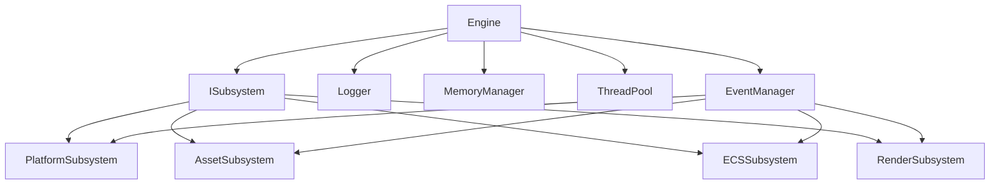
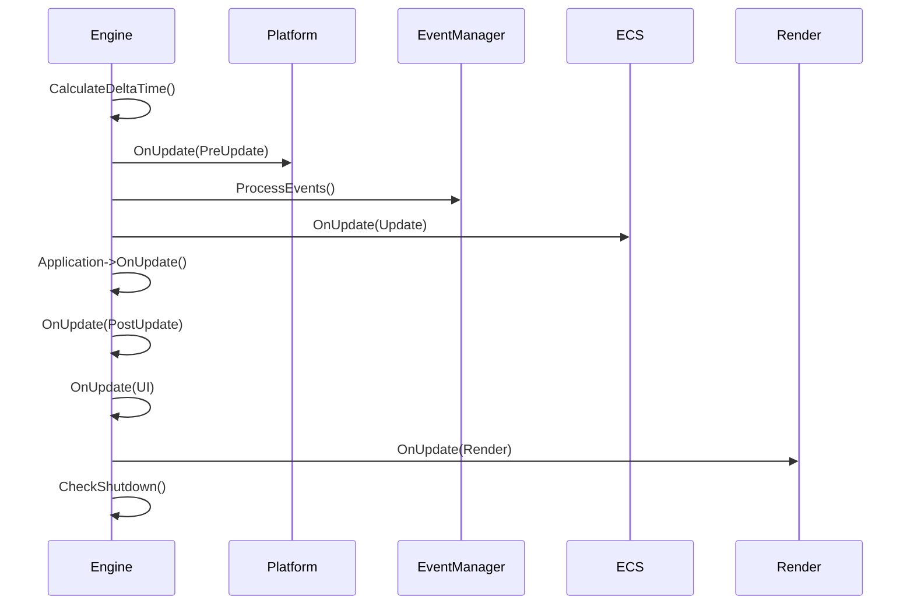
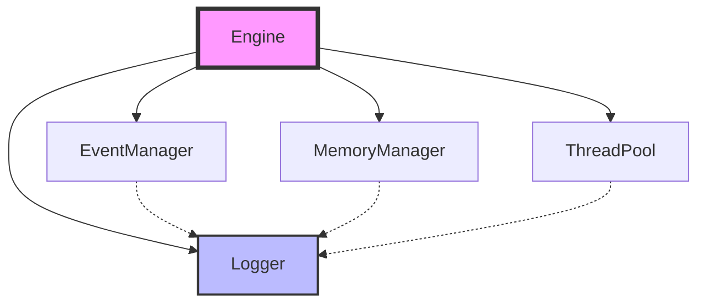

# Astral Engine - Core Modüller Mimarisi

## Giriş

Core modüller, Astral Engine'in temel yapı taşlarını oluşturan ve motorun çalışması için gerekli minimum sistemleri sağlar. Bu modüller, subsystem yönetimi, loglama, bellek yönetimi, çoklu iş parçacığı yönetimi ve olay tabanlı iletişim gibi temel işlevleri yerine getirir.

## Core Modüller Yapısı



## 1. Engine Sınıfı

### 1.1 Genel Bakış

`Engine` sınıfı, Astral Engine'in merkezi orkestratörüdür. Tüm alt sistemlerin yaşam döngüsünü yönetir ve ana döngüyü çalıştırır. Singleton pattern kullanmaz; isteğe bağlı olarak birden fazla Engine örneği oluşturulabilir.

### 1.2 Ana Özellikler

- **Subsystem Yönetimi**: Alt sistemlerin kaydedilmesi, başlatılması, güncellenmesi ve kapatılması
- **Çok Aşamalı Güncelleme**: Farklı güncelleme aşamalarında subsystem'leri organize etme
- **Hata Yönetimi**: Her alt sistem için ayrı ayrı hata yakalama ve günlükleme
- **Tip Güvenli Erişim**: Template tabanlı tip güvenli subsystem erişimi

### 1.3 Güncelleme Aşamaları

```cpp
enum class UpdateStage {
    PreUpdate,   // Input, Platform Events
    Update,      // Game Logic, ECS Systems  
    PostUpdate,  // Physics
    UI,          // UI logic updates
    Render       // Render operations
};
```

### 1.4 Ana Döngü Akışı



### 1.5 Hata Yönetimi

Her güncelleme aşaması ayrı try-catch bloğu içerisindedir. Bir alt sistemde hata oluştuğunda:
- Hata günlüğe kaydedilir
- Diğer subsystem'ler çalışmaya devam eder
- Motor çökmek yerine hatayı tolere eder

### 1.6 Örnek Kullanım

```cpp
// Motor oluşturma
Engine engine;

// Alt sistemleri kaydetme (kritik sıraya dikkat!)
engine.RegisterSubsystem<PlatformSubsystem>();
engine.RegisterSubsystem<AssetSubsystem>();
engine.RegisterSubsystem<ECSSubsystem>();
engine.RegisterSubsystem<RenderSubsystem>();

// Uygulama oluşturma
MyApplication app;

// Motoru çalıştırma
engine.Run(&app);
```

## 2. ISubsystem Arayüzü

### 2.1 Genel Bakış

`ISubsystem` arayüzü, tüm alt sistemlerin uyması gereken temel sözleşmedir. Bu arayüz, Engine çekirdeğinin tüm sistemlerin yaşam döngüsünü tek tip bir şekilde yönetmesini sağlar.

### 2.2 Yaşam Döngüsü Metodları

```cpp
class ISubsystem {
public:
    virtual void OnInitialize(Engine* owner) = 0;  // Başlatma
    virtual void OnUpdate(float deltaTime) = 0;    // Güncelleme
    virtual void OnShutdown() = 0;                 // Kapatma
    virtual const char* GetName() const = 0;       // Sistem adı
    virtual UpdateStage GetUpdateStage() const = 0;// Güncelleme aşaması
};
```

### 2.3 Güncelleme Aşamaları

Her alt sistem, güncelleme aşamasını belirleyerek Engine'in güncelleme sırasını optimize etmesini sağlar:

- **PreUpdate**: Input toplama, pencere olayları
- **Update**: Oyun mantığı, ECS sistemleri
- **PostUpdate**: Fizik, son işlemler
- **UI**: Kullanıcı arayüzü güncellemeleri
- **Render**: Grafik çizim işlemleri

### 2.4 Bağımlılık Yönetimi

Alt sistemler kendi aralarında bağımlılıklar oluşturabilir. Örneğin:
- `RenderSubsystem` → `PlatformSubsystem` (pencere tanıtıcısı için)
- `ECSSubsystem` → `AssetSubsystem` (asset yükleme için)

## 3. Logger Sistemi

### 3.1 Genel Bakış

`Logger` sınıfı, thread-safe merkezi loglama sistemidir. Farklı log seviyelerini destekler ve hem konsol hem dosya çıkışı sağlar.

### 3.2 Log Seviyeleri

```cpp
enum class LogLevel {
    Trace = 0,    // En detaylı debug bilgisi
    Debug = 1,    // Debug bilgisi
    Info = 2,     // Bilgi mesajları
    Warning = 3,  // Uyarı mesajları
    Error = 4,    // Hata mesajları
    Critical = 5  // Kritik hatalar
};
```

### 3.3 Thread Safety

Logger sistemi thread-safe tasarıma sahiptir:
- Static metodlar üzerinden erişim
- İç durum paylaşılmaz
- Formatlama ve çıktı atomik işlemlerdir

### 3.4 Dosya Loglaması

- Otomatik olarak executable dizininde log dosyası oluşturur
- Zaman damgalı log girişleri
- Günlük dosya rotasyonu (gelecek özellik)

### 3.5 Örnek Kullanım

```cpp
// Basit loglama
Logger::Info("Engine", "Motor başlatıldı");

// Formatlı loglama
Logger::Error("Render", "Shader yüklenemedi: {}", shaderPath);

// Kategori bazlı loglama
Logger::Debug("AssetManager", "Texture yüklendi: {}x{}", width, height);
```

## 4. MemoryManager Sistemi

### 4.1 Genel Bakış

`MemoryManager` sınıfı, merkezi bellek yönetimini sağlar. Şu anda basit bir wrapper olarak çalışır ancak gelecekte özel allocator'lar içerecek şekilde tasarlanmıştır.

### 4.2 Özellikler

- **Singleton Pattern**: Tek örnek üzerinden erişim
- **Hizalı Bellek Ayırma**: Özel hizalama gereksinimlerini destekler
- **Frame Bazlı Bellek**: Geçici bellek ayırma için optimize edilmiş
- **İstatistik Takibi**: Ayrılan toplam bellek miktarını izler

### 4.3 Frame Memory Sistemi

Frame bazlı bellek sistemi, her frame için geçici veriler için optimize edilmiştir:

```cpp
// Frame belleği ayırma
void* tempData = MemoryManager::GetInstance().AllocateFrameMemory(size);

// Frame sonunda belleği temizleme
MemoryManager::GetInstance().ResetFrameMemory();
```

### 4.4 Performans Özellikleri

- **Stack Benzeri Ayırma**: Frame belleği için hızlı ayırma
- **Minimum Overhead**: Sadece offset takibi
- **Cache Friendly**: Ardışık bellek düzeni

### 4.5 Örnek Kullanım

```cpp
auto& memoryManager = MemoryManager::GetInstance();

// Normal bellek ayırma
void* data = memoryManager.Allocate(1024, 16); // 1024 byte, 16-byte aligned

// Frame belleği kullanımı
void* tempBuffer = memoryManager.AllocateFrameMemory(256);

// Bellek istatistikleri
size_t totalAllocated = memoryManager.GetTotalAllocated();
```

## 5. ThreadPool Sistemi

### 5.1 Genel Bakış

`ThreadPool` sınıfı, genel amaçlı thread havuzu sağlar. Asenkron görev çalıştırmak için kullanılır ve ana thread'i bloklamadan uzun süren işlemleri paralel olarak yürütür.

### 5.2 Ana Özellikler

- **İş Kuyruğu**: FIFO görev yürütme
- **Thread Güvenliği**: Mutex ve condition variable kullanımı
- **Task Bazlı İşlem**: std::function ile esnek görev tanımı
- **Future Desteği**: Sonuç döndüren görevler için std::future

### 5.3 Thread Güvenliği

ThreadPool aşağıdaki senkronizasyon mekanizmalarını kullanır:
- **std::mutex**: Görev kuyruğu erişimi için
- **std::condition_variable**: Thread'lerin uyandırılması için
- **std::atomic**: Durdurma bayrağı için

### 5.4 Performans Karakteristikleri

- **Worker Thread'ler**: Sabit sayıda worker thread
- **Dinamik Görev Dağıtımı**: İş yüküne göre otomatik dağıtım
- **Düşük Gecikme**: Minimum kilitlenme süresi

### 5.5 Örnek Kullanım

```cpp
// ThreadPool oluşturma
ThreadPool pool(4); // 4 worker thread

// Basit görev gönderme
pool.Submit([]() {
    // Arka planda çalışacak kod
    LoadTexture("texture.png");
});

// Sonuç döndüren görev
auto future = pool.Submit([]() -> int {
    return CalculateExpensiveOperation();
});

// Sonucu bekleme
int result = future.get();
```

## 6. EventManager Sistemi

### 6.1 Genel Bakış

`EventManager` sınıfı, olay tabanlı iletişim sistemidir. Observer pattern implementasyonu ile thread-safe event yönetimi sağlar.

### 6.2 Thread Safety

EventManager çift katmanlı mutex sistemi kullanır:
- **m_handlersMutex**: Handler yönetimi için
- **m_queueMutex**: Event kuyruğu için

### 6.3 Event Türleri

Tüm event'ler `Event` taban sınıfından türetilir:
- Tip güvenli event sistemi
- Runtime tip kontrolü
- Tip bazlı handler organizasyonu

### 6.4 Handler Yönetimi

```cpp
// Event handler kaydetme
EventManager::GetInstance().Subscribe<WindowResizeEvent>(
    [](WindowResizeEvent& event) {
        // Event işleme
        return true; // Event'in işlendiğini belirt
    }
);

// Event gönderme
EventManager::GetInstance().PublishEvent<WindowResizeEvent>(1920, 1080);
```

### 6.5 Örnek Kullanım

```cpp
// Custom event tanımı
struct GameEvent : public Event {
    GameEvent(int score) : score(score) {}
    int score;
    
    static std::type_index GetStaticType() {
        return typeid(GameEvent);
    }
};

// Handler kaydetme
auto handlerID = EventManager::GetInstance().Subscribe<GameEvent>(
    [](GameEvent& event) {
        Logger::Info("Game", "Score updated: {}", event.score);
        return true;
    }
);

// Event gönderme
EventManager::GetInstance().PublishEvent<GameEvent>(100);
```

## 7. Core Modüller Arası İletişim

### 7.1 Bağımlılık Grafiği



### 7.2 Başlatma Sırası

1. **Logger**: İlk başlatılan sistem (diğer sistemler loglayabilir)
2. **MemoryManager**: Bellek yönetimi sistemleri için
3. **EventManager**: Olay tabanlı iletişim için
4. **ThreadPool**: Asenkron işlemler için
5. **Engine**: Tüm sistemleri koordine eder

### 7.3 Veri Akışı

Core modüller arası veri akışı:

```
Engine → Subsystem'leri başlat
  ↓
Subsystem → EventManager'a abone ol
  ↓
Runtime → EventManager üzerinden iletişim
  ↓
Shutdown → Ters sırada kapatma
```

## 8. Performans ve Optimizasyonlar

### 8.1 Bellek Optimizasyonları

- **Cache-friendly yapılar**: Veri odaklı tasarım
- **Minimum allocation**: RAII ve move semantics
- **Frame-based memory**: Geçici bellek için optimize edilmiş

### 8.2 Thread Optimizasyonları

- **Lock-free algoritmalar**: Mümkün olduğunca
- **Minimum kilitlenme**: Ince taneli kilitleme
- **Thread-local storage**: Thread özel veriler için

### 8.3 CPU Optimizasyonları

- **Template metaprogramming**: Runtime maliyeti azaltma
- **Inline functions**: Küçük fonksiyonlar için
- **Const correctness**: Derleyici optimizasyonları

## 9. Gelecek Geliştirmeler

### 9.1 Planlanan Özellikler

- **Gelişmiş Memory Manager**: Pool allocator, stack allocator
- **Job System**: Daha gelişmiş paralel iş yönetimi
- **Profiler Integration**: Performans izleme
- **Hot Reload**: Runtime kod yeniden yükleme

### 9.2 Mimari İyileştirmeler

- **Plugin System**: Dinamik yükleme desteği
- **Service Locator**: Daha esnek bağımlılık yönetimi
- **Configuration System**: Merkezi yapılandırma yönetimi

## 10. Özet

Core modüller, Astral Engine'in sağlam temelini oluşturur. Her modül tek bir sorumluluğa sahiptir ve diğer modüllerle gevşek bağlılık prensibiyle iletişim kurar. Bu tasarım sayesinde:

- **Bakım Kolaylığı**: Her modül bağımsız olarak geliştirilebilir
- **Test Edilebilirlik**: Unit testler için uygun yapı
- **Performans**: Optimize edilmiş algoritmalar ve veri yapıları
- **Genişletilebilirlik**: Yeni özellikler kolayca eklenebilir

Core modüller, Astral Engine'in güçlü ve esnek mimarisinin temelini oluşturarak üst seviye sistemlerin güvenli ve verimli çalışmasını sağlar.