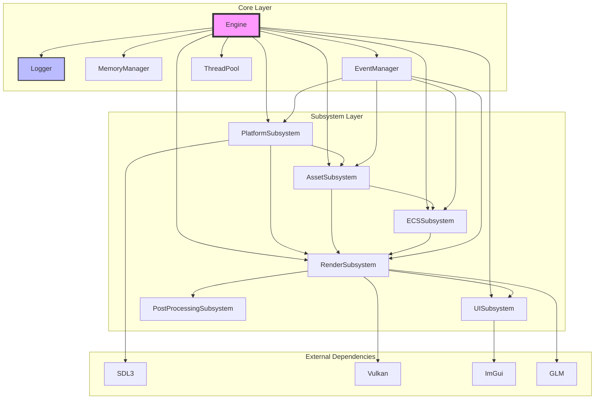
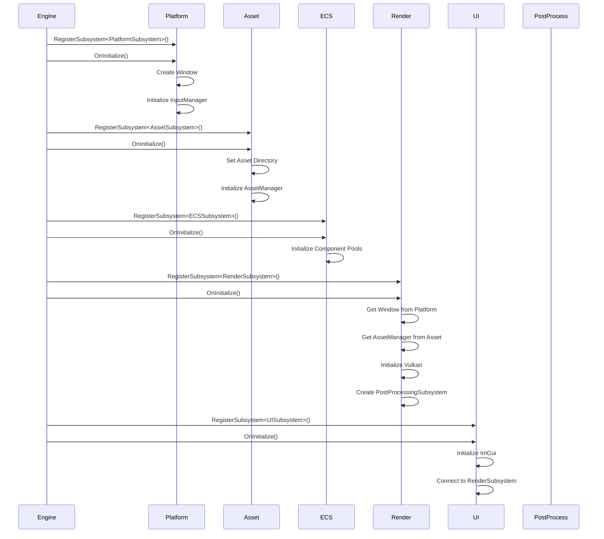
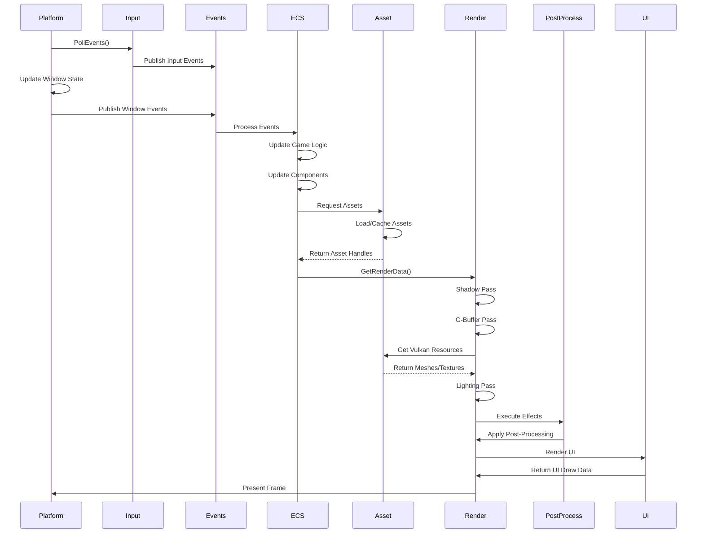
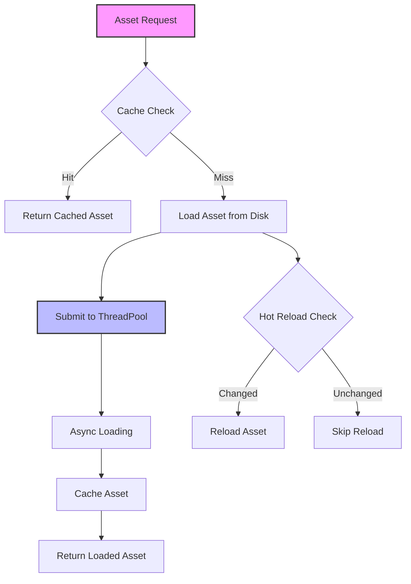
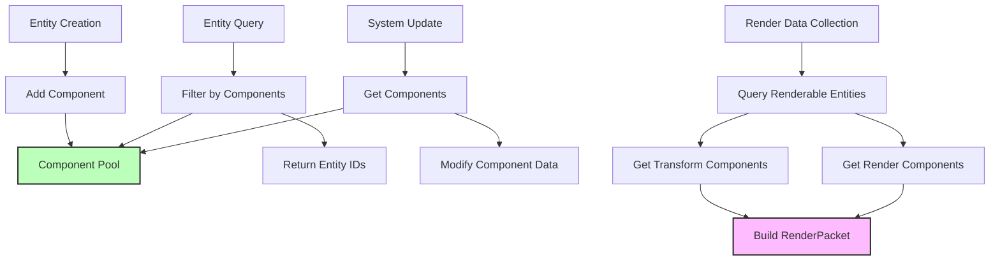
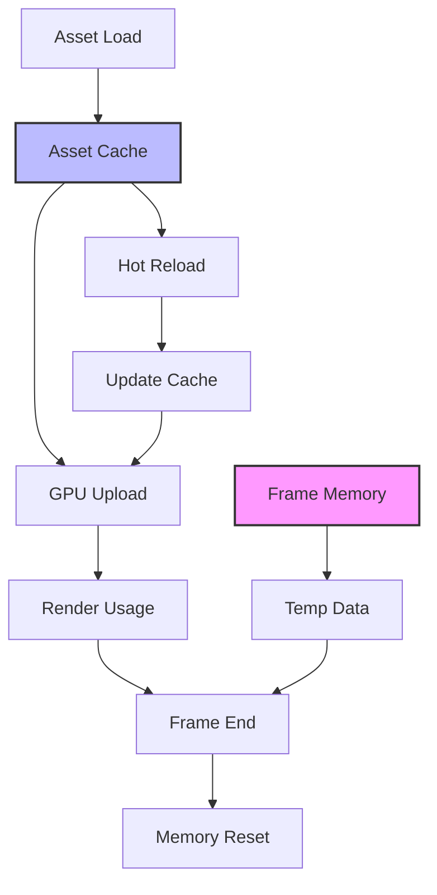
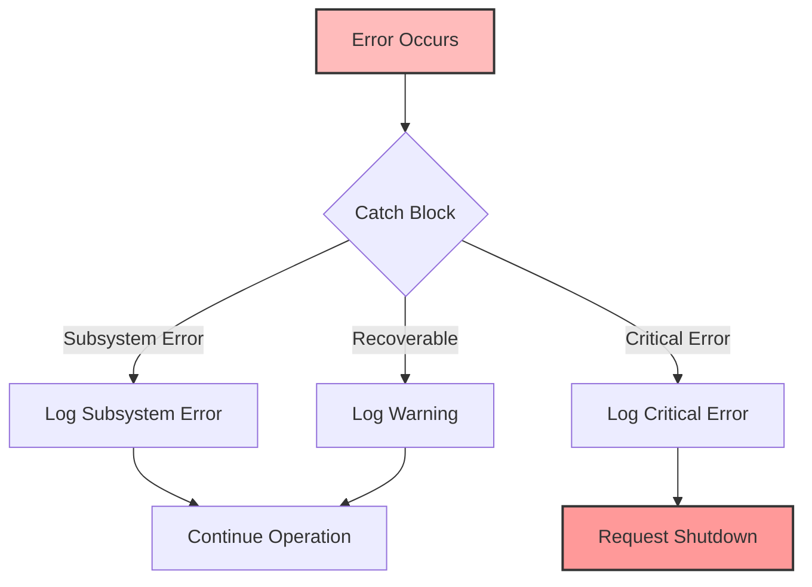

# Astral Engine - Modüller Arası Bağımlılıklar ve Veri Akışı

## Giriş

Bu dokümantasyon, Astral Engine'deki modüller arasındaki bağımlılıkları, veri akışını ve iletişim mekanizmalarını detaylı olarak açıklamaktadır. Modüler mimari, gevşek bağlılık prensiplerine dayanarak tasarlanmıştır ve bu doküman bu tasarımın nasıl uygulandığını göstermektedir.

## Genel Bağımlılık Yapısı



## 1. Başlatma Sırası ve Bağımlılık Hiyerarşisi

### 1.1 Kritik Başlatma Sırası

Astral Engine'de subsystem'lerin başlatılma sırası kritik öneme sahiptir çünkü bazı subsystem'ler diğerlerine bağımlıdır:



### 1.2 Bağımlılık Kuralları

Her subsystem'in başlatılması için gereken bağımlılıklar:

| Subsystem | Bağımlılıklar | Başlatma Önceliği |
|-----------|---------------|-------------------|
| PlatformSubsystem | Logger, MemoryManager | 1 |
| AssetSubsystem | Logger, PlatformSubsystem | 2 |
| ECSSubsystem | Logger, AssetSubsystem | 3 |
| RenderSubsystem | Logger, PlatformSubsystem, AssetSubsystem, ECSSubsystem | 4 |
| UISubsystem | Logger, RenderSubsystem | 5 |
| PostProcessingSubsystem | Logger, RenderSubsystem | 6 |

### 1.3 Başlatma Hata Yönetimi

```cpp
void Engine::Initialize() {
    for (auto& [stage, subsystems] : m_subsystemsByStage) {
        for (auto& subsystem : subsystems) {
            try {
                Logger::Info("Engine", "Initializing subsystem: {}", subsystem->GetName());
                subsystem->OnInitialize(this);
                Logger::Info("Engine", "Successfully initialized subsystem: {}", subsystem->GetName());
            } catch (const std::exception& e) {
                Logger::Error("Engine", "Failed to initialize subsystem {}: {}", 
                            subsystem->GetName(), e.what());
                throw std::runtime_error(std::string("Subsystem initialization failed: ") + 
                                       subsystem->GetName() + " - " + e.what());
            }
        }
    }
}
```

## 2. Veri Akışı Diyagramları

### 2.1 Bir Frame'in Veri Akışı



### 2.2 Asset Yükleme Veri Akışı



### 2.3 ECS Veri Akışı



## 3. İletişim Mekanizmaları

### 3.1 Event Tabanlı İletişim

Event sistemi, subsystem'ler arasında gevşek bağlı iletişim sağlar:

```cpp
// Event tanımı
struct WindowResizeEvent : public Event {
    uint32_t width;
    uint32_t height;
    
    WindowResizeEvent(uint32_t w, uint32_t h) : width(w), height(h) {}
    
    static std::type_index GetStaticType() {
        return typeid(WindowResizeEvent);
    }
};

// Event yayınlama
EventManager::GetInstance().PublishEvent<WindowResizeEvent>(1920, 1080);

// Event dinleme
auto handlerID = EventManager::GetInstance().Subscribe<WindowResizeEvent>(
    [](WindowResizeEvent& event) {
        Logger::Info("Render", "Window resized to {}x{}", 
                    event.width, event.height);
        // Render hedeflerini yeniden boyutlandır
        return true;
    }
);
```

### 3.2 Doğrudan Subsystem Erişimi

```cpp
// Engine üzerinden tip güvenli erişim
class RenderSubsystem : public ISubsystem {
private:
    PlatformSubsystem* m_platform = nullptr;
    AssetSubsystem* m_asset = nullptr;
    ECSSubsystem* m_ecs = nullptr;
    
public:
    void OnInitialize(Engine* owner) override {
        // Bağımlı subsystem'leri al
        m_platform = owner->GetSubsystem<PlatformSubsystem>();
        m_asset = owner->GetSubsystem<AssetSubsystem>();
        m_ecs = owner->GetSubsystem<ECSSubsystem>();
        
        // Null kontrolü
        if (!m_platform || !m_asset || !m_ecs) {
            throw std::runtime_error("Required subsystems not available");
        }
    }
};
```

### 3.3 ECS Veri Paylaşımı

ECS, subsystem'ler arasında veri paylaşımı için merkezi bir veri havuzu görevi görür:

```cpp
// ECSSubsystem'den render verisi alma
RenderSubsystem::RenderPacket RenderSubsystem::GetRenderData() {
    RenderPacket packet;
    
    // ECS'den renderable entity'leri al
    auto view = m_ecs->GetRegistry().view<const RenderComponent, const TransformComponent>();
    
    for (auto entity : view) {
        const auto& renderComp = view.get<RenderComponent>(entity);
        const auto& transformComp = view.get<TransformComponent>(entity);
        
        if (renderComp.visible) {
            packet.renderItems.emplace_back(
                transformComp.GetWorldMatrix(),
                renderComp.modelHandle,
                renderComp.materialHandle,
                renderComp.visible,
                renderComp.renderLayer
            );
        }
    }
    
    return packet;
}
```

### 3.4 Asset Veri Paylaşımı

AssetSubsystem, diğer subsystem'ler için kaynak yönetimi sağlar:

```cpp
// AssetSubsystem üzerinden kaynak alma
void RenderSubsystem::LoadResources() {
    auto* assetManager = m_assetSubsystem->GetAssetManager();
    
    // Model yükleme
    AssetHandle modelHandle = assetManager->Load<Model>("models/cube.fbx");
    VulkanMesh* mesh = m_vulkanMeshManager->GetOrCreateMesh(modelHandle);
    
    // Texture yükleme
    AssetHandle textureHandle = assetManager->Load<Texture>("textures/diffuse.png");
    VulkanTexture* texture = m_vulkanTextureManager->GetOrCreateTexture(textureHandle);
    
    // Material oluşturma
    Material* material = m_materialManager->CreateMaterial("PBR");
    material->SetTexture("albedo", textureHandle);
}
```

## 4. Thread Safety ve Senkronizasyon

### 4.1 Thread Güvenliği Seviyeleri

| Subsystem | Thread Safety | Açıklama |
|-----------|---------------|----------|
| Logger | Thread-Safe | Static metodlar, iç durum paylaşılmaz |
| EventManager | Thread-Safe | Çift katmanlı mutex sistemi |
| AssetSubsystem | Thread-Safe | ThreadPool kullanır, async yükleme |
| MemoryManager | Thread-Safe | Singleton, atomic operasyonlar |
| PlatformSubsystem | Not Thread-Safe | Ana thread'de çalışır |
| ECSSubsystem | Not Thread-Safe | Ana thread'de çalışır |
| RenderSubsystem | Vulkan Thread-Safety | Vulkan API thread güvenliği kullanır |

### 4.2 Event Sistemi Thread Safety

```cpp
class EventManager {
    mutable std::mutex m_handlersMutex;  // Handler yönetimi için
    mutable std::mutex m_queueMutex;     // Event kuyruğu için
    
public:
    template<typename T>
    EventHandlerID Subscribe(EventHandler handler) {
        std::lock_guard<std::mutex> lock(m_handlersMutex);
        // Handler ekleme işlemi
    }
    
    void PublishEvent(std::unique_ptr<Event> event) {
        {
            std::lock_guard<std::mutex> lock(m_queueMutex);
            m_eventQueue.push_back(std::move(event));
        }
        // Event işleme ana thread'de yapılır
    }
};
```

### 4.3 Asset Yükleme Thread Safety

```cpp
class AssetManager {
    ThreadPool& m_threadPool;
    std::mutex m_cacheMutex;
    std::unordered_map<AssetHandle, std::unique_ptr<Asset>> m_cache;
    
public:
    template<typename T>
    std::future<AssetHandle> LoadAsync(const std::string& path) {
        return m_threadPool.Submit([this, path]() {
            // Arka planda yükleme
            auto asset = LoadAsset<T>(path);
            
            // Cache'e thread-safe ekleme
            {
                std::lock_guard<std::mutex> lock(m_cacheMutex);
                m_cache[asset->GetHandle()] = std::move(asset);
            }
            
            return asset->GetHandle();
        });
    }
};
```

## 5. Bellek Yönetimi ve Veri Yaşam Döngüsü

### 5.1 Bellek Akışı



### 5.2 Frame-Based Memory Management

```cpp
class MemoryManager {
    static constexpr size_t FRAME_MEMORY_SIZE = 1024 * 1024; // 1MB
    std::unique_ptr<char[]> m_frameMemoryBuffer;
    size_t m_frameMemoryOffset = 0;
    
public:
    void* AllocateFrameMemory(size_t size, size_t alignment = 16) {
        // Hizalama hesapla
        size_t alignedOffset = (m_frameMemoryOffset + alignment - 1) & ~(alignment - 1);
        
        if (alignedOffset + size > FRAME_MEMORY_SIZE) {
            Logger::Error("MemoryManager", "Frame memory overflow!");
            return nullptr;
        }
        
        void* ptr = m_frameMemoryBuffer.get() + alignedOffset;
        m_frameMemoryOffset = alignedOffset + size;
        
        return ptr;
    }
    
    void ResetFrameMemory() {
        m_frameMemoryOffset = 0;
        m_frameAllocated = 0;
    }
};
```

### 5.3 Asset Bellek Yönetimi

```cpp
class AssetManager {
    // LRU cache ile bellek yönetimi
    std::unordered_map<AssetHandle, std::unique_ptr<Asset>> m_cache;
    std::list<AssetHandle> m_lruList;
    size_t m_maxCacheSize = 512 * 1024 * 1024; // 512MB
    
public:
    void ManageCacheSize() {
        while (GetCacheSize() > m_maxCacheSize && !m_lruList.empty()) {
            AssetHandle oldest = m_lruList.back();
            m_lruList.pop_back();
            m_cache.erase(oldest);
        }
    }
};
```

## 6. Hata Yönetimi ve Geri Dönüşüm

### 6.1 Hata Akışı



### 6.2 Hata Yönetimi Stratejileri

```cpp
void Engine::Run(IApplication* application) {
    while (m_isRunning) {
        try {
            // Ana döngü
            Update();
        } catch (const std::exception& e) {
            Logger::Error("Engine", "Frame update failed: {}", e.what());
            // Motor çökmez, devam eder
            // Hata geçici olabilir
        }
    }
}

void Subsystem::OnUpdate(float deltaTime) {
    try {
        // Subsystem güncelleme
        InternalUpdate(deltaTime);
    } catch (const std::exception& e) {
        Logger::Error(GetName(), "Update failed: {}", e.what());
        // Diğer subsystem'ler çalışmaya devam etsin
        // Hata üst seviyeye fırlatılmaz
    }
}
```

### 6.3 Geri Dönüşüm ve Temizlik

```cpp
class Engine {
    void Shutdown() {
        // Ters sırada kapatma (LIFO)
        for (auto it = m_subsystemsByStage.rbegin(); 
             it != m_subsystemsByStage.rend(); ++it) {
            for (auto subsystem_it = it->second.rbegin(); 
                 subsystem_it != it->second.rend(); ++subsystem_it) {
                try {
                    (*subsystem_it)->OnShutdown();
                } catch (const std::exception& e) {
                    Logger::Error("Engine", "Shutdown failed for {}: {}", 
                                (*subsystem_it)->GetName(), e.what());
                    // Diğer subsystem'leri kapatmaya devam et
                }
            }
        }
    }
};
```

## 7. Performans ve Optimizasyon

### 7.1 Veri Akışı Optimizasyonları

```cpp
// Cache-friendly veri erişimi
struct TransformComponent {
    glm::vec3 position;
    glm::vec3 rotation;
    glm::vec3 scale;
}; // 36 byte, cache line'a sığar

// SoA (Structure of Arrays) düzeni
class ECSSubsystem {
    std::vector<glm::vec3> m_positions;
    std::vector<glm::vec3> m_rotations;
    std::vector<glm::vec3> m_scales;
    
public:
    void UpdatePositions(float deltaTime) {
        // Tüm pozisyonları sırayla güncelle - cache friendly
        for (size_t i = 0; i < m_positions.size(); ++i) {
            m_positions[i] += m_velocities[i] * deltaTime;
        }
    }
};
```

### 7.2 Thread Optimizasyonları

```cpp
// Lock-free queue kullanımı
class ThreadPool {
    std::atomic<bool> m_stop{false};
    std::queue<std::function<void()>> m_tasks;
    std::mutex m_queueMutex;
    
public:
    template<typename F>
    auto Submit(F&& f) -> std::future<decltype(f())> {
        auto task = std::make_shared<std::packaged_task<decltype(f())()>>(
            std::forward<F>(f)
        );
        
        std::future<decltype(f())> result = task->get_future();
        
        {
            std::lock_guard<std::mutex> lock(m_queueMutex);
            if (m_stop) {
                throw std::runtime_error("Submit on stopped ThreadPool");
            }
            m_tasks.emplace([task]() { (*task)(); });
        }
        
        m_condition.notify_one();
        return result;
    }
};
```

### 7.3 Bellek Optimizasyonları

```cpp
// Object pooling
class GameObjectPool {
    std::vector<std::unique_ptr<GameObject>> m_pool;
    std::queue<GameObject*> m_available;
    
public:
    GameObject* Acquire() {
        if (m_available.empty()) {
            // Yeni obje oluştur
            m_pool.emplace_back(std::make_unique<GameObject>());
            return m_pool.back().get();
        } else {
            // Mevcut objeyi yeniden kullan
            GameObject* obj = m_available.front();
            m_available.pop();
            return obj;
        }
    }
    
    void Release(GameObject* obj) {
        obj->Reset(); // Objeyi temizle
        m_available.push(obj);
    }
};
```

## 8. Ölçeklenebilirlik ve Gelecek Genişlemeler

### 8.1 Plugin Sistemi için Hazırlık

```cpp
// Plugin arayüzü
class IPlugin {
public:
    virtual ~IPlugin() = default;
    virtual bool Load(Engine* engine) = 0;
    virtual void Unload() = 0;
    virtual const char* GetName() const = 0;
    virtual const char* GetVersion() const = 0;
};

// Plugin yöneticisi
class PluginManager {
    std::vector<std::unique_ptr<IPlugin>> m_plugins;
    
public:
    bool LoadPlugin(const std::string& path) {
        // DLL/SO yükleme
        // Plugin oluşturma
        // Engine'e kaydetme
    }
};
```

### 8.2 Modüler Genişleme Noktaları

```cpp
// Custom component desteği
class ECSSubsystem {
    template<typename T>
    void RegisterComponentType() {
        // Yeni component tipi kaydetme
        m_componentTypes[typeid(T)] = sizeof(T);
    }
    
    template<typename T>
    void RegisterSystem() {
        // Yeni sistem kaydetme
        m_systems.emplace_back(std::make_unique<T>());
    }
};

// Custom render pass desteği
class RenderSubsystem {
    void AddRenderPass(std::unique_ptr<IRenderPass> pass) {
        m_renderPasses.push_back(std::move(pass));
    }
};
```

## 9. Özet

Astral Engine'in modüler mimarisi, aşağıdaki temel prensiplere dayanır:

### 9.1 Temel Prensipler

1. **Loose Coupling**: Modüller arası gevşek bağımlılık
2. **High Cohesion**: Her modül tek bir sorumluluğa sahip
3. **Interface Segregation**: Açık ve net arayüzler
4. **Dependency Inversion**: Soyutlamalar üzerinden bağımlılık
5. **Thread Safety**: Gerektiğinde thread-safe tasarım

### 9.2 Avantajlar

- **Bakım Kolaylığı**: Her modül bağımsız olarak geliştirilebilir
- **Test Edilebilirlik**: Unit testler için izole edilebilir yapı
- **Genişletilebilirlik**: Yeni modüller kolayca eklenebilir
- **Performans**: Optimize edilmiş veri akışı ve işleme
- **Hata Yalıtımı**: Bir modüldeki hata diğerlerini etkilemez

### 9.3 Gelecek İyileştirmeler

- **Plugin Sistemi**: Runtime modül yükleme/boşaltma
- **Hot Reload**: Kod değişikliklerinin runtime uygulanması
- **Advanced Profiling**: Detaylı performans analizi
- **Distributed Systems**: Çoklu işlemci/çekirdek optimizasyonları

Bu mimari, Astral Engine'in güçlü, esnek ve ölçeklenebilir bir oyun motoru olmasını sağlayan sağlam bir temel sunar.