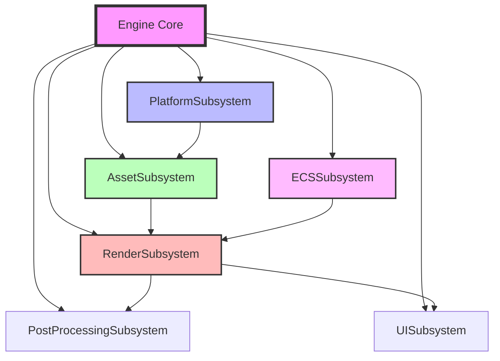
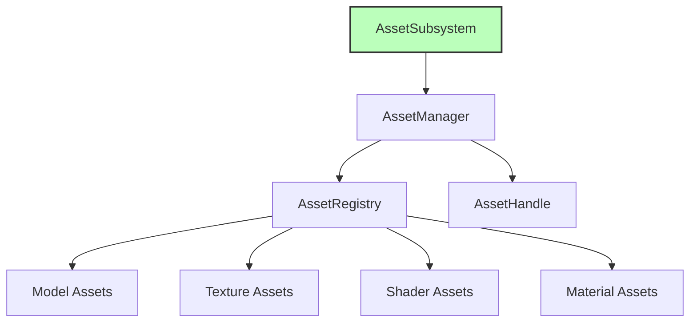
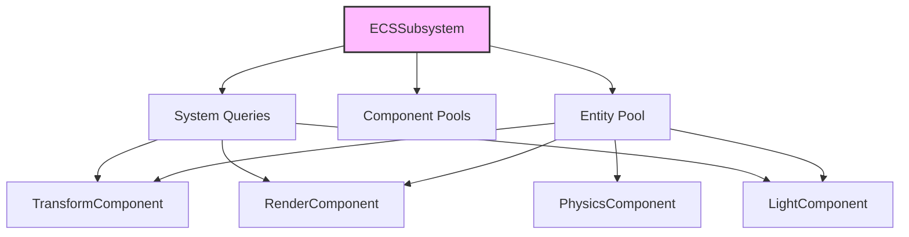
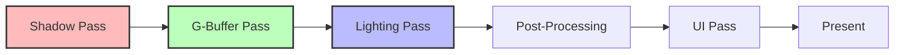
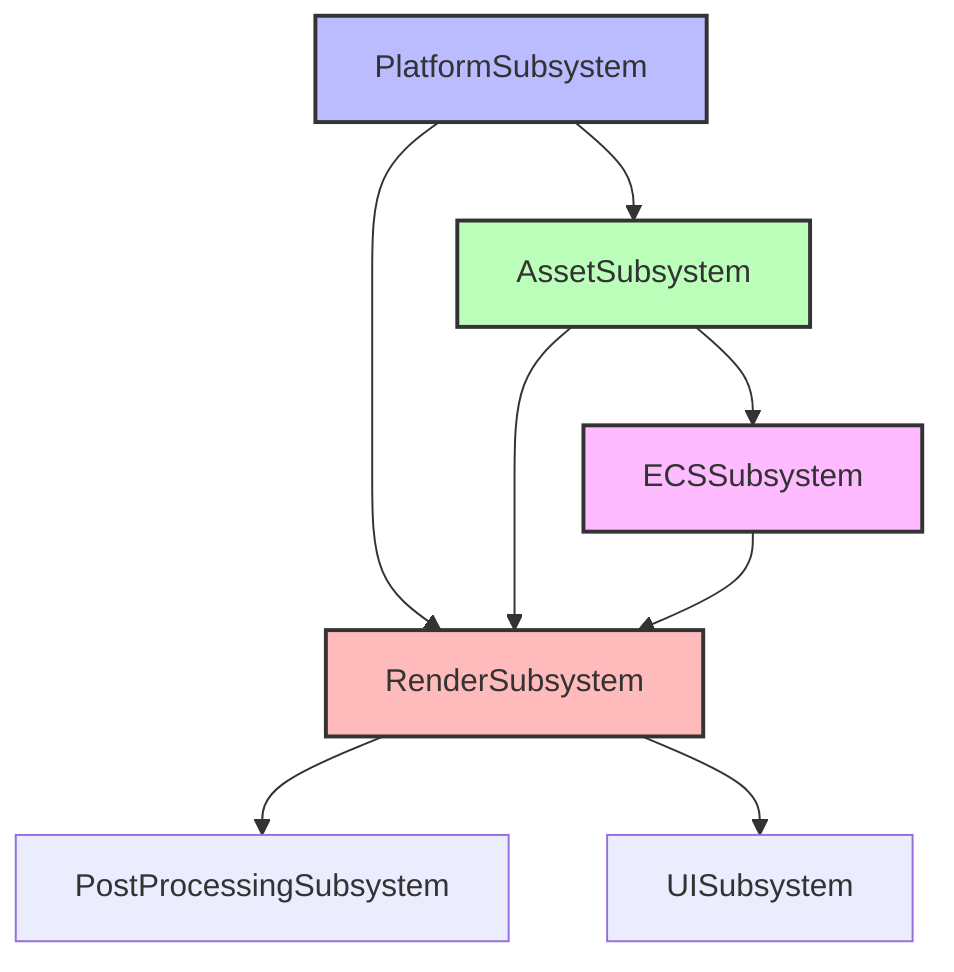

# Astral Engine - Subsystem Mimarisi

## Giriş

Astral Engine'in subsystem mimarisi, motorun temel işlevlerini modüler ve bağımsız bileşenler halinde organize eder. Her subsystem belirli bir sorumluluğa sahiptir ve diğer subsystem'lerle gevşek bağlılık prensibiyle iletişim kurar. Bu tasarım, kodun bakımını kolaylaştırır, test edilebilirliği artırır ve yeni özelliklerin entegrasyonunu basitleştirir.

## Subsystem Mimarisi Genel Bakış



## 1. PlatformSubsystem

### 1.1 Sorumluluklar

PlatformSubsystem, işletim sistemi ile ilgili tüm işlemleri soyutlar ve platformdan bağımsız bir API sağlar:

- **Pencere Yönetimi**: Pencere oluşturma, boyutlandırma, kapatma
- **Girdi Yönetimi**: Klavye, fare ve diğer girdi cihazlarından gelen verileri işleme
- **Olay İşleme**: Pencere olaylarını (yeniden boyutlandırma, kapatma vb.) yakalama ve yayınlama
- **Platform Bağımsızlığı**: SDL3 üzerinden çapraz platform desteği

### 1.2 Başlatma Sırası

```cpp
void PlatformSubsystem::OnInitialize(Engine* owner) {
    // 1. SDL3 başlatma
    // 2. Pencere oluşturma
    // 3. InputManager başlatma
    // 4. Render context oluşturma
    // 5. Event sistemine abone olma
}
```

### 1.3 Güncelleme Döngüsü

PlatformSubsystem `UpdateStage::PreUpdate` aşamasında çalışır:

```cpp
void PlatformSubsystem::OnUpdate(float deltaTime) {
    // 1. Pencere olaylarını işle
    m_window->PollEvents();
    
    // 2. Input durumunu güncelle
    m_inputManager->Update();
    
    // 3. Pencere kapatma kontrolü
    if (m_window->ShouldClose()) {
        m_owner->RequestShutdown();
    }
}
```

### 1.4 Bağımlılıklar

- **Engine**: Sahiplik ve yaşam döngüsü yönetimi
- **Window**: Pencere soyutlama sınıfı
- **InputManager**: Girdi işleme sınıfı
- **EventManager**: Olay tabanlı iletişim

### 1.5 Örnek Kullanım

```cpp
// PlatformSubsystem erişimi
auto* platform = engine.GetSubsystem<PlatformSubsystem>();
Window* window = platform->GetWindow();
InputManager* input = platform->GetInputManager();

// Pencere kontrolü
if (!platform->IsWindowOpen()) {
    engine.RequestShutdown();
}

// Input sorgulama
if (input->IsKeyPressed(KeyCode::Escape)) {
    platform->CloseWindow();
}
```

## 2. AssetSubsystem

### 2.1 Sorumluluklar

AssetSubsystem, oyun varlıklarının yaşam döngüsünü yönetir:

- **Asset Yükleme**: Modeller, dokular, shader'lar, sesler
- **Asset Önbellekleme**: Sık kullanılan asset'leri bellekte tutma
- **Hot Reload**: Dosya değişikliklerini izleme ve otomatik yeniden yükleme
- **Asset Referans Yönetimi**: Tip güvenli asset erişimi

### 2.2 Asset Yönetim Mimarisi



### 2.3 Asset Handle Sistemi

```cpp
// Tip güvenli asset erişimi
AssetHandle modelHandle = assetManager->Load<Model>("models/character.fbx");
AssetHandle textureHandle = assetManager->Load<Texture>("textures/diffuse.png");

// Asset kullanımı
if (modelHandle.IsValid()) {
    Model* model = assetManager->Get<Model>(modelHandle);
    // Model ile işlemler...
}
```

### 2.4 Hot Reload Mekanizması

```cpp
void AssetSubsystem::OnUpdate(float deltaTime) {
    // Asset Manager'ın background yükleme işlemlerini kontrol et
    if (m_assetManager) {
        m_assetManager->Update();
        
        // Hot reload kontrolü
        m_assetManager->CheckForAssetChanges();
    }
}
```

### 2.5 Thread Safety

- **Asenkron Yükleme**: ThreadPool kullanarak arka planda yükleme
- **Thread-Safe Cache**: Çoklu thread'den güvenli erişim
- **Asset Durum Takibi**: Yükleme durumu izleme

## 3. ECSSubsystem (Entity Component System)

### 3.1 Sorumluluklar

ECSSubsystem, oyun dünyasının durumunu veri odaklı bir yaklaşımla yönetir:

- **Entity Yönetimi**: Entity oluşturma, yok etme, geçerlilik kontrolü
- **Component Yönetimi**: Component ekleme, kaldırma, erişim
- **System Koordinasyonu**: Component'ler üzerinde çalışan sistemler
- **Render Verisi Üretme**: Render sistemine veri sağlama

### 3.2 ECS Mimarisi



### 3.3 Component Pool Sistemi

```cpp
struct ComponentPool {
    std::vector<std::byte> data;     // Component verileri
    size_t componentSize;            // Her component'in boyutu
    size_t count;                    // Mevcut component sayısı
};
```

### 3.4 Entity ve Component Yönetimi

```cpp
// Entity oluşturma
uint32_t entity = ecs->CreateEntity();

// Component ekleme
TransformComponent* transform = ecs->AddComponent<TransformComponent>(entity);
RenderComponent* render = ecs->AddComponent<RenderComponent>(entity);

// Component erişimi
TransformComponent* transform = ecs->GetComponent<TransformComponent>(entity);

// Component sorgulama
std::vector<uint32_t> entities = ecs->QueryEntities<TransformComponent, RenderComponent>();
```

### 3.5 Render Verisi Üretme

```cpp
struct RenderPacket {
    struct RenderItem {
        glm::mat4 transform;
        AssetHandle modelHandle;
        AssetHandle materialHandle;
        bool visible;
        int renderLayer;
    };
    std::vector<RenderItem> renderItems;
};

// Render verisi toplama
RenderPacket packet = ecs->GetRenderData();
```

### 3.6 Performans Optimizasyonları

- **Cache-Friendly Veri Düzeni**: Component'ler düz veri dizilerinde saklanır
- **Frustum Culling**: Görünmeyen entity'ler atlanır
- **Instancing Support**: Çoklu örnek renderleme için optimize edilmiş

## 4. RenderSubsystem

### 4.1 Sorumluluklar

RenderSubsystem, tüm çizim işlemlerini yönetir ve Vulkan API'sini soyutlar:

- **Vulkan Başlatma**: Vulkan instance, device, swapchain oluşturma
- **Deferred Rendering**: G-Buffer, lighting, shadow pass'leri
- **Post-Processing**: Bloom, tonemapping gibi efektler
- **UI Rendering**: ImGui entegrasyonu

### 4.2 Rendering Pipeline



### 4.3 Shadow Pass

```cpp
void RenderSubsystem::ShadowPass() {
    // 1. Işık frustum'u oluştur
    Frustum lightFrustum = CreateLightFrustum();
    
    // 2. Shadow caster'ları bul
    std::vector<RenderItem> shadowCasters;
    auto view = m_ecsSubsystem->QueryEntities<RenderComponent, TransformComponent>();
    
    for (auto entity : view) {
        if (entity.castsShadows && lightFrustum.Intersects(entity.bounds)) {
            shadowCasters.push_back(entity);
        }
    }
    
    // 3. Shadow map oluştur
    m_vulkanRenderer->RecordShadowPassCommands(shadowCasters);
}
```

### 4.4 G-Buffer Pass

```cpp
void RenderSubsystem::GBufferPass() {
    // 1. Render kuyruğu oluştur
    std::map<MeshMaterialKey, std::vector<glm::mat4>> renderQueue;
    
    // 2. ECS'den görünür entity'leri al
    auto view = m_ecsSubsystem->QueryEntities<RenderComponent, TransformComponent>();
    
    // 3. Frustum culling uygula
    for (auto entity : view) {
        if (IsVisible(entity) && m_camera->GetFrustum().Intersects(entity.bounds)) {
            renderQueue[key].push_back(entity.transform);
        }
    }
    
    // 4. G-Buffer'a çiz
    m_vulkanRenderer->RecordGBufferCommands(renderQueue);
}
```

### 4.5 Post-Processing Sistemi

```cpp
// Post-processing efektleri
std::unique_ptr<PostProcessingSubsystem> m_postProcessing;

// Tonemapping ayarlama
if (auto* tonemapping = m_postProcessing->GetEffect<TonemappingEffect>()) {
    tonemapping->SetExposure(1.5f);
    tonemapping->SetGamma(2.2f);
    tonemapping->SetTonemapper(TonemapperType::ACES);
}

// Bloom ayarlama
if (auto* bloom = m_postProcessing->GetEffect<BloomEffect>()) {
    bloom->SetThreshold(0.8f);
    bloom->SetIntensity(0.6f);
    bloom->SetRadius(4.0f);
}
```

### 4.6 UI Rendering

```cpp
void RenderSubsystem::RenderUI() {
#ifdef ASTRAL_USE_IMGUI
    VkCommandBuffer commandBuffer = GetCurrentUICommandBuffer();
    
    // UI render pass başlat
    VkRenderPassBeginInfo renderPassInfo{};
    renderPassInfo.renderPass = m_uiRenderPass;
    renderPassInfo.framebuffer = m_uiFramebuffers[m_currentFrame];
    
    vkCmdBeginRenderPass(commandBuffer, &renderPassInfo, VK_SUBPASS_CONTENTS_INLINE);
    
    // ImGui rendering
    ImDrawData* drawData = ImGui::GetDrawData();
    if (drawData) {
        ImGui_ImplVulkan_RenderDrawData(drawData, commandBuffer);
    }
    
    vkCmdEndRenderPass(commandBuffer);
#endif
}
```

## 5. UISubsystem

### 5.1 Sorumluluklar

UISubsystem, Dear ImGui tabanlı kullanıcı arayüzünü yönetir:

- **ImGui Başlatma**: Context oluşturma, backend başlatma
- **Font Yönetimi**: Font yükleme ve yönetimi
- **Debug Araçları**: İçerik üretme araçları ve hata ayıklama pencereleri
- **Event İşleme**: Kullanıcı girdilerini işleme

### 5.2 ImGui Entegrasyonu

```cpp
void UISubsystem::InitializeImGui() {
    // 1. ImGui Context oluştur
    IMGUI_CHECKVERSION();
    ImGui::CreateContext();
    
    // 2. Vulkan backend başlat
    ImGui_ImplVulkan_InitInfo init_info{};
    init_info.Instance = graphicsDevice->GetInstance();
    init_info.Device = graphicsDevice->GetDevice();
    init_info.Queue = graphicsDevice->GetGraphicsQueue();
    init_info.DescriptorPool = m_descriptorPool;
    
    ImGui_ImplVulkan_Init(&init_info, renderPass);
    
    // 3. Font yükle
    SetupFonts();
}
```

### 5.3 Frame Yönetimi

```cpp
void UISubsystem::OnUpdate(float deltaTime) {
    BeginFrame();
    
    // Custom UI pencereleri
    ShowDebugWindow();
    ShowMetricsWindow();
    ShowDemoWindow();
    
    EndFrame();
}
```

### 5.4 Debug ve Profil Araçları

```cpp
void UISubsystem::ShowDebugWindow() {
    if (ImGui::Begin("Astral Engine Debug")) {
        ImGui::Text("FPS: %.1f", ImGui::GetIO().Framerate);
        ImGui::Text("Frame Time: %.3f ms", 1000.0f / ImGui::GetIO().Framerate);
        
        // Engine durumu
        ImGui::Text("Engine State: %s", m_initialized ? "Initialized" : "Not Initialized");
        
        // Subsystem bilgileri
        if (ImGui::CollapsingHeader("Subsystems")) {
            // Her subsystem için durum göster
        }
    }
    ImGui::End();
}
```

## 6. PostProcessingSubsystem

### 6.1 Sorumluluklar

PostProcessingSubsystem, render sonrası efektleri yönetir:

- **Efekt Zinciri**: Birden fazla efektin sıralı uygulanması
- **Render Target Yönetimi**: Geçici texture'ların yönetimi
- **Parametre Kontrolü**: Efekt parametrelerinin dinamik ayarlanması

### 6.2 Efekt Mimarisi

```cpp
class PostProcessingSubsystem {
    std::vector<std::unique_ptr<IPostProcessingEffect>> m_effects;
    std::vector<std::unique_ptr<VulkanTexture>> m_renderTargets;
    
public:
    template<typename T>
    T* GetEffect() {
        // Tip güvenli efekt erişimi
        for (auto& effect : m_effects) {
            if (auto* typed = dynamic_cast<T*>(effect.get())) {
                return typed;
            }
        }
        return nullptr;
    }
};
```

### 6.3 Mevcut Efektler

- **TonemappingEffect**: HDR'den LDR'ye dönüşüm
- **BloomEffect**: Parlak alanların yayılması efekti

### 6.4 Efekt Parametreleri

```cpp
// Tonemapping parametreleri
struct TonemappingParams {
    float exposure = 1.0f;
    float gamma = 2.2f;
    int tonemapper = 0; // 0: ACES, 1: Reinhard, 2: Filmic
    float contrast = 1.0f;
    float brightness = 0.0f;
    float saturation = 1.0f;
};

// Bloom parametreleri
struct BloomParams {
    float threshold = 0.8f;
    float knee = 0.5f;
    float intensity = 0.6f;
    float radius = 4.0f;
    int quality = 1; // 0: low, 1: medium, 2: high
    bool useDirt = false;
    float dirtIntensity = 1.0f;
};
```

## 7. Subsystem Bağımlılıkları ve İletişim

### 7.1 Başlatma Sırası ve Bağımlılıklar



### 7.2 İletişim Mekanizmaları

#### 7.2.1 Doğrudan Erişim

```cpp
// Engine üzerinden subsystem erişimi
auto* platform = engine.GetSubsystem<PlatformSubsystem>();
auto* asset = engine.GetSubsystem<AssetSubsystem>();
auto* ecs = engine.GetSubsystem<ECSSubsystem>();
```

#### 7.2.2 Event Tabanlı İletişim

```cpp
// Event yayınlama
EventManager::GetInstance().PublishEvent<WindowResizeEvent>(width, height);

// Event dinleme
EventManager::GetInstance().Subscribe<WindowResizeEvent>(
    [](WindowResizeEvent& event) {
        // Pencere yeniden boyutlandırma işlemi
        return true;
    }
);
```

#### 7.2.3 ECS Veri Paylaşımı

```cpp
// ECS'den render verisi alma
RenderPacket renderData = m_ecsSubsystem->GetRenderData();

// Render sistemine veri gönderme
m_renderSubsystem->RenderFrame(renderData);
```

### 7.3 Thread Safety

Her subsystem'in thread safety gereksinimleri farklıdır:

- **PlatformSubsystem**: Ana thread'de çalışır, thread-safe değil
- **AssetSubsystem**: Thread-safe, ThreadPool kullanır
- **ECSSubsystem**: Ana thread'de çalışır, thread-safe değil
- **RenderSubsystem**: Ana thread'de çalışır, Vulkan thread safety'si kullanır
- **UISubsystem**: Ana thread'de çalışır, ImGui thread safety'si kullanır

## 8. Performans ve Optimizasyonlar

### 8.1 Cache Optimizasyonları

- **Component Pool'lar**: Component'ler düz veri dizilerinde saklanır
- **SoA (Structure of Arrays)**: Veri odaklı tasarım
- **Minimize Virtual Calls**: Mümkün olduğunca az virtual function call

### 8.2 Render Optimizasyonları

- **Frustum Culling**: Görünmeyen objeler atlanır
- **Instancing**: Çoklu örnek renderleme
- **Batch Rendering**: Aynı materyale sahip objeler birlikte çizilir
- **GPU-Driven Rendering**: Minimum CPU-GPU senkronizasyonu

### 8.3 Bellek Optimizasyonları

- **RAII Pattern**: Otomatik kaynak yönetimi
- **Object Pooling**: Sık oluşturulan/yok edilen objeler için
- **Frame-Based Memory**: Geçici bellek ayırma için optimize edilmiş

## 9. Hata Yönetimi ve Debug Desteği

### 9.1 Hata Yakalama

Her subsystem kendi hatalarını yakalar ve loglar:

```cpp
try {
    subsystem->OnUpdate(deltaTime);
} catch (const std::exception& e) {
    Logger::Error("Engine", "Update failed for subsystem {}: {}", 
                  subsystem->GetName(), e.what());
    // Devam et, diğer subsystem'ler çalışmaya devam etsin
}
```

### 9.2 Debug Araçları

- **Subsystem Durum İzleme**: Her subsystem'in durumu UI üzerinden görüntülenebilir
- **Performans Metrikleri**: Frame zamanı, memory kullanımı, draw call sayısı
- **Asset İzleme**: Yüklenen asset'ler, bellek kullanımı, yükleme süreleri

## 10. Gelecek Geliştirmeler

### 10.1 Planlanan Subsystem'ler

- **PhysicsSubsystem**: Jolt Physics entegrasyonu
- **AudioSubsystem**: 3D spatial audio yönetimi
- **ScriptingSubsystem**: Lua/Python scripting desteği
- **NetworkingSubsystem**: Çok oyunculu ağ desteği

### 10.2 Mimari İyileştirmeler

- **Plugin Sistemi**: Runtime'da subsystem yükleme/boşaltma
- **Hot Reload**: Kod değişikliklerinin runtime'da uygulanması
- **Configuration System**: Merkezi yapılandırma yönetimi
- **Profiling Integration**: Detaylı performans analizi araçları

## 11. Özet

Astral Engine'in subsystem mimarisi, modern oyun motoru tasarım prensiplerini uygular:

- **Single Responsibility**: Her subsystem tek bir sorumluluğa sahiptir
- **Loose Coupling**: Subsystem'ler gevşek bağlılıkla iletişim kurar
- **Interface Segregation**: ISubsystem arayüzü ile standartlaştırma
- **Dependency Inversion**: Soyutlamalar üzerinden bağımlılık yönetimi

Bu tasarım sayesinde:
- **Bakım Kolaylığı**: Her subsystem bağımsız olarak geliştirilebilir
- **Test Edilebilirlik**: Unit testler için izole edilebilir yapı
- **Genişletilebilirlik**: Yeni subsystem'ler kolayca eklenebilir
- **Performans**: Optimize edilmiş veri akışı ve işleme

Subsystem mimarisi, Astral Engine'in güçlü, esnek ve ölçeklenebilir bir oyun motoru olmasını sağlayan temel yapı taşıdır.